# Awesome GPT-6 Astra Prompts

[](https://github.com/sindresorhus/awesome) [](https://github.com/X-RayLuan/awesome-gpt-6-astra-prompts/stargazers) [](LICENSE) [](https://easyveo.com?utm_source=github&utm_medium=referral&utm_campaign=awesome_gpt6_astra_prompts&utm_content=badge) [](CONTRIBUTING.md)

<p>
  <a href="README.md"></a>
  <a href="README.zh-CN.md"></a>
</p>

<a href="https://easyveo.com?utm_source=github&amp;utm_medium=referral&amp;utm_campaign=awesome_gpt6_astra_prompts&amp;utm_content=readme_hero"></a>

**A starting point for your next Astra build — or your next AI video ad remake.**

Explore GPT-6 Astra community demos scraped from [@OpenAIDevs](https://x.com/OpenAIDevs/status/2098827327832822014) (article + comments) plus EasyVeo remake prompts.

**49 examples · EN + ZH · EasyVeo remake lane · CTA: [easyveo.com](https://easyveo.com?utm_source=github&utm_medium=referral&utm_campaign=awesome_gpt6_astra_prompts&utm_content=lede)**

## Featured projects

<sub>Click a thumb (or ▶ Play) to open GitHub’s video player. Clips are compressed; full originals on X.</sub>

<table>
<tr>
<td width="50%" valign="top"><a href="https://github.com/X-RayLuan/awesome-gpt-6-astra-prompts/blob/main/assets/videos/nurm-alex-inkstorm-readme.mp4"></a><br><strong><a href="#alex-and-the-inkstorm">Alex and the Inkstorm</a></strong><br><sub><a href="https://x.com/NURM_Dima/status/2096534403610562910">@NURM_Dima</a> · <a href="https://github.com/X-RayLuan/awesome-gpt-6-astra-prompts/blob/main/assets/videos/nurm-alex-inkstorm-readme.mp4">▶ Play</a></sub><br><a href="#alex-and-the-inkstorm">Prompt →</a></td>
<td width="50%" valign="top"><a href="https://github.com/X-RayLuan/awesome-gpt-6-astra-prompts/blob/main/assets/videos/pallav-tron-lightcycle-readme.mp4"></a><br><strong><a href="#tron-lightcycle-to-playable">Tron lightcycle → playable</a></strong><br><sub><a href="https://x.com/pallavmac/status/2097016391903657991">@pallavmac</a> · <a href="https://github.com/X-RayLuan/awesome-gpt-6-astra-prompts/blob/main/assets/videos/pallav-tron-lightcycle-readme.mp4">▶ Play</a></sub><br><a href="#tron-lightcycle-to-playable">Prompt →</a></td>
</tr>
<tr>
<td width="50%" valign="top"><a href="https://github.com/X-RayLuan/awesome-gpt-6-astra-prompts/blob/main/assets/videos/miki-4d-chess-readme.mp4"></a><br><strong><a href="#miki-4d-chess">Playable 4D chess</a></strong><br><sub><a href="https://x.com/miki_code/status/2096132455652549117">@miki_code</a> · <a href="https://github.com/X-RayLuan/awesome-gpt-6-astra-prompts/blob/main/assets/videos/miki-4d-chess-readme.mp4">▶ Play</a></sub><br><a href="#miki-4d-chess">Prompt →</a></td>
<td width="50%" valign="top"><a href="https://github.com/X-RayLuan/awesome-gpt-6-astra-prompts/blob/main/assets/videos/scribble-tanks-readme.mp4"></a><br><strong><a href="#scribble-tanks">Scribble Tanks</a></strong><br><sub><a href="https://x.com/shortaktien/status/2098874536028410196">@shortaktien</a> · <a href="https://github.com/X-RayLuan/awesome-gpt-6-astra-prompts/blob/main/assets/videos/scribble-tanks-readme.mp4">▶ Play</a></sub><br><a href="#scribble-tanks">Prompt →</a></td>
</tr>
</table>

<a id="all-prompts"></a>

## Latest Astra prompts

<details>
<summary>Browse examples</summary>

- [Alex and the Inkstorm](#alex-and-the-inkstorm) · video
- [Tron lightcycle → playable](#tron-lightcycle-to-playable) · video
- [Playable 4D chess](#miki-4d-chess) · @miki_code
- [Scribble Tanks](#scribble-tanks) · @shortaktien
- [Geometric OpenAI-logo look](#openai-logo-geo) · @globalainomad
- [Browser wavetable synth](#wavetable-synth) · @android_stern
- [Dragon flight over flooded city](#panzer-dragon) · @yasei_no_otoko
- [Spline Rush racing](#spline-rush) · @dandumt23
- [Aetherfall: The Twilight Expanse](#aetherfall) · @dandumt23
- [SOLIFAN exploded workplace](#solifan) · @solid_fdn
- [Browser rhythm game (Thumper-like)](#thumper-rhythm) · @GZhan57
- [Blob game](#blob-game) · @SimonasLTU1
- [Blender × Seedance one-take](#blender-seedance) · @KanaWorks_AI
- [Shinkansen crash panic film](#shinkansen-panic) · @KanaWorks_AI
- [RP2040 PCB Studio prototype](#rp2040-pcb) · @PinoZlatan
- [Interactive high-school math](#hs-math) · @Xian0063
- [Astra.directory galaxy index](#astra-directory) · @AnupPandey_X
- [2,234 anatomical parts in 3D](#anatomical-atlas-3d)
- [Manhattan in Unreal Engine](#manhattan-unreal)
- [Van Gogh → walkable Three.js town](#van-gogh-threejs-town)
- [Sweep AR vacuum coverage](#sweep-ar)
- [Train drawing → Blender (3,295 objects)](#train-blender)
- [Underwater browser game](#underwater-browser-game)
- [Images → custom LEGO designs](#lego-designs)
- [Mixed-reality air traffic (Unity)](#air-traffic-unity)
- [Screen recording → interactive UI](#screen-to-ui)
- [Browser racing (Three.js)](#browser-racing)
- [Backrooms in Blender (VHS)](#backrooms-blender)
- [ESP32 workbench visualizer](#esp32-workbench)
- [Swift ray tracer on iPhone GPU](#swift-ray-tracer)
- [GPT-6 + Blender → Seedance 2.5 workflow](#tanluai-gpt6-blender-seedance) · @TanLuAI
- [Kaiju Three.js game](#majid-kaiju-threejs) · @majidmanzarpour · video
- [Isometric ARPG → Blender trailer](#mengto-isometric-arpg) · @MengTo · video
- [Hollowflux](#openai-showcase-hollowflux) · GPT-6 Astra
- [Sunwake](#openai-showcase-sunwake) · GPT-6 Astra
- [Void Explorer](#openai-showcase-void-explorer) · GPT-6 Astra
- [Frame Studio](#openai-showcase-frame-studio) · GPT-6 Astra
- [Tidegarden](#openai-showcase-tidegarden) · GPT-6 Astra
- [EasyVeo decode → stills → remake](#easyveo-remake-loop)
**OpenAI Showcase**
- [Little Ritual](#openai-showcase-little-ritual) · GPT-6 Astra · video
- [Velocity Loop](#openai-showcase-velocity-loop) · GPT-6 Astra · video
- [Abyssal](#openai-showcase-abyssal-bioluminescent-ecosystem) · GPT-6 Astra
- [Clockwork Observatory](#openai-showcase-impossible-kinetic-architecture) · GPT-6 Astra
- [Living Cell](#openai-showcase-living-cell-cross-section) · GPT-6 Astra
- [Below the Surface](#openai-showcase-below-the-surface) · GPT-6 Astra
- [Courtyard House](#openai-showcase-courtyard-house) · GPT-6 Astra
- [Physics museum](#openai-showcase-physics-museum) · GPT-6 Astra
- [Architecture Studio](#openai-showcase-architecture-studio) · GPT-6 Astra
- [Stop-Motion Desk](#openai-showcase-stop-motion-desk) · GPT-6 Astra · video
- [Hollowflux](#openai-showcase-hollowflux) · GPT-6 Astra
- [Sunwake](#openai-showcase-sunwake) · GPT-6 Astra
- [Void Explorer](#openai-showcase-void-explorer) · GPT-6 Astra
- [Frame Studio](#openai-showcase-frame-studio) · GPT-6 Astra
- [Tidegarden](#openai-showcase-tidegarden) · GPT-6 Astra

</details>

---

### Alex and the Inkstorm
<a id="alex-and-the-inkstorm"></a>

[NURM_Dima](https://x.com/NURM_Dima) · reply thread

<a href="https://github.com/X-RayLuan/awesome-gpt-6-astra-prompts/blob/main/assets/videos/nurm-alex-inkstorm-readme.mp4"></a><br>
<sub><a href="https://github.com/X-RayLuan/awesome-gpt-6-astra-prompts/blob/main/assets/videos/nurm-alex-inkstorm-readme.mp4">▶ Play video</a> · <a href="https://github.com/X-RayLuan/awesome-gpt-6-astra-prompts/releases/download/media-v1/nurm-alex-inkstorm-readme.mp4">Download MP4</a></sub>

**Prompt**

```text
I uploaded a photo. Make this person the hero of an original platformer with multiple worlds, distinct enemies and bosses, and a gentle difficulty mode. Deliver a playable prototype plan (web or iOS). Do not copy commercial game IP.
```

[Original post](https://x.com/NURM_Dima/status/2096534403610562910) · [Back to examples](#all-prompts)

---

### Tron lightcycle → playable
<a id="tron-lightcycle-to-playable"></a>

[pallavmac](https://x.com/pallavmac) · reply thread

<a href="https://github.com/X-RayLuan/awesome-gpt-6-astra-prompts/blob/main/assets/videos/pallav-tron-lightcycle-readme.mp4"></a><br>
<sub><a href="https://github.com/X-RayLuan/awesome-gpt-6-astra-prompts/blob/main/assets/videos/pallav-tron-lightcycle-readme.mp4">▶ Play video</a> · <a href="https://github.com/X-RayLuan/awesome-gpt-6-astra-prompts/releases/download/media-v1/pallav-tron-lightcycle-readme.mp4">Download MP4</a></sub>

**Prompt**

```text
Render a lightcycle-style arena battle in Blender, then port a playable slice to Unreal (or Three.js) for desktop and ideally iOS. Prioritize feel. Do not bundle copyrighted audio without a license.
```

[Original post](https://x.com/pallavmac/status/2097016391903657991) · [Back to examples](#all-prompts)

---

### Playable 4D chess
<a id="miki-4d-chess"></a>

[@miki_code](https://x.com/miki_code) · reply thread

<a href="https://github.com/X-RayLuan/awesome-gpt-6-astra-prompts/blob/main/assets/videos/miki-4d-chess-readme.mp4"></a><br>
<sub><a href="https://github.com/X-RayLuan/awesome-gpt-6-astra-prompts/blob/main/assets/videos/miki-4d-chess-readme.mp4">▶ Play video</a> · <a href="https://github.com/X-RayLuan/awesome-gpt-6-astra-prompts/releases/download/media-v1/miki-4d-chess-readme.mp4">Download MP4</a></sub>

**Prompt**

```text
Build a playable 4D chess prototype with clear piece moves across a fourth dimension and readable UI.
```

[Original post](https://x.com/miki_code/status/2096132455652549117) · [Back to examples](#all-prompts)

---

### Scribble Tanks
<a id="scribble-tanks"></a>

[@shortaktien](https://x.com/shortaktien) · reply thread

<a href="https://github.com/X-RayLuan/awesome-gpt-6-astra-prompts/blob/main/assets/videos/scribble-tanks-readme.mp4"></a><br>
<sub><a href="https://github.com/X-RayLuan/awesome-gpt-6-astra-prompts/blob/main/assets/videos/scribble-tanks-readme.mp4">▶ Play video</a> · <a href="https://github.com/X-RayLuan/awesome-gpt-6-astra-prompts/releases/download/media-v1/scribble-tanks-readme.mp4">Download MP4</a></sub>

**Prompt**

```text
Build Scribble Tanks: a playful tank sandbox with weather, physics, animals, water, and zombies. Prioritize feel.
```

[Original post](https://x.com/shortaktien/status/2098874536028410196) · [Back to examples](#all-prompts)

---

### Geometric OpenAI-logo look
<a id="openai-logo-geo"></a>

[@globalainomad](https://x.com/globalainomad) · reply thread

<a href="https://x.com/globalainomad/status/2098833443501310063"></a>

**Prompt**

```text
Generate a geometric, motion-friendly take inspired by a logo silhouette. Keep it original; do not copy trademarked marks into a commercial asset.
```

[Original post](https://x.com/globalainomad/status/2098833443501310063) · [Back to examples](#all-prompts)

---

### Browser wavetable synth
<a id="wavetable-synth"></a>

[@android_stern](https://x.com/android_stern) · reply thread

<a href="https://x.com/android_stern/status/2098834316126028265"></a>

**Prompt**

```text
Build a browser wavetable synth with modulation, an FX graph, and bounce-to-sampler. Ship a playable web demo.
```

[Original post](https://x.com/android_stern/status/2098834316126028265) · [Back to examples](#all-prompts)

---

### Dragon flight over flooded city
<a id="panzer-dragon"></a>

[@yasei_no_otoko](https://x.com/yasei_no_otoko) · reply thread

<a href="https://github.com/X-RayLuan/awesome-gpt-6-astra-prompts/blob/main/assets/videos/panzer-dragon-readme.mp4"></a><br>
<sub><a href="https://github.com/X-RayLuan/awesome-gpt-6-astra-prompts/blob/main/assets/videos/panzer-dragon-readme.mp4">▶ Play video</a> · <a href="https://github.com/X-RayLuan/awesome-gpt-6-astra-prompts/releases/download/media-v1/panzer-dragon-readme.mp4">Download MP4</a></sub>

**Prompt**

```text
Create a Panzer Dragoon–style dragon flight over a flooded city. Original creatures and city; do not copy commercial IP art.
```

[Original post](https://x.com/yasei_no_otoko/status/2098833173623005666) · [Back to examples](#all-prompts)

---

### Spline Rush racing
<a id="spline-rush"></a>

[@dandumt23](https://x.com/dandumt23) · reply thread

<a href="https://github.com/X-RayLuan/awesome-gpt-6-astra-prompts/blob/main/assets/videos/spline-rush-readme.mp4"></a><br>
<sub><a href="https://github.com/X-RayLuan/awesome-gpt-6-astra-prompts/blob/main/assets/videos/spline-rush-readme.mp4">▶ Play video</a> · <a href="https://github.com/X-RayLuan/awesome-gpt-6-astra-prompts/releases/download/media-v1/spline-rush-readme.mp4">Download MP4</a></sub>

**Prompt**

```text
One-shot racing game Spline Rush on Azure Coast: satisfying handling, instant retry, polished track.
```

[Original post](https://x.com/dandumt23/status/2098839458195939612) · [Back to examples](#all-prompts)

---

### Aetherfall: The Twilight Expanse
<a id="aetherfall"></a>

[@dandumt23](https://x.com/dandumt23) · reply thread

<a href="https://github.com/X-RayLuan/awesome-gpt-6-astra-prompts/blob/main/assets/videos/aetherfall-readme.mp4"></a><br>
<sub><a href="https://github.com/X-RayLuan/awesome-gpt-6-astra-prompts/blob/main/assets/videos/aetherfall-readme.mp4">▶ Play video</a> · <a href="https://github.com/X-RayLuan/awesome-gpt-6-astra-prompts/releases/download/media-v1/aetherfall-readme.mp4">Download MP4</a></sub>

**Prompt**

```text
Dark platformer across linked islands: Aetherfall — Twilight Expanse. Readable silhouettes, tight jumps.
```

[Original post](https://x.com/dandumt23/status/2098839718020382983) · [Back to examples](#all-prompts)

---

### SOLIFAN exploded workplace
<a id="solifan"></a>

[@solid_fdn](https://x.com/solid_fdn) · reply thread

<a href="https://github.com/X-RayLuan/awesome-gpt-6-astra-prompts/blob/main/assets/videos/solifan-readme.mp4"></a><br>
<sub><a href="https://github.com/X-RayLuan/awesome-gpt-6-astra-prompts/blob/main/assets/videos/solifan-readme.mp4">▶ Play video</a> · <a href="https://github.com/X-RayLuan/awesome-gpt-6-astra-prompts/releases/download/media-v1/solifan-readme.mp4">Download MP4</a></sub>

**Prompt**

```text
Exploded 3D workplace over a city map with hundreds of moving parts and clear camera choreography.
```

[Original post](https://x.com/solid_fdn/status/2098910304163991874) · [Back to examples](#all-prompts)

---

### Browser rhythm game (Thumper-like)
<a id="thumper-rhythm"></a>

[@GZhan57](https://x.com/GZhan57) · reply thread

<a href="https://github.com/X-RayLuan/awesome-gpt-6-astra-prompts/blob/main/assets/videos/thumper-rhythm-readme.mp4"></a><br>
<sub><a href="https://github.com/X-RayLuan/awesome-gpt-6-astra-prompts/blob/main/assets/videos/thumper-rhythm-readme.mp4">▶ Play video</a> · <a href="https://github.com/X-RayLuan/awesome-gpt-6-astra-prompts/releases/download/media-v1/thumper-rhythm-readme.mp4">Download MP4</a></sub>

**Prompt**

```text
Browser rhythm game inspired by Thumper feel using WASM + WebGPU. Original track art; do not copy commercial IP.
```

[Original post](https://x.com/GZhan57/status/2098555255596450022) · [Back to examples](#all-prompts)

---

### Blob game
<a id="blob-game"></a>

[@SimonasLTU1](https://x.com/SimonasLTU1) · reply thread

<a href="https://x.com/SimonasLTU1/status/2098011856128332214"></a>

**Prompt**

```text
Build a polished blob physics game. Note model used (Astra or other) in the README.
```

[Original post](https://x.com/SimonasLTU1/status/2098011856128332214) · [Back to examples](#all-prompts)

---

### Blender × Seedance one-take
<a id="blender-seedance"></a>

[@KanaWorks_AI](https://x.com/KanaWorks_AI) · reply thread

<a href="https://github.com/X-RayLuan/awesome-gpt-6-astra-prompts/blob/main/assets/videos/blender-seedance-readme.mp4"></a><br>
<sub><a href="https://github.com/X-RayLuan/awesome-gpt-6-astra-prompts/blob/main/assets/videos/blender-seedance-readme.mp4">▶ Play video</a> · <a href="https://github.com/X-RayLuan/awesome-gpt-6-astra-prompts/releases/download/media-v1/blender-seedance-readme.mp4">Download MP4</a></sub>

**Prompt**

```text
Blender × Seedance 2.5 one-take: prefer open scenes over cluttered interiors; keep camera continuous.
```

[Original post](https://x.com/KanaWorks_AI/status/2098586768174203155) · [Back to examples](#all-prompts)

---

### Shinkansen crash panic film
<a id="shinkansen-panic"></a>

[@KanaWorks_AI](https://x.com/KanaWorks_AI) · reply thread

<a href="https://x.com/KanaWorks_AI/status/2097604098900021513"></a>

**Prompt**

```text
Blender × Seedance panic-film piece with a shinkansen crash motif. Fictional; no real-incident claims.
```

[Original post](https://x.com/KanaWorks_AI/status/2097604098900021513) · [Back to examples](#all-prompts)

---

### RP2040 PCB Studio prototype
<a id="rp2040-pcb"></a>

[@PinoZlatan](https://x.com/PinoZlatan) · reply thread

<a href="https://x.com/PinoZlatan/status/2098945126563205268"></a>

**Prompt**

```text
RP2040 controller: schematic, BOM, provisional 3D in a PCB studio app. Document assumptions.
```

[Original post](https://x.com/PinoZlatan/status/2098945126563205268) · [Back to examples](#all-prompts)

---

### Interactive high-school math
<a id="hs-math"></a>

[@Xian0063](https://x.com/Xian0063) · reply thread

<a href="https://x.com/Xian0063/status/2096046406951903398"></a>

**Prompt**

```text
Interactive high-school math course with lessons, manipulables, and software delivery.
```

[Original post](https://x.com/Xian0063/status/2096046406951903398) · [Back to examples](#all-prompts)

---

### Astra.directory galaxy index
<a id="astra-directory"></a>

[@AnupPandey_X](https://x.com/AnupPandey_X) · reply thread

<a href="https://x.com/AnupPandey_X/status/2098828020652093444"></a>

**Prompt**

```text
Galaxy-style index of independent Astra builds with links out to each project.
```

[Original post](https://x.com/AnupPandey_X/status/2098828020652093444) · [Back to examples](#all-prompts)

---

### 2,234 anatomical parts in 3D
<a id="anatomical-atlas-3d"></a>

OpenAIDevs article

<a href="https://github.com/X-RayLuan/awesome-gpt-6-astra-prompts/blob/main/assets/videos/anatomical-atlas-3d-readme.mp4"></a><br>
<sub><a href="https://github.com/X-RayLuan/awesome-gpt-6-astra-prompts/blob/main/assets/videos/anatomical-atlas-3d-readme.mp4">▶ Play video</a> · <a href="https://github.com/X-RayLuan/awesome-gpt-6-astra-prompts/releases/download/media-v1/anatomical-atlas-3d-readme.mp4">Download MP4</a></sub>

**Prompt**

```text
Build an interactive 3D anatomical explorer with thousands of selectable parts, layered visibility, search, and a clean educational UI. Use appropriately licensed meshes. Do not claim clinical validation.
```

[Original post](https://x.com/i/web/status/2096221988763173186) · [Back to examples](#all-prompts)

---

### Manhattan in Unreal Engine
<a id="manhattan-unreal"></a>

OpenAIDevs article

<a href="https://github.com/X-RayLuan/awesome-gpt-6-astra-prompts/blob/main/assets/videos/manhattan-unreal-readme.mp4"></a><br>
<sub><a href="https://github.com/X-RayLuan/awesome-gpt-6-astra-prompts/blob/main/assets/videos/manhattan-unreal-readme.mp4">▶ Play video</a> · <a href="https://github.com/X-RayLuan/awesome-gpt-6-astra-prompts/releases/download/media-v1/manhattan-unreal-readme.mp4">Download MP4</a></sub>

**Prompt**

```text
Recreate a recognizable Manhattan slice in Unreal Engine with readable landmarks, daylight, and a flythrough camera.
```

[Original post](https://x.com/i/web/status/2095609734845927525) · [Back to examples](#all-prompts)

---

### Van Gogh → walkable Three.js town
<a id="van-gogh-threejs-town"></a>

OpenAIDevs article

<a href="https://github.com/X-RayLuan/awesome-gpt-6-astra-prompts/blob/main/assets/videos/van-gogh-threejs-town-readme.mp4"></a><br>
<sub><a href="https://github.com/X-RayLuan/awesome-gpt-6-astra-prompts/blob/main/assets/videos/van-gogh-threejs-town-readme.mp4">▶ Play video</a> · <a href="https://github.com/X-RayLuan/awesome-gpt-6-astra-prompts/releases/download/media-v1/van-gogh-threejs-town-readme.mp4">Download MP4</a></sub>

**Prompt**

```text
Turn a set of paintings into a walkable miniature town in Three.js. Preserve motifs, prioritize camera readability, ship one self-contained HTML demo.
```

[Original post](https://x.com/i/web/status/2095776685807346105) · [Back to examples](#all-prompts)

---

### Sweep AR vacuum coverage
<a id="sweep-ar"></a>

OpenAIDevs article

<a href="https://github.com/X-RayLuan/awesome-gpt-6-astra-prompts/blob/main/assets/videos/sweep-ar-readme.mp4"></a><br>
<sub><a href="https://github.com/X-RayLuan/awesome-gpt-6-astra-prompts/blob/main/assets/videos/sweep-ar-readme.mp4">▶ Play video</a> · <a href="https://github.com/X-RayLuan/awesome-gpt-6-astra-prompts/releases/download/media-v1/sweep-ar-readme.mp4">Download MP4</a></sub>

**Prompt**

```text
Build an AR prototype that visualizes vacuum / coverage maps over a room with clear progress feedback.
```

[Original post](https://x.com/i/web/status/2096711155762782411) · [Back to examples](#all-prompts)

---

### Train drawing → Blender (3,295 objects)
<a id="train-blender"></a>

OpenAIDevs article

<a href="https://github.com/X-RayLuan/awesome-gpt-6-astra-prompts/blob/main/assets/videos/train-blender-readme.mp4"></a><br>
<sub><a href="https://github.com/X-RayLuan/awesome-gpt-6-astra-prompts/blob/main/assets/videos/train-blender-readme.mp4">▶ Play video</a> · <a href="https://github.com/X-RayLuan/awesome-gpt-6-astra-prompts/releases/download/media-v1/train-blender-readme.mp4">Download MP4</a></sub>

**Prompt**

```text
Take a train line drawing and build a fully editable Blender model with a deep object hierarchy. Export stills + orbit.
```

[Original post](https://x.com/i/web/status/2095756085890310311) · [Back to examples](#all-prompts)

---

### Underwater browser game
<a id="underwater-browser-game"></a>

OpenAIDevs article

<a href="https://github.com/X-RayLuan/awesome-gpt-6-astra-prompts/blob/main/assets/videos/underwater-browser-game-readme.mp4"></a><br>
<sub><a href="https://github.com/X-RayLuan/awesome-gpt-6-astra-prompts/blob/main/assets/videos/underwater-browser-game-readme.mp4">▶ Play video</a> · <a href="https://github.com/X-RayLuan/awesome-gpt-6-astra-prompts/releases/download/media-v1/underwater-browser-game-readme.mp4">Download MP4</a></sub>

**Prompt**

```text
Build an underwater browser game with Astra + Blender assets. Simple controls, polished feel.
```

[Original post](https://x.com/i/web/status/2095599934766764338) · [Back to examples](#all-prompts)

---

### Images → custom LEGO designs
<a id="lego-designs"></a>

OpenAIDevs article

<a href="https://github.com/X-RayLuan/awesome-gpt-6-astra-prompts/blob/main/assets/videos/lego-designs-readme.mp4"></a><br>
<sub><a href="https://github.com/X-RayLuan/awesome-gpt-6-astra-prompts/blob/main/assets/videos/lego-designs-readme.mp4">▶ Play video</a> · <a href="https://github.com/X-RayLuan/awesome-gpt-6-astra-prompts/releases/download/media-v1/lego-designs-readme.mp4">Download MP4</a></sub>

**Prompt**

```text
Prototype images/ideas → custom LEGO-style designs with assembly steps. Keep designs original.
```

[Original post](https://x.com/i/web/status/2096377028945576370) · [Back to examples](#all-prompts)

---

### Mixed-reality air traffic (Unity)
<a id="air-traffic-unity"></a>

OpenAIDevs article

<a href="https://github.com/X-RayLuan/awesome-gpt-6-astra-prompts/blob/main/assets/videos/air-traffic-unity-readme.mp4"></a><br>
<sub><a href="https://github.com/X-RayLuan/awesome-gpt-6-astra-prompts/blob/main/assets/videos/air-traffic-unity-readme.mp4">▶ Play video</a> · <a href="https://github.com/X-RayLuan/awesome-gpt-6-astra-prompts/releases/download/media-v1/air-traffic-unity-readme.mp4">Download MP4</a></sub>

**Prompt**

```text
Mixed-reality air traffic simulator in Unity with readable aircraft, routes, and scenario controls.
```

[Original post](https://x.com/i/web/status/2096374716906745941) · [Back to examples](#all-prompts)

---

### Screen recording → interactive UI
<a id="screen-to-ui"></a>

OpenAIDevs article

<a href="https://github.com/X-RayLuan/awesome-gpt-6-astra-prompts/blob/main/assets/videos/screen-to-ui-readme.mp4"></a><br>
<sub><a href="https://github.com/X-RayLuan/awesome-gpt-6-astra-prompts/blob/main/assets/videos/screen-to-ui-readme.mp4">▶ Play video</a> · <a href="https://github.com/X-RayLuan/awesome-gpt-6-astra-prompts/releases/download/media-v1/screen-to-ui-readme.mp4">Download MP4</a></sub>

**Prompt**

```text
From a screen recording, reconstruct an interactive interface including animations.
```

[Original post](https://x.com/i/web/status/2095595938534351231) · [Back to examples](#all-prompts)

---

### Browser racing (Three.js)
<a id="browser-racing"></a>

OpenAIDevs article

<a href="https://github.com/X-RayLuan/awesome-gpt-6-astra-prompts/blob/main/assets/videos/browser-racing-readme.mp4"></a><br>
<sub><a href="https://github.com/X-RayLuan/awesome-gpt-6-astra-prompts/blob/main/assets/videos/browser-racing-readme.mp4">▶ Play video</a> · <a href="https://github.com/X-RayLuan/awesome-gpt-6-astra-prompts/releases/download/media-v1/browser-racing-readme.mp4">Download MP4</a></sub>

**Prompt**

```text
Browser racing game with Three.js: satisfying handling, one track, instant retry.
```

[Original post](https://x.com/i/web/status/2096587056755638553) · [Back to examples](#all-prompts)

---

### Backrooms in Blender (VHS)
<a id="backrooms-blender"></a>

OpenAIDevs article

<a href="https://github.com/X-RayLuan/awesome-gpt-6-astra-prompts/blob/main/assets/videos/backrooms-blender-readme.mp4"></a><br>
<sub><a href="https://github.com/X-RayLuan/awesome-gpt-6-astra-prompts/blob/main/assets/videos/backrooms-blender-readme.mp4">▶ Play video</a> · <a href="https://github.com/X-RayLuan/awesome-gpt-6-astra-prompts/releases/download/media-v1/backrooms-blender-readme.mp4">Download MP4</a></sub>

**Prompt**

```text
First-person VHS-style Backrooms journey in Blender (~30s) with sound design notes.
```

[Original post](https://x.com/i/web/status/2096003511104508411) · [Back to examples](#all-prompts)

---

### ESP32 workbench visualizer
<a id="esp32-workbench"></a>

OpenAIDevs article

**Prompt**

```text
Workbench prototype visualizing ESP32 boards, components, and wiring with interactive callouts.
```

[Original post](https://x.com/i/web/status/2096342954273054843) · [Back to examples](#all-prompts)

---

### Swift ray tracer on iPhone GPU
<a id="swift-ray-tracer"></a>

OpenAIDevs article

<a href="https://github.com/X-RayLuan/awesome-gpt-6-astra-prompts/blob/main/assets/videos/swift-ray-tracer-readme.mp4"></a><br>
<sub><a href="https://github.com/X-RayLuan/awesome-gpt-6-astra-prompts/blob/main/assets/videos/swift-ray-tracer-readme.mp4">▶ Play video</a> · <a href="https://github.com/X-RayLuan/awesome-gpt-6-astra-prompts/releases/download/media-v1/swift-ray-tracer-readme.mp4">Download MP4</a></sub>

**Prompt**

```text
Port a C++ ray tracer to Swift on the iPhone GPU. Show interactive frames and performance notes.
```

[Original post](https://x.com/i/web/status/2095879835088293931) · [Back to examples](#all-prompts)

---


### GPT-6 + Blender → Seedance 2.5 workflow
<a id="tanluai-gpt6-blender-seedance"></a>

[@TanLuAI](https://x.com/TanLuAI) · X article (not Astra — GPT-6 / Codex + Blender whitebox → Seedance 2.5)

<a href="https://github.com/X-RayLuan/awesome-gpt-6-astra-prompts/blob/main/assets/videos/tanluai-gpt6-blender-seedance-readme.mp4"></a><br>
<sub><a href="https://github.com/X-RayLuan/awesome-gpt-6-astra-prompts/blob/main/assets/videos/tanluai-gpt6-blender-seedance-readme.mp4">▶ Play video</a> · <a href="https://github.com/X-RayLuan/awesome-gpt-6-astra-prompts/releases/download/media-v1/tanluai-gpt6-blender-seedance-readme.mp4">Download MP4</a></sub>

**Prompt** (workflow excerpt — full camera / dialogue / racing prompts in the article)

```text
Workflow: (1) Send story beats to Codex/GPT-6 for a shot-by-shot script with camera notes for Blender.
(2) Generate a rough whitebox / proxy 3D preview (cubes OK) that locks blocking, camera, and timing.
(3) Iterate bad shots with the model. (4) Feed reference video + character/env stills into Seedance 2.5
with a detailed render prompt (asset anchors, timing, negatives). Example camera-control brief:
18s 16:9 cinematic urban fantasy — heroine kicks through a Tokyo rooftop door, three agents chase her
to the ledge, she leaps into mist, returns with red-white wings and a rocket launcher; follow the
projectile into a rooftop explosion. Keep geometry as placeholders only; regenerate natural motion.
```

[Original post](https://x.com/TanLuAI/status/2099124935285461329) · [Article](https://x.com/i/article/2099111135169384451) · [Back to examples](#all-prompts)

---
### Kaiju Three.js game
<a id="majid-kaiju-threejs"></a>

[majidmanzarpour](https://x.com/majidmanzarpour) · community demo · GPT-6 Astra

<a href="https://github.com/X-RayLuan/awesome-gpt-6-astra-prompts/blob/main/assets/videos/majid-kaiju-threejs-readme.mp4">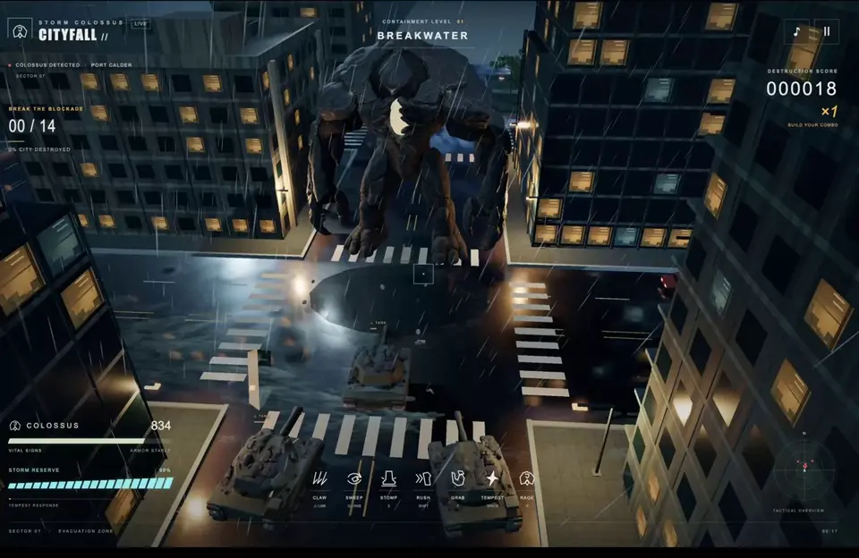</a><br>
<sub><a href="https://github.com/X-RayLuan/awesome-gpt-6-astra-prompts/blob/main/assets/videos/majid-kaiju-threejs-readme.mp4">▶ Play video</a> · <a href="https://x.com/majidmanzarpour/status/2096251574918013135">Original on X</a></sub>

_Kaiju-inspired playable Three.js game; models via Tripo, sound via ElevenLabs. Skill pack on GitHub._

**Prompt**

```text
Pair GPT-6 Astra with a Three.js game-dev skill pack to build an original kaiju-inspired playable browser game. Prioritize feel and polish. Use original creatures and arenas; do not copy commercial kaiju IP art. Credit third-party model/audio tools separately.
```

[Original post](https://x.com/majidmanzarpour/status/2096251574918013135) · [Remake with EasyVeo](https://easyveo.com?utm_source=github&utm_medium=referral&utm_campaign=awesome_gpt6_astra_prompts&utm_content=majid_kaiju_threejs) · [Back to examples](#all-prompts)

---

### Isometric ARPG → Blender trailer
<a id="mengto-isometric-arpg"></a>

[MengTo](https://x.com/MengTo) · community demo · GPT-6 Astra

<a href="https://github.com/X-RayLuan/awesome-gpt-6-astra-prompts/blob/main/assets/videos/mengto-isometric-arpg-readme.mp4">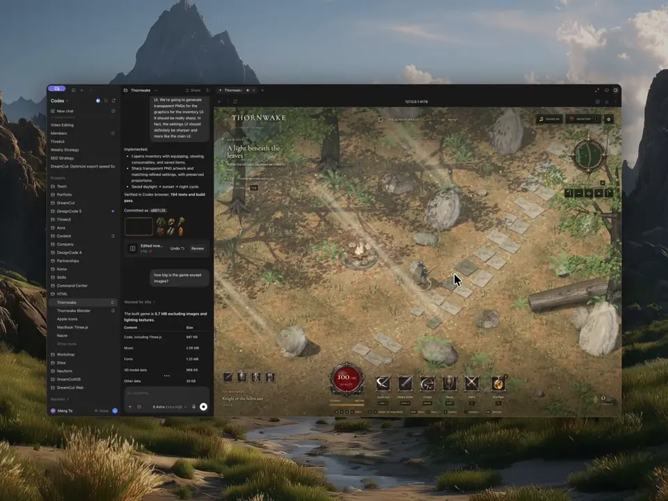</a><br>
<sub><a href="https://github.com/X-RayLuan/awesome-gpt-6-astra-prompts/blob/main/assets/videos/mengto-isometric-arpg-readme.mp4">▶ Play video</a> · <a href="https://x.com/MengTo/status/2096213835460084184">Original on X</a></sub>

_Procedural isometric action RPG in Three.js (<2MB before images/music), then every scene rebuilt in Blender for a trailer. UI icons via GPT Image 2._

**Prompt**

```text
Build an original isometric action RPG in Three.js mixing Elden Ring–paced exploration with Diablo-style loot, starting in a daytime forest. Keep geometry procedural (no asset packs) so the playable core stays tiny. Then recreate key scenes in Blender and cut a short trailer. Original world and creatures only — do not copy commercial game IP.
```

[Original post](https://x.com/MengTo/status/2096213835460084184) · [Remake with EasyVeo](https://easyveo.com?utm_source=github&utm_medium=referral&utm_campaign=awesome_gpt6_astra_prompts&utm_content=mengto_isometric_arpg) · [Back to examples](#all-prompts)

---

### Hollowflux
<a id="openai-showcase-hollowflux"></a>

[OpenAI Showcase](https://developers.openai.com/showcase/hollowflux) · Thomas Ricouard · official demo · GPT-6 Astra

<a href="https://developers.openai.com/showcase/hollowflux">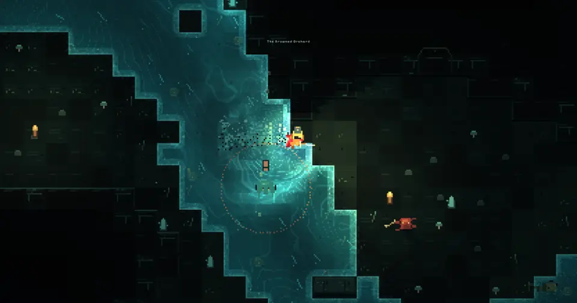</a><br>
<sub><a href="https://developers.openai.com/showcase/hollowflux">Open showcase</a></sub>

_A procedural dungeon crawler with combat shaped by reactive water._

**Prompt**

```text
Generate five concept images for a top-down pixel dungeon crawler with real-time combat and a procedural fluid engine. Keep characters, equipment, and monsters simple and readable. Explore distinct environments with reactive water, blood particles, metal sparks, and responsive lighting. Aim for atmosphere and systemic variety without copying commercial game IP.
```

[Showcase page](https://developers.openai.com/showcase/hollowflux) · [Remake with EasyVeo](https://easyveo.com?utm_source=github&utm_medium=referral&utm_campaign=awesome_gpt6_astra_prompts&utm_content=openai_showcase_hollowflux) · [Back to examples](#all-prompts)

---

### Sunwake
<a id="openai-showcase-sunwake"></a>

[OpenAI Showcase](https://developers.openai.com/showcase/sunwake) · Thomas Ricouard · official demo · GPT-6 Astra

<a href="https://developers.openai.com/showcase/sunwake">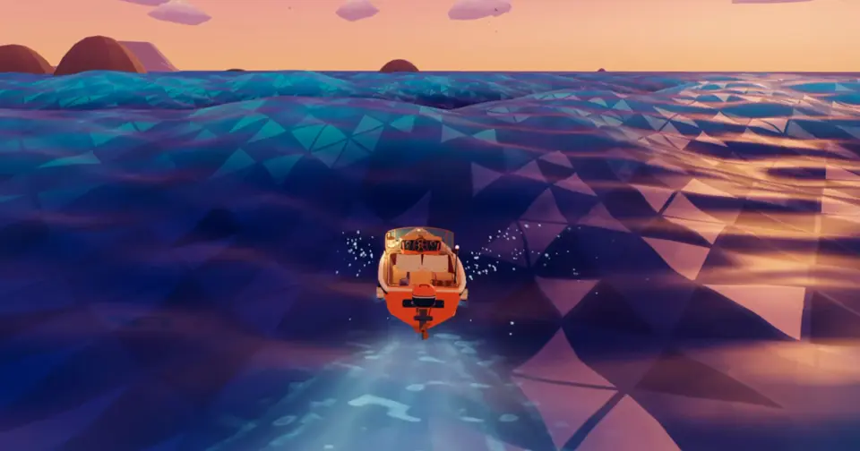</a><br>
<sub><a href="https://developers.openai.com/showcase/sunwake">Open showcase</a></sub>

_A sailing game about crossing wild seas and reaching lighthouses._

**Prompt**

```text
Generate concept images for a 3D boating game with high seas and large waves at sunrise — sunlight on water, spray, and droplets on camera. Prefer procedural geometry without imported sprites. Aim for extremely smooth movement and physics even if water looks retro/faceted.
```

[Showcase page](https://developers.openai.com/showcase/sunwake) · [Remake with EasyVeo](https://easyveo.com?utm_source=github&utm_medium=referral&utm_campaign=awesome_gpt6_astra_prompts&utm_content=openai_showcase_sunwake) · [Back to examples](#all-prompts)

---

### Void Explorer
<a id="openai-showcase-void-explorer"></a>

[OpenAI Showcase](https://developers.openai.com/showcase/void-explorer) · Thomas Ricouard · official demo · GPT-6 Astra

<a href="https://developers.openai.com/showcase/void-explorer">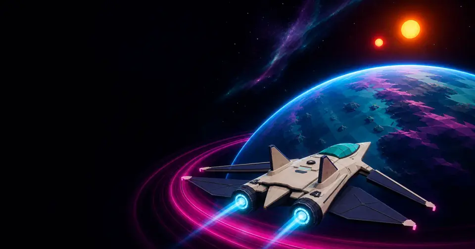</a><br>
<sub><a href="https://developers.openai.com/showcase/void-explorer">Open showcase</a></sub>

_A procedural space exploration game with planets to land on._

**Prompt**

```text
Generate concept art for a fully explorable procedural universe where every visible star and planet is reachable. Support acceleration, atmospheric descent, and ground views. Use retro-futurist neon 3D with strong contrast — not photoreal, not overly simplistic.
```

[Showcase page](https://developers.openai.com/showcase/void-explorer) · [Remake with EasyVeo](https://easyveo.com?utm_source=github&utm_medium=referral&utm_campaign=awesome_gpt6_astra_prompts&utm_content=openai_showcase_void-explorer) · [Back to examples](#all-prompts)

---

### Frame Studio
<a id="openai-showcase-frame-studio"></a>

[OpenAI Showcase](https://developers.openai.com/showcase/frame-studio) · Katia Gil Guzman · official demo · GPT-6 Astra

<a href="https://developers.openai.com/showcase/frame-studio"></a><br>
<sub><a href="https://developers.openai.com/showcase/frame-studio">Open showcase</a></sub>

_A portfolio site for a fictional motion design studio._

**Prompt**

```text
Build a polished interactive landing page for a fictional motion-design studio. Bold black/white with acid lime and ultramarine accents. Hero showreel with three original silent scenes and a scrubbable timeline that stays in sync with play/pause and scene selection. No real client logos or fabricated awards.
```

[Showcase page](https://developers.openai.com/showcase/frame-studio) · [Remake with EasyVeo](https://easyveo.com?utm_source=github&utm_medium=referral&utm_campaign=awesome_gpt6_astra_prompts&utm_content=openai_showcase_frame-studio) · [Back to examples](#all-prompts)

---

### Tidegarden
<a id="openai-showcase-tidegarden"></a>

[OpenAI Showcase](https://developers.openai.com/showcase/tidegarden) · Eric Provencher · official demo · GPT-6 Astra

<a href="https://developers.openai.com/showcase/tidegarden"></a><br>
<sub><a href="https://developers.openai.com/showcase/tidegarden">Open showcase</a></sub>

_A 3D tropical island with a living reef and rolling waves._

**Prompt**

```text
Create a tiny tropical island with a beach, grass, one palm, open ocean, and clouds. Use a believable realtime 3D reference (leaning palm, turquoise shallows, warm afternoon light) as the visual north star, then improve foliage, reef banks, refraction, and shoreline wash tied to traveling waves.
```

[Showcase page](https://developers.openai.com/showcase/tidegarden) · [Remake with EasyVeo](https://easyveo.com?utm_source=github&utm_medium=referral&utm_campaign=awesome_gpt6_astra_prompts&utm_content=openai_showcase_tidegarden) · [Back to examples](#all-prompts)

### EasyVeo decode → stills → remake
<a id="easyveo-remake-loop"></a>

[EasyVeo](https://easyveo.com) · remake the winner, keep your product

**Prompt**

```text
Authorized short ad clip (≤30s). Decode hook / pacing / proof / CTA (~18 elements). Produce product-true stills, then a Seedance 2.5 / multi-model remake that keeps my SKU. No invented ROAS.
```

[Original post](https://easyveo.com?utm_source=github&utm_medium=referral&utm_campaign=awesome_gpt6_astra_prompts&utm_content=entry_studio) · [Back to examples](#all-prompts)

---


### Little Ritual
<a id="openai-showcase-little-ritual"></a>

[OpenAI Showcase](https://developers.openai.com/showcase/little-ritual) · Jeff Wang · official demo · GPT-6 Astra

<a href="https://github.com/X-RayLuan/awesome-gpt-6-astra-prompts/blob/main/assets/videos/openai-showcase-little-ritual-readme.mp4"></a><br>
<sub><a href="https://github.com/X-RayLuan/awesome-gpt-6-astra-prompts/blob/main/assets/videos/openai-showcase-little-ritual-readme.mp4">▶ Play video</a> · <a href="https://github.com/X-RayLuan/awesome-gpt-6-astra-prompts/releases/download/media-v1/openai-showcase-little-ritual-readme.mp4">Download MP4</a> · <a href="https://developers.openai.com/showcase/little-ritual">Showcase</a></sub>

_A 3D coffee-delivery game on a small spherical world._

**Prompt**

```text
Build an original single-player 3D browser game about delivering coffee, set on a small, walkable spherical planet with a curved horizon. Give it a warm, stylized, cutesy look, mixing a compact town with quieter natural areas connected by paths around the globe. Include vertical exploration through stairs, upper floors, and bridges. Start the player in a café beside a coffee machine. Let them carry four visibly modeled coffees and explore to find neighbors, delivering to each once per round. Use a custom 3D interpretation of the Codex pet as the courier and other pets as neighbors. Keep discovery central, with interesting places to explore and small, playful interactions. Build the game modularly so we can change the world, characters, and mechanics easily.
```

[Showcase page](https://developers.openai.com/showcase/little-ritual) · [Remake with EasyVeo](https://easyveo.com?utm_source=github&utm_medium=referral&utm_campaign=awesome_gpt6_astra_prompts&utm_content=openai_showcase_little-ritual) · [Back to examples](#all-prompts)

---

### Velocity Loop
<a id="openai-showcase-velocity-loop"></a>

[OpenAI Showcase](https://developers.openai.com/showcase/velocity-loop) · VB Srivastav · official demo · GPT-6 Astra

<a href="https://github.com/X-RayLuan/awesome-gpt-6-astra-prompts/blob/main/assets/videos/openai-showcase-velocity-loop-readme.mp4">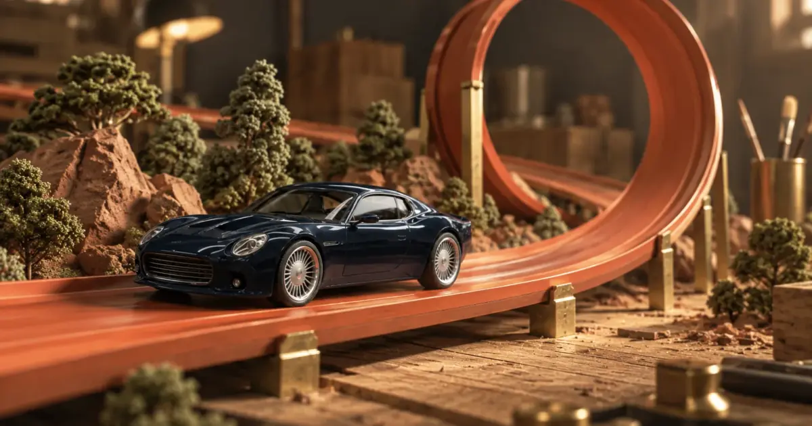</a><br>
<sub><a href="https://github.com/X-RayLuan/awesome-gpt-6-astra-prompts/blob/main/assets/videos/openai-showcase-velocity-loop-readme.mp4">▶ Play video</a> · <a href="https://github.com/X-RayLuan/awesome-gpt-6-astra-prompts/releases/download/media-v1/openai-showcase-velocity-loop-readme.mp4">Download MP4</a> · <a href="https://developers.openai.com/showcase/velocity-loop">Showcase</a></sub>

_A 3D toy-car time-trial game set in miniature workshops._

**Prompt**

```text
Generate a menu concept for a realistic, die-cast-style 3D racing game with loop-the-loop tracks and nitrous. Show five course choices, varying difficulty, three assist levels, and best-time records in a clear, readable layout.
```

[Showcase page](https://developers.openai.com/showcase/velocity-loop) · [Remake with EasyVeo](https://easyveo.com?utm_source=github&utm_medium=referral&utm_campaign=awesome_gpt6_astra_prompts&utm_content=openai_showcase_velocity-loop) · [Back to examples](#all-prompts)

---

### Abyssal
<a id="openai-showcase-abyssal-bioluminescent-ecosystem"></a>

[OpenAI Showcase](https://developers.openai.com/showcase/abyssal-bioluminescent-ecosystem) · VB Srivastav · official demo · GPT-6 Astra

<a href="https://developers.openai.com/showcase/abyssal-bioluminescent-ecosystem">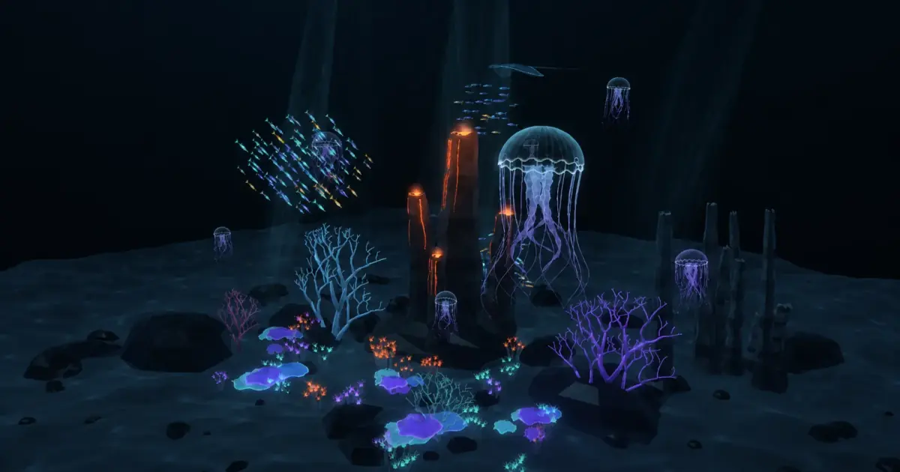</a><br>
<sub><a href="https://developers.openai.com/showcase/abyssal-bioluminescent-ecosystem">Open showcase</a></sub>

_A procedural underwater scene with bioluminescent marine life._

**Prompt**

```text
Build this interactive 3D experience as a single self-contained index.html that works offline. Keep the HTML, CSS, JavaScript, procedural geometry, textures, and shaders inline, with no external dependencies or downloaded assets. Use browser-native WebGL with a graceful fallback if unavailable. Support desktop and mobile, keyboard-accessible controls, pause/resume, and reduced motion. Keep animation smooth and rendering performance bounded.

Render an original deep-ocean ecosystem surrounding a hydrothermal vent and towering procedurally grown coral or mineral formations. Establish strong depth with underwater fog, volumetric-looking light shafts, animated caustic approximations, marine-snow particles, and a dark abyss beyond the habitat.
```

[Showcase page](https://developers.openai.com/showcase/abyssal-bioluminescent-ecosystem) · [Remake with EasyVeo](https://easyveo.com?utm_source=github&utm_medium=referral&utm_campaign=awesome_gpt6_astra_prompts&utm_content=openai_showcase_abyssal-bioluminescent-ecosystem) · [Back to examples](#all-prompts)

---

### Clockwork Observatory
<a id="openai-showcase-impossible-kinetic-architecture"></a>

[OpenAI Showcase](https://developers.openai.com/showcase/impossible-kinetic-architecture) · VB Srivastav · official demo · GPT-6 Astra

<a href="https://developers.openai.com/showcase/impossible-kinetic-architecture">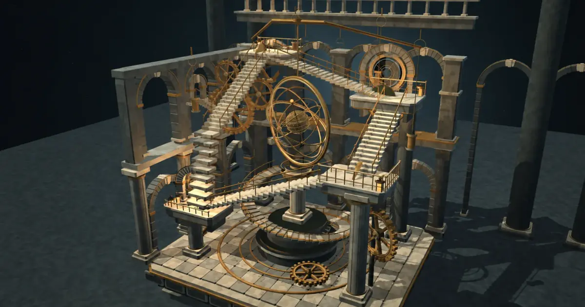</a><br>
<sub><a href="https://developers.openai.com/showcase/impossible-kinetic-architecture">Open showcase</a></sub>

_An interactive 3D scene of a transforming mechanical observatory._

**Prompt**

```text
Build this interactive 3D experience as a single self-contained index.html that works offline. Keep the HTML, CSS, JavaScript, procedural geometry, textures, and shaders inline, with no external dependencies or downloaded assets. Use browser-native WebGL with a graceful fallback if unavailable. Support desktop and mobile, keyboard-accessible controls, pause/resume, and reduced motion. Keep animation smooth and rendering performance bounded.

Construct an original cinematic impossible observatory inspired by historical fantastical prison etchings and precise astronomical instruments, without copying any source image.
```

[Showcase page](https://developers.openai.com/showcase/impossible-kinetic-architecture) · [Remake with EasyVeo](https://easyveo.com?utm_source=github&utm_medium=referral&utm_campaign=awesome_gpt6_astra_prompts&utm_content=openai_showcase_impossible-kinetic-architecture) · [Back to examples](#all-prompts)

---

### Living Cell
<a id="openai-showcase-living-cell-cross-section"></a>

[OpenAI Showcase](https://developers.openai.com/showcase/living-cell-cross-section) · VB Srivastav · official demo · GPT-6 Astra

<a href="https://developers.openai.com/showcase/living-cell-cross-section">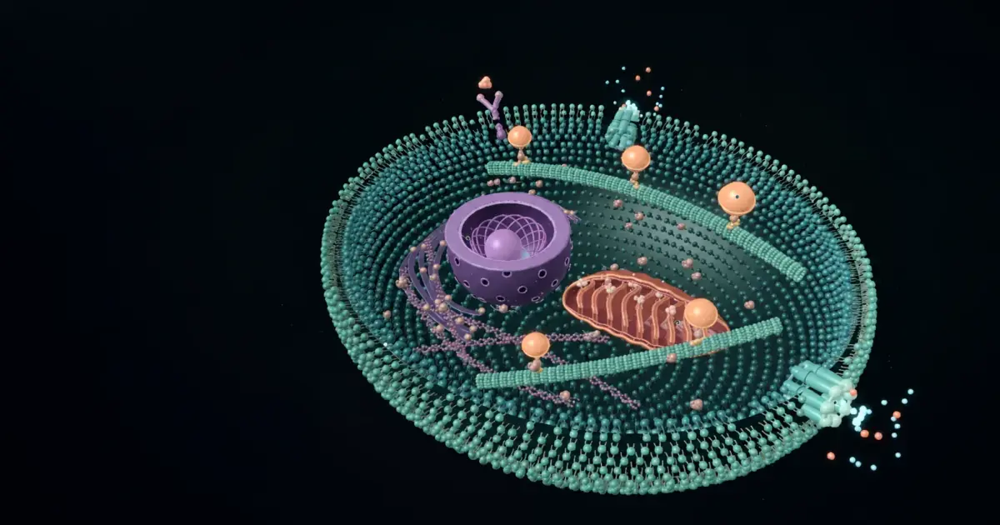</a><br>
<sub><a href="https://developers.openai.com/showcase/living-cell-cross-section">Open showcase</a></sub>

_An interactive 3D cell cross-section with inspectable structures._

**Prompt**

```text
Build this interactive 3D experience as a single self-contained index.html that works offline. Keep the HTML, CSS, JavaScript, procedural geometry, textures, and shaders inline, with no external dependencies or downloaded assets. Use browser-native WebGL with a graceful fallback if unavailable. Support desktop and mobile, keyboard-accessible controls, pause/resume, and reduced motion. Keep animation smooth and rendering performance bounded.

Build a luminous interactive cross-section of a living eukaryotic cell at molecular scale. Show an unmistakable phospholipid bilayer as two dense instanced layers with hydrophilic heads and paired hydrophobic tails. Animate membrane channels opening, receptor binding, and a selective concentration gradient of moving ions.
```

[Showcase page](https://developers.openai.com/showcase/living-cell-cross-section) · [Remake with EasyVeo](https://easyveo.com?utm_source=github&utm_medium=referral&utm_campaign=awesome_gpt6_astra_prompts&utm_content=openai_showcase_living-cell-cross-section) · [Back to examples](#all-prompts)

---

### Below the Surface
<a id="openai-showcase-below-the-surface"></a>

[OpenAI Showcase](https://developers.openai.com/showcase/below-the-surface) · Katia Gil Guzman · official demo · GPT-6 Astra

<a href="https://developers.openai.com/showcase/below-the-surface">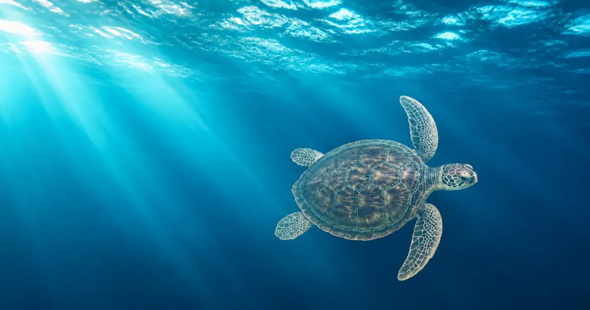</a><br>
<sub><a href="https://developers.openai.com/showcase/below-the-surface">Open showcase</a></sub>

_An interactive site for exploring five ocean zones._

**Prompt**

```text
Build a complete, polished, interactive landing page. Use clear, natural copy and a restrained layout with purposeful controls. Keep native scrolling, support phone and desktop layouts, keyboard controls, and reduced motion. The main interaction should work without a runtime AI call or account.

Scenario: Below the Surface is a digital ocean exhibition. A visitor scrolls from the sunlit surface into the deep sea, discovering how light, pressure and animals change with depth.
```

[Showcase page](https://developers.openai.com/showcase/below-the-surface) · [Remake with EasyVeo](https://easyveo.com?utm_source=github&utm_medium=referral&utm_campaign=awesome_gpt6_astra_prompts&utm_content=openai_showcase_below-the-surface) · [Back to examples](#all-prompts)

---

### Courtyard House
<a id="openai-showcase-courtyard-house"></a>

[OpenAI Showcase](https://developers.openai.com/showcase/courtyard-house) · Katia Gil Guzman · official demo · GPT-6 Astra

<a href="https://developers.openai.com/showcase/courtyard-house">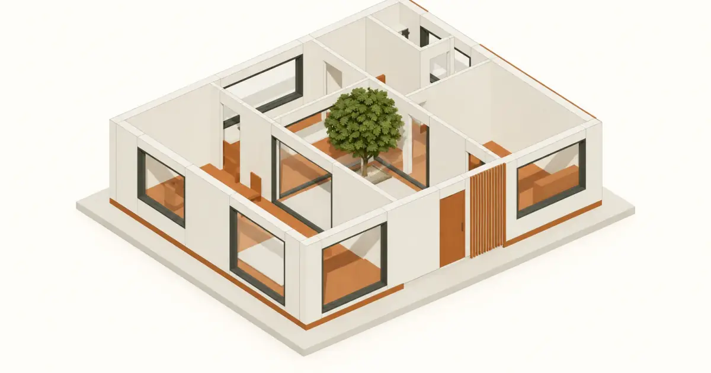</a><br>
<sub><a href="https://developers.openai.com/showcase/courtyard-house">Open showcase</a></sub>

_An interactive 3D tour of a compact courtyard home._

**Prompt**

```text
Build a complete, polished, interactive landing page. Use clear, natural copy and a restrained layout with purposeful controls. Keep native scrolling, support phone and desktop layouts, keyboard controls, and reduced motion. The main interaction should work without a runtime AI call or account.

Scenario: an architectural practice presents Courtyard House, an imagined compact home organized around a planted courtyard. The visitor wants to understand the plan, how spaces connect and how daylight moves through the building. This is a focused architecture-project landing page, not an interior moodboard generator.

Art direction: gallery white, charcoal drawing lines, natural oak and one restrained terracotta accent.
```

[Showcase page](https://developers.openai.com/showcase/courtyard-house) · [Remake with EasyVeo](https://easyveo.com?utm_source=github&utm_medium=referral&utm_campaign=awesome_gpt6_astra_prompts&utm_content=openai_showcase_courtyard-house) · [Back to examples](#all-prompts)

---

### Physics museum
<a id="openai-showcase-physics-museum"></a>

[OpenAI Showcase](https://developers.openai.com/showcase/physics-museum) · Katia Gil Guzman · official demo · GPT-6 Astra

<a href="https://developers.openai.com/showcase/physics-museum">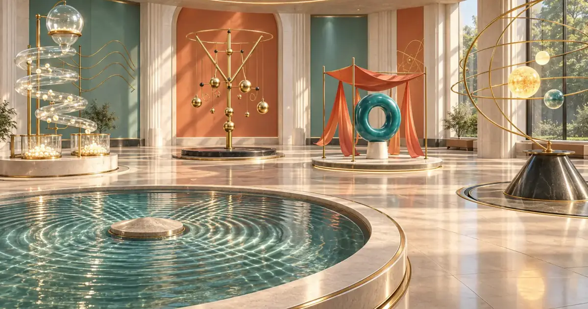</a><br>
<sub><a href="https://developers.openai.com/showcase/physics-museum">Open showcase</a></sub>

_A 3D science museum with five interactive exhibits._

**Prompt**

```text
Build a polished interactive science museum with five exhibits.

The concept
Create a beautiful museum that visitors move through in 3D. The museum and its sculptural exhibits must be authored in Blender, with editable .blend sources and a reproducible asset-generation script, then exported for the interactive web experience. Do not put a live model in the visitor experience: all five exhibits are authored in advance, and visitors play with their fixed interactions. No prompt field, chat interface, or runtime content generation.

This should feel like entering a small, extraordinary science museum: architectural daylight, pale mineral walls, a dark reflective floor used sparingly, brass details, translucent glass, carefully composed shadows, and restrained accents of color.
```

[Showcase page](https://developers.openai.com/showcase/physics-museum) · [Remake with EasyVeo](https://easyveo.com?utm_source=github&utm_medium=referral&utm_campaign=awesome_gpt6_astra_prompts&utm_content=openai_showcase_physics-museum) · [Back to examples](#all-prompts)

---

### Architecture Studio
<a id="openai-showcase-architecture-studio"></a>

[OpenAI Showcase](https://developers.openai.com/showcase/architecture-studio) · Katia Gil Guzman · official demo · GPT-6 Astra

<a href="https://developers.openai.com/showcase/architecture-studio">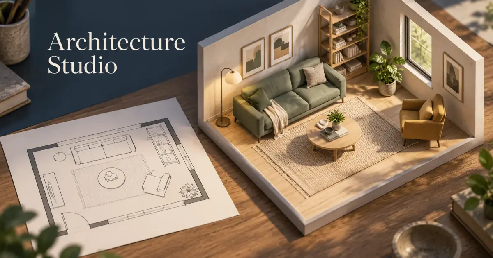</a><br>
<sub><a href="https://developers.openai.com/showcase/architecture-studio">Open showcase</a></sub>

_A room planner with a 2D floor plan and synchronized 3D view._

**Prompt**

```text
Build a room planner with one shared document powering a dimensioned 2D floor plan and a synchronized 3D view. Let people resize a rectangular room, place furniture from an original collection, move and rotate pieces, change finishes, and undo edits. Keep furniture editing in the plan and make the 3D view easy to orbit and inspect.
```

[Showcase page](https://developers.openai.com/showcase/architecture-studio) · [Remake with EasyVeo](https://easyveo.com?utm_source=github&utm_medium=referral&utm_campaign=awesome_gpt6_astra_prompts&utm_content=openai_showcase_architecture-studio) · [Back to examples](#all-prompts)

---

### Stop-Motion Desk
<a id="openai-showcase-stop-motion-desk"></a>

[OpenAI Showcase](https://developers.openai.com/showcase/stop-motion-desk) · Katia Gil Guzman · official demo · GPT-6 Astra

<a href="https://github.com/X-RayLuan/awesome-gpt-6-astra-prompts/blob/main/assets/videos/openai-showcase-stop-motion-desk-readme.mp4">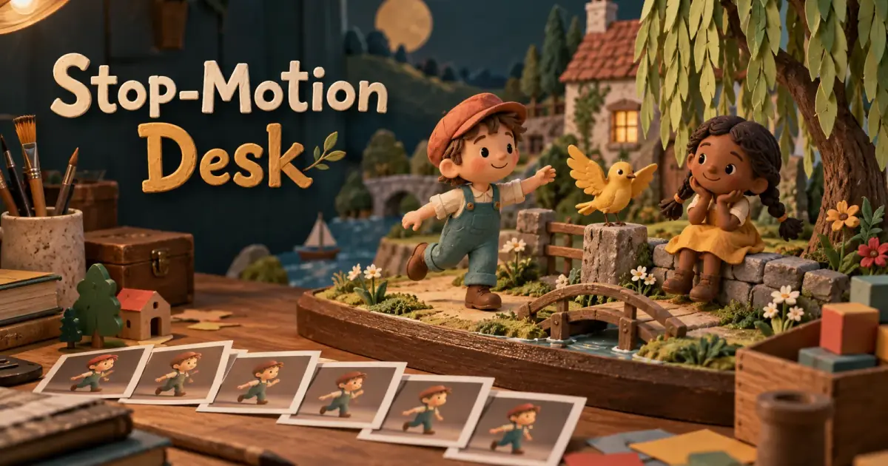</a><br>
<sub><a href="https://github.com/X-RayLuan/awesome-gpt-6-astra-prompts/blob/main/assets/videos/openai-showcase-stop-motion-desk-readme.mp4">▶ Play video</a> · <a href="https://github.com/X-RayLuan/awesome-gpt-6-astra-prompts/releases/download/media-v1/openai-showcase-stop-motion-desk-readme.mp4">Download MP4</a> · <a href="https://developers.openai.com/showcase/stop-motion-desk">Showcase</a></sub>

_A browser studio for posing 3D characters and making stop-motion animations._

**Prompt**

```text
Build a browser-based stop-motion studio with original 3D characters and props. Let people arrange a scene, adjust a character’s pose, capture frames, preview the animation at different speeds, and export a GIF. Include frame reordering, duplication, deletion, and a clear preview of the previous pose. Keep the creative work on a single stage with a simple timeline below it.
```

[Showcase page](https://developers.openai.com/showcase/stop-motion-desk) · [Remake with EasyVeo](https://easyveo.com?utm_source=github&utm_medium=referral&utm_campaign=awesome_gpt6_astra_prompts&utm_content=openai_showcase_stop-motion-desk) · [Back to examples](#all-prompts)

---


## Related indexes

- [OpenAI Developers Showcase](https://developers.openai.com/showcase) — official GPT / Codex / Astra demos
- [astra.directory](https://astra.directory) — galaxy index of independent Astra builds ([@AnupPandey_X](https://x.com/AnupPandey_X/status/2098828020652093444)). Soft listing contact: `hello@astra.directory`
- [pmer.cn Astra projects](https://pmer.cn/en/ai-tools/astra-projects/) — scored catalog ([@ai_pmer](https://x.com/ai_pmer/status/2098932007741063179))
- [thecrystalbears.com](https://www.thecrystalbears.com/) — games/books/site ([@JulianJenkins](https://x.com/JulianJenkins/status/2098858237667737960))
- This list welcomes PRs via [CONTRIBUTING.md](CONTRIBUTING.md); we prefer reciprocal links with the indexes above

## Share a good example

Open a PR — see [CONTRIBUTING.md](CONTRIBUTING.md). Prefer preview frames in `assets/`; keep full videos on X.

## Credits

Official demos also curated from [OpenAI Developers Showcase](https://developers.openai.com/showcase). Scraped from [@OpenAIDevs](https://x.com/OpenAIDevs) [GPT-6 Astra by our community](https://x.com/OpenAIDevs/status/2098827327832822014) article embeds + reply thread. Layout inspired by public awesome-list formats (not Tripo media). Product CTA: [EasyVeo](https://easyveo.com).

See [RIGHTS.md](RIGHTS.md).
