# Awesome GPT-6 Astra 提示词精选

[](https://github.com/sindresorhus/awesome) [](https://github.com/X-RayLuan/awesome-gpt-6-astra-prompts/stargazers) [](LICENSE) [](https://easyveo.com?utm_source=github&utm_medium=referral&utm_campaign=awesome_gpt6_astra_prompts&utm_content=zh_badge) [](CONTRIBUTING.md)

<p>
  <a href="README.md"></a>
  <a href="README.zh-CN.md"></a>
</p>

<a href="https://easyveo.com?utm_source=github&amp;utm_medium=referral&amp;utm_campaign=awesome_gpt6_astra_prompts&amp;utm_content=zh_readme_hero">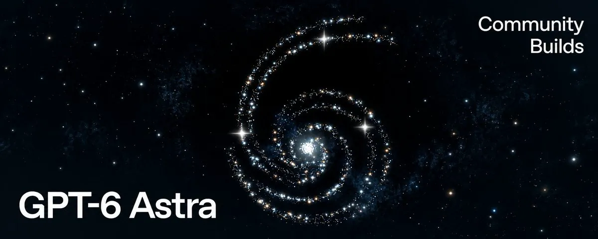</a>

**下一款 Astra 作品的起点 —— 或下一条 AI 视频广告复刻。**

精选整理自 [@OpenAIDevs](https://x.com/OpenAIDevs/status/2098827327832822014) （长文嵌入 + 评论区）的 GPT-6 Astra 社区演示，以及 EasyVeo 复刻提示词。

**32 个案例 · 中英双语文档 · EasyVeo 复刻车道 · CTA： [easyveo.com](https://easyveo.com?utm_source=github&utm_medium=referral&utm_campaign=awesome_gpt6_astra_prompts&utm_content=zh_lede)**

## 精选项目

<sub>点击缩略图或 ▶ 播放，在 GitHub 内置播放器打开视频。片段已压缩；完整原片在 X。</sub>

<table>
<tr>
<td width="50%" valign="top"><a href="https://github.com/X-RayLuan/awesome-gpt-6-astra-prompts/blob/main/assets/videos/nurm-alex-inkstorm-readme.mp4">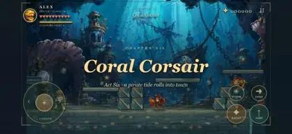</a><br><strong><a href="#alex-and-the-inkstorm">Alex 与墨雨风暴</a></strong><br><sub><a href="https://x.com/NURM_Dima/status/2096534403610562910">@NURM_Dima</a> · <a href="https://github.com/X-RayLuan/awesome-gpt-6-astra-prompts/blob/main/assets/videos/nurm-alex-inkstorm-readme.mp4">▶ 播放</a></sub><br><a href="#alex-and-the-inkstorm">提示词 →</a></td>
<td width="50%" valign="top"><a href="https://github.com/X-RayLuan/awesome-gpt-6-astra-prompts/blob/main/assets/videos/pallav-tron-lightcycle-readme.mp4">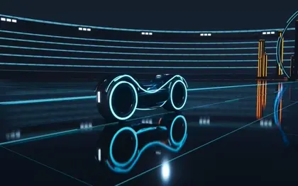</a><br><strong><a href="#tron-lightcycle-to-playable">光轮对战 → 可玩原型</a></strong><br><sub><a href="https://x.com/pallavmac/status/2097016391903657991">@pallavmac</a> · <a href="https://github.com/X-RayLuan/awesome-gpt-6-astra-prompts/blob/main/assets/videos/pallav-tron-lightcycle-readme.mp4">▶ 播放</a></sub><br><a href="#tron-lightcycle-to-playable">提示词 →</a></td>
</tr>
<tr>
<td width="50%" valign="top"><a href="https://github.com/X-RayLuan/awesome-gpt-6-astra-prompts/blob/main/assets/videos/miki-4d-chess-readme.mp4">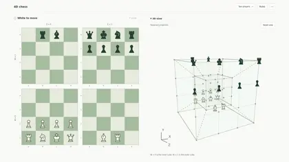</a><br><strong><a href="#miki-4d-chess">可玩四维象棋</a></strong><br><sub><a href="https://x.com/miki_code/status/2096132455652549117">@miki_code</a> · <a href="https://github.com/X-RayLuan/awesome-gpt-6-astra-prompts/blob/main/assets/videos/miki-4d-chess-readme.mp4">▶ 播放</a></sub><br><a href="#miki-4d-chess">提示词 →</a></td>
<td width="50%" valign="top"><a href="https://github.com/X-RayLuan/awesome-gpt-6-astra-prompts/blob/main/assets/videos/scribble-tanks-readme.mp4">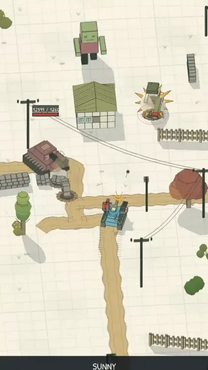</a><br><strong><a href="#scribble-tanks">Scribble Tanks 涂鸦坦克</a></strong><br><sub><a href="https://x.com/shortaktien/status/2098874536028410196">@shortaktien</a> · <a href="https://github.com/X-RayLuan/awesome-gpt-6-astra-prompts/blob/main/assets/videos/scribble-tanks-readme.mp4">▶ 播放</a></sub><br><a href="#scribble-tanks">提示词 →</a></td>
</tr>
</table>

<a id="all-prompts"></a>

## 最新 Astra 提示词

<details>
<summary>浏览全部案例</summary>

- [Alex 与墨雨风暴](#alex-and-the-inkstorm) · video
- [光轮对战 → 可玩原型](#tron-lightcycle-to-playable) · video
- [可玩四维象棋](#miki-4d-chess) · @miki_code
- [Scribble Tanks 涂鸦坦克](#scribble-tanks) · @shortaktien
- [几何 Logo 动效风格](#openai-logo-geo) · @globalainomad
- [浏览器波表合成器](#wavetable-synth) · @android_stern
- [淹城上空的龙骑飞行](#panzer-dragon) · @yasei_no_otoko
- [Spline Rush 竞速](#spline-rush) · @dandumt23
- [Aetherfall：暮光广域](#aetherfall) · @dandumt23
- [SOLIFAN 爆炸视图职场](#solifan) · @solid_fdn
- [浏览器节奏游戏（Thumper 感）](#thumper-rhythm) · @GZhan57
- [Blob 物理小游戏](#blob-game) · @SimonasLTU1
- [Blender × Seedance 一镜到底](#blender-seedance) · @KanaWorks_AI
- [新干线崩溃恐慌短片](#shinkansen-panic) · @KanaWorks_AI
- [RP2040 PCB Studio 原型](#rp2040-pcb) · @PinoZlatan
- [互动高中数学课](#hs-math) · @Xian0063
- [Astra.directory 星系索引](#astra-directory) · @AnupPandey_X
- [2234 个解剖部件 3D 浏览器](#anatomical-atlas-3d)
- [Unreal 中的曼哈顿](#manhattan-unreal)
- [梵高画作 → 可走 Three.js 小镇](#van-gogh-threejs-town)
- [AR 扫地覆盖可视化](#sweep-ar)
- [火车线稿 → Blender（3295 物体）](#train-blender)
- [水下浏览器游戏](#underwater-browser-game)
- [图片 → 定制乐高式设计](#lego-designs)
- [混合现实空管（Unity）](#air-traffic-unity)
- [录屏 → 可交互界面](#screen-to-ui)
- [浏览器竞速（Three.js）](#browser-racing)
- [Blender 后室（VHS）](#backrooms-blender)
- [ESP32 工作台可视化](#esp32-workbench)
- [iPhone GPU 上的 Swift 光线追踪](#swift-ray-tracer)
- [GPT-6 + Blender → Seedance 2.5 工作流](#tanluai-gpt6-blender-seedance) · @TanLuAI
- [EasyVeo：拆解 → 分镜静帧 → 复刻](#easyveo-remake-loop)

</details>

---

### Alex 与墨雨风暴
<a id="alex-and-the-inkstorm"></a>

[NURM_Dima](https://x.com/NURM_Dima) · 回复线程

<a href="https://github.com/X-RayLuan/awesome-gpt-6-astra-prompts/blob/main/assets/videos/nurm-alex-inkstorm-readme.mp4">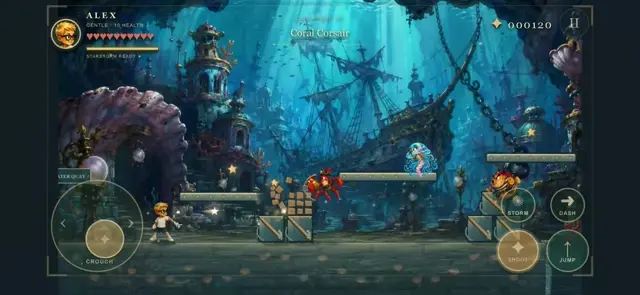</a><br>
<sub><a href="https://github.com/X-RayLuan/awesome-gpt-6-astra-prompts/blob/main/assets/videos/nurm-alex-inkstorm-readme.mp4">▶ 播放视频</a> · <a href="https://github.com/X-RayLuan/awesome-gpt-6-astra-prompts/releases/download/media-v1/nurm-alex-inkstorm-readme.mp4">下载 MP4</a></sub>

**提示词（英文原文）**

```text
I uploaded a photo. Make this person the hero of an original platformer with multiple worlds, distinct enemies and bosses, and a gentle difficulty mode. Deliver a playable prototype plan (web or iOS). Do not copy commercial game IP.
```

**中文简述**

上传一张照片，让此人成为原创平台跳跃游戏主角：多世界、独立敌人与 Boss、温和难度；交付可玩原型方案（Web/iOS），勿抄商业 IP。

[原帖](https://x.com/NURM_Dima/status/2096534403610562910) · [返回列表](#all-prompts)

---

### 光轮对战 → 可玩原型
<a id="tron-lightcycle-to-playable"></a>

[pallavmac](https://x.com/pallavmac) · 回复线程

<a href="https://github.com/X-RayLuan/awesome-gpt-6-astra-prompts/blob/main/assets/videos/pallav-tron-lightcycle-readme.mp4">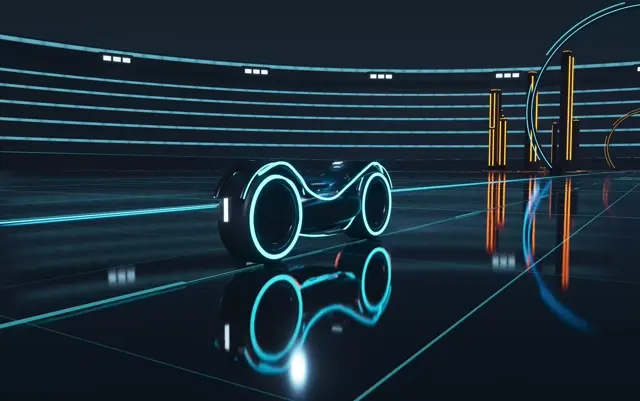</a><br>
<sub><a href="https://github.com/X-RayLuan/awesome-gpt-6-astra-prompts/blob/main/assets/videos/pallav-tron-lightcycle-readme.mp4">▶ 播放视频</a> · <a href="https://github.com/X-RayLuan/awesome-gpt-6-astra-prompts/releases/download/media-v1/pallav-tron-lightcycle-readme.mp4">下载 MP4</a></sub>

**提示词（英文原文）**

```text
Render a lightcycle-style arena battle in Blender, then port a playable slice to Unreal (or Three.js) for desktop and ideally iOS. Prioritize feel. Do not bundle copyrighted audio without a license.
```

**中文简述**

先做光轮竞技场渲染，再移植可玩切片到 Unreal/Three.js；优先手感，勿擅自打包无版权音频。

[原帖](https://x.com/pallavmac/status/2097016391903657991) · [返回列表](#all-prompts)

---

### 可玩四维象棋
<a id="miki-4d-chess"></a>

[@miki_code](https://x.com/miki_code) · 回复线程

<a href="https://github.com/X-RayLuan/awesome-gpt-6-astra-prompts/blob/main/assets/videos/miki-4d-chess-readme.mp4"></a><br>
<sub><a href="https://github.com/X-RayLuan/awesome-gpt-6-astra-prompts/blob/main/assets/videos/miki-4d-chess-readme.mp4">▶ 播放视频</a> · <a href="https://github.com/X-RayLuan/awesome-gpt-6-astra-prompts/releases/download/media-v1/miki-4d-chess-readme.mp4">下载 MP4</a></sub>

**提示词（英文原文）**

```text
Build a playable 4D chess prototype with clear piece moves across a fourth dimension and readable UI.
```

**中文简述**

做可玩四维象棋原型：第四维走法清晰、UI 可读。

[原帖](https://x.com/miki_code/status/2096132455652549117) · [返回列表](#all-prompts)

---

### Scribble Tanks 涂鸦坦克
<a id="scribble-tanks"></a>

[@shortaktien](https://x.com/shortaktien) · 回复线程

<a href="https://github.com/X-RayLuan/awesome-gpt-6-astra-prompts/blob/main/assets/videos/scribble-tanks-readme.mp4"></a><br>
<sub><a href="https://github.com/X-RayLuan/awesome-gpt-6-astra-prompts/blob/main/assets/videos/scribble-tanks-readme.mp4">▶ 播放视频</a> · <a href="https://github.com/X-RayLuan/awesome-gpt-6-astra-prompts/releases/download/media-v1/scribble-tanks-readme.mp4">下载 MP4</a></sub>

**提示词（英文原文）**

```text
Build Scribble Tanks 涂鸦坦克: a playful tank sandbox with weather, physics, animals, water, and zombies. Prioritize feel.
```

**中文简述**

涂鸦坦克沙盒：天气、物理、动物、水与僵尸；优先手感。

[原帖](https://x.com/shortaktien/status/2098874536028410196) · [返回列表](#all-prompts)

---

### 几何 Logo 动效风格
<a id="openai-logo-geo"></a>

[@globalainomad](https://x.com/globalainomad) · 回复线程

<a href="https://x.com/globalainomad/status/2098833443501310063">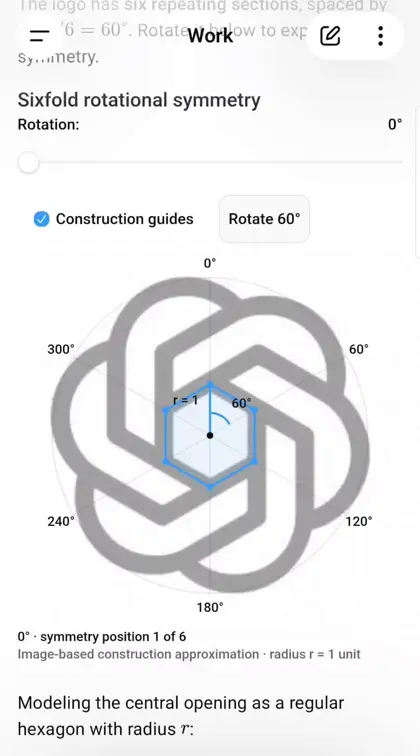</a>

**提示词（英文原文）**

```text
Generate a geometric, motion-friendly take inspired by a logo silhouette. Keep it original; do not copy trademarked marks into a commercial asset.
```

**中文简述**

几何、适合动效的剪影风格；保持原创，勿把商标直接做成商用素材。

[原帖](https://x.com/globalainomad/status/2098833443501310063) · [返回列表](#all-prompts)

---

### 浏览器波表合成器
<a id="wavetable-synth"></a>

[@android_stern](https://x.com/android_stern) · 回复线程

<a href="https://x.com/android_stern/status/2098834316126028265">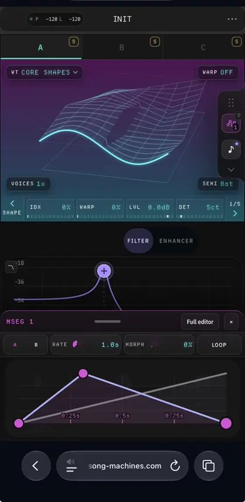</a>

**提示词（英文原文）**

```text
Build a browser wavetable synth with modulation, an FX graph, and bounce-to-sampler. Ship a playable web demo.
```

**中文简述**

浏览器波表合成器：调制、FX 图、导出采样；交付可玩网页 Demo。

[原帖](https://x.com/android_stern/status/2098834316126028265) · [返回列表](#all-prompts)

---

### 淹城上空的龙骑飞行
<a id="panzer-dragon"></a>

[@yasei_no_otoko](https://x.com/yasei_no_otoko) · 回复线程

<a href="https://github.com/X-RayLuan/awesome-gpt-6-astra-prompts/blob/main/assets/videos/panzer-dragon-readme.mp4">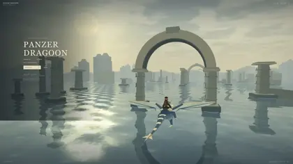</a><br>
<sub><a href="https://github.com/X-RayLuan/awesome-gpt-6-astra-prompts/blob/main/assets/videos/panzer-dragon-readme.mp4">▶ 播放视频</a> · <a href="https://github.com/X-RayLuan/awesome-gpt-6-astra-prompts/releases/download/media-v1/panzer-dragon-readme.mp4">下载 MP4</a></sub>

**提示词（英文原文）**

```text
Create a Panzer Dragoon–style dragon flight over a flooded city. Original creatures and city; do not copy commercial IP art.
```

**中文简述**

淹城上空龙骑飞行（Panzer Dragoon 感）；原创生物与城市，勿抄商业 IP 美术。

[原帖](https://x.com/yasei_no_otoko/status/2098833173623005666) · [返回列表](#all-prompts)

---

### Spline Rush 竞速
<a id="spline-rush"></a>

[@dandumt23](https://x.com/dandumt23) · 回复线程

<a href="https://github.com/X-RayLuan/awesome-gpt-6-astra-prompts/blob/main/assets/videos/spline-rush-readme.mp4">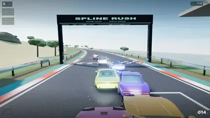</a><br>
<sub><a href="https://github.com/X-RayLuan/awesome-gpt-6-astra-prompts/blob/main/assets/videos/spline-rush-readme.mp4">▶ 播放视频</a> · <a href="https://github.com/X-RayLuan/awesome-gpt-6-astra-prompts/releases/download/media-v1/spline-rush-readme.mp4">下载 MP4</a></sub>

**提示词（英文原文）**

```text
One-shot racing game Spline Rush on Azure Coast: satisfying handling, instant retry, polished track.
```

**中文简述**

一镜竞速 Spline Rush：操控爽、秒重开、赛道打磨。

[原帖](https://x.com/dandumt23/status/2098839458195939612) · [返回列表](#all-prompts)

---

### Aetherfall：暮光广域
<a id="aetherfall"></a>

[@dandumt23](https://x.com/dandumt23) · 回复线程

<a href="https://github.com/X-RayLuan/awesome-gpt-6-astra-prompts/blob/main/assets/videos/aetherfall-readme.mp4">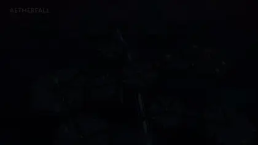</a><br>
<sub><a href="https://github.com/X-RayLuan/awesome-gpt-6-astra-prompts/blob/main/assets/videos/aetherfall-readme.mp4">▶ 播放视频</a> · <a href="https://github.com/X-RayLuan/awesome-gpt-6-astra-prompts/releases/download/media-v1/aetherfall-readme.mp4">下载 MP4</a></sub>

**提示词（英文原文）**

```text
Dark platformer across linked islands: Aetherfall — Twilight Expanse. Readable silhouettes, tight jumps.
```

**中文简述**

跨岛黑暗平台跳跃：剪影可读、跳跃紧。

[原帖](https://x.com/dandumt23/status/2098839718020382983) · [返回列表](#all-prompts)

---

### SOLIFAN 爆炸视图职场
<a id="solifan"></a>

[@solid_fdn](https://x.com/solid_fdn) · 回复线程

<a href="https://github.com/X-RayLuan/awesome-gpt-6-astra-prompts/blob/main/assets/videos/solifan-readme.mp4">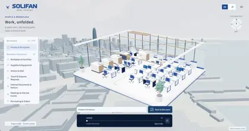</a><br>
<sub><a href="https://github.com/X-RayLuan/awesome-gpt-6-astra-prompts/blob/main/assets/videos/solifan-readme.mp4">▶ 播放视频</a> · <a href="https://github.com/X-RayLuan/awesome-gpt-6-astra-prompts/releases/download/media-v1/solifan-readme.mp4">下载 MP4</a></sub>

**提示词（英文原文）**

```text
Exploded 3D workplace over a city map with hundreds of moving parts and clear camera choreography.
```

**中文简述**

城市地图上的爆炸视图职场：数百活动件 + 清晰镜头编排。

[原帖](https://x.com/solid_fdn/status/2098910304163991874) · [返回列表](#all-prompts)

---

### 浏览器节奏游戏（Thumper 感）
<a id="thumper-rhythm"></a>

[@GZhan57](https://x.com/GZhan57) · 回复线程

<a href="https://github.com/X-RayLuan/awesome-gpt-6-astra-prompts/blob/main/assets/videos/thumper-rhythm-readme.mp4">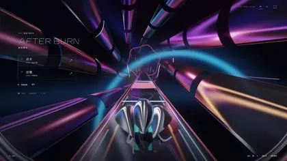</a><br>
<sub><a href="https://github.com/X-RayLuan/awesome-gpt-6-astra-prompts/blob/main/assets/videos/thumper-rhythm-readme.mp4">▶ 播放视频</a> · <a href="https://github.com/X-RayLuan/awesome-gpt-6-astra-prompts/releases/download/media-v1/thumper-rhythm-readme.mp4">下载 MP4</a></sub>

**提示词（英文原文）**

```text
Browser rhythm game inspired by Thumper feel using WASM + WebGPU. Original track art; do not copy commercial IP.
```

**中文简述**

WASM+WebGPU 浏览器节奏游戏（Thumper 感）；原创轨道美术，勿抄商业 IP。

[原帖](https://x.com/GZhan57/status/2098555255596450022) · [返回列表](#all-prompts)

---

### Blob 物理小游戏
<a id="blob-game"></a>

[@SimonasLTU1](https://x.com/SimonasLTU1) · 回复线程

<a href="https://x.com/SimonasLTU1/status/2098011856128332214">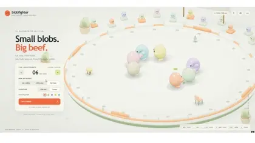</a>

**提示词（英文原文）**

```text
Build a polished blob physics game. Note model used (Astra or other) in the README.
```

**中文简述**

打磨 Blob 物理小游戏；在 README 注明所用模型。

[原帖](https://x.com/SimonasLTU1/status/2098011856128332214) · [返回列表](#all-prompts)

---

### Blender × Seedance 一镜到底
<a id="blender-seedance"></a>

[@KanaWorks_AI](https://x.com/KanaWorks_AI) · 回复线程

<a href="https://github.com/X-RayLuan/awesome-gpt-6-astra-prompts/blob/main/assets/videos/blender-seedance-readme.mp4">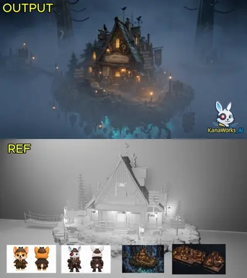</a><br>
<sub><a href="https://github.com/X-RayLuan/awesome-gpt-6-astra-prompts/blob/main/assets/videos/blender-seedance-readme.mp4">▶ 播放视频</a> · <a href="https://github.com/X-RayLuan/awesome-gpt-6-astra-prompts/releases/download/media-v1/blender-seedance-readme.mp4">下载 MP4</a></sub>

**提示词（英文原文）**

```text
Blender × Seedance 2.5 one-take: prefer open scenes over cluttered interiors; keep camera continuous.
```

**中文简述**

Blender × Seedance 2.5 一镜：偏开阔场景，镜头连续。

[原帖](https://x.com/KanaWorks_AI/status/2098586768174203155) · [返回列表](#all-prompts)

---

### 新干线崩溃恐慌短片
<a id="shinkansen-panic"></a>

[@KanaWorks_AI](https://x.com/KanaWorks_AI) · 回复线程

<a href="https://x.com/KanaWorks_AI/status/2097604098900021513">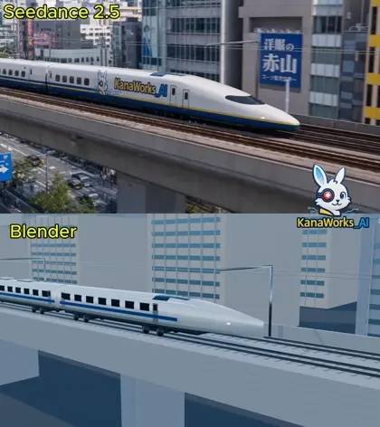</a>

**提示词（英文原文）**

```text
Blender × Seedance panic-film piece with a shinkansen crash motif. Fictional; no real-incident claims.
```

**中文简述**

Blender × Seedance 恐慌短片（新干线崩溃母题）；虚构，勿声称真实事故。

[原帖](https://x.com/KanaWorks_AI/status/2097604098900021513) · [返回列表](#all-prompts)

---

### RP2040 PCB Studio 原型
<a id="rp2040-pcb"></a>

[@PinoZlatan](https://x.com/PinoZlatan) · 回复线程

<a href="https://x.com/PinoZlatan/status/2098945126563205268">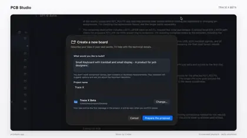</a>

**提示词（英文原文）**

```text
RP2040 controller: schematic, BOM, provisional 3D in a PCB studio app. Document assumptions.
```

**中文简述**

RP2040：原理图、BOM、PCB Studio 临时 3D；写清假设。

[原帖](https://x.com/PinoZlatan/status/2098945126563205268) · [返回列表](#all-prompts)

---

### 互动高中数学课
<a id="hs-math"></a>

[@Xian0063](https://x.com/Xian0063) · 回复线程

<a href="https://x.com/Xian0063/status/2096046406951903398">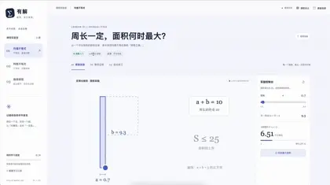</a>

**提示词（英文原文）**

```text
互动高中数学课 course with lessons, manipulables, and software delivery.
```

**中文简述**

互动高中数学：课时、可操作控件、软件交付。

[原帖](https://x.com/Xian0063/status/2096046406951903398) · [返回列表](#all-prompts)

---

### Astra.directory 星系索引
<a id="astra-directory"></a>

[@AnupPandey_X](https://x.com/AnupPandey_X) · 回复线程

<a href="https://x.com/AnupPandey_X/status/2098828020652093444">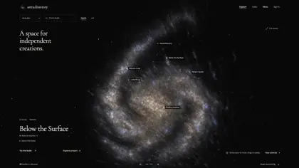</a>

**提示词（英文原文）**

```text
Galaxy-style index of independent Astra builds with links out to each project.
```

**中文简述**

星系风格索引，链出各独立 Astra 项目。

[原帖](https://x.com/AnupPandey_X/status/2098828020652093444) · [返回列表](#all-prompts)

---

### 2234 个解剖部件 3D 浏览器
<a id="anatomical-atlas-3d"></a>

OpenAIDevs 长文

<a href="https://github.com/X-RayLuan/awesome-gpt-6-astra-prompts/blob/main/assets/videos/anatomical-atlas-3d-readme.mp4">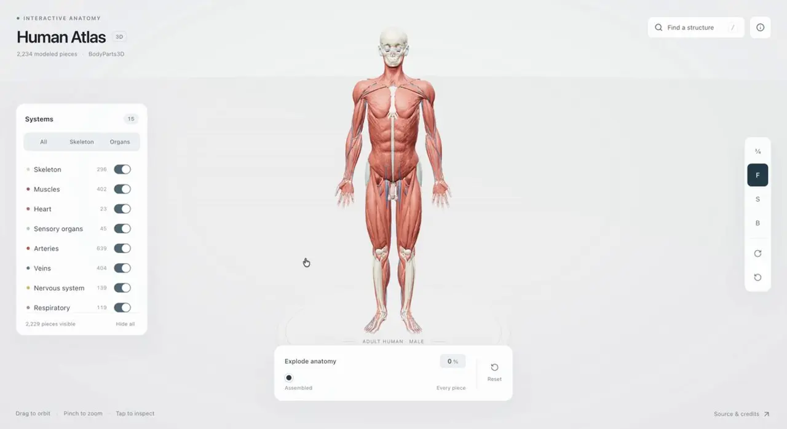</a><br>
<sub><a href="https://github.com/X-RayLuan/awesome-gpt-6-astra-prompts/blob/main/assets/videos/anatomical-atlas-3d-readme.mp4">▶ 播放视频</a> · <a href="https://github.com/X-RayLuan/awesome-gpt-6-astra-prompts/releases/download/media-v1/anatomical-atlas-3d-readme.mp4">下载 MP4</a></sub>

**提示词（英文原文）**

```text
Build an interactive 3D anatomical explorer with thousands of selectable parts, layered visibility, search, and a clean educational UI. Use appropriately licensed meshes. Do not claim clinical validation.
```

**中文简述**

数千可点选解剖部件的互动 3D 浏览器；用合规网格，勿宣称临床验证。

[原帖](https://x.com/i/web/status/2096221988763173186) · [返回列表](#all-prompts)

---

### Unreal 中的曼哈顿
<a id="manhattan-unreal"></a>

OpenAIDevs 长文

<a href="https://github.com/X-RayLuan/awesome-gpt-6-astra-prompts/blob/main/assets/videos/manhattan-unreal-readme.mp4">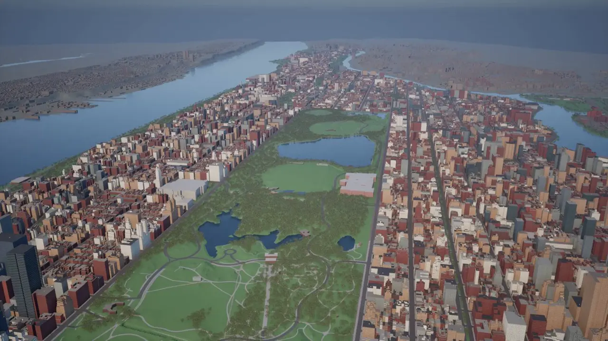</a><br>
<sub><a href="https://github.com/X-RayLuan/awesome-gpt-6-astra-prompts/blob/main/assets/videos/manhattan-unreal-readme.mp4">▶ 播放视频</a> · <a href="https://github.com/X-RayLuan/awesome-gpt-6-astra-prompts/releases/download/media-v1/manhattan-unreal-readme.mp4">下载 MP4</a></sub>

**提示词（英文原文）**

```text
Recreate a recognizable Manhattan slice in Unreal Engine with readable landmarks, daylight, and a flythrough camera.
```

**中文简述**

在 Unreal 复刻可读曼哈顿切片：地标、日光、飞越镜头。

[原帖](https://x.com/i/web/status/2095609734845927525) · [返回列表](#all-prompts)

---

### 梵高画作 → 可走 Three.js 小镇
<a id="van-gogh-threejs-town"></a>

OpenAIDevs 长文

<a href="https://github.com/X-RayLuan/awesome-gpt-6-astra-prompts/blob/main/assets/videos/van-gogh-threejs-town-readme.mp4">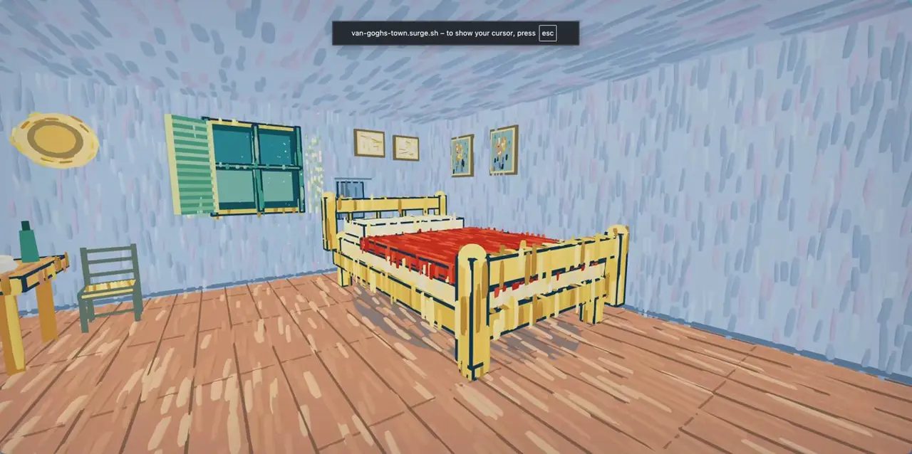</a><br>
<sub><a href="https://github.com/X-RayLuan/awesome-gpt-6-astra-prompts/blob/main/assets/videos/van-gogh-threejs-town-readme.mp4">▶ 播放视频</a> · <a href="https://github.com/X-RayLuan/awesome-gpt-6-astra-prompts/releases/download/media-v1/van-gogh-threejs-town-readme.mp4">下载 MP4</a></sub>

**提示词（英文原文）**

```text
Turn a set of paintings into a walkable miniature town in Three.js. Preserve motifs, prioritize camera readability, ship one self-contained HTML demo.
```

**中文简述**

一组画作变成可走的 Three.js 微缩镇；保留母题，优先镜头可读。

[原帖](https://x.com/i/web/status/2095776685807346105) · [返回列表](#all-prompts)

---

### AR 扫地覆盖可视化
<a id="sweep-ar"></a>

OpenAIDevs 长文

<a href="https://github.com/X-RayLuan/awesome-gpt-6-astra-prompts/blob/main/assets/videos/sweep-ar-readme.mp4">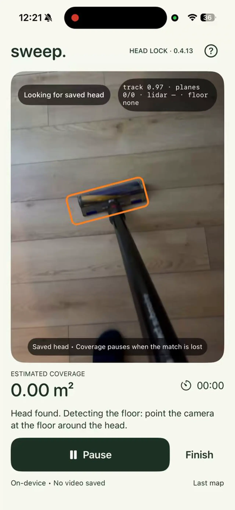</a><br>
<sub><a href="https://github.com/X-RayLuan/awesome-gpt-6-astra-prompts/blob/main/assets/videos/sweep-ar-readme.mp4">▶ 播放视频</a> · <a href="https://github.com/X-RayLuan/awesome-gpt-6-astra-prompts/releases/download/media-v1/sweep-ar-readme.mp4">下载 MP4</a></sub>

**提示词（英文原文）**

```text
Build an AR prototype that visualizes vacuum / coverage maps over a room with clear progress feedback.
```

**中文简述**

AR 原型：房间覆盖/清扫进度可视化。

[原帖](https://x.com/i/web/status/2096711155762782411) · [返回列表](#all-prompts)

---

### 火车线稿 → Blender（3295 物体）
<a id="train-blender"></a>

OpenAIDevs 长文

<a href="https://github.com/X-RayLuan/awesome-gpt-6-astra-prompts/blob/main/assets/videos/train-blender-readme.mp4">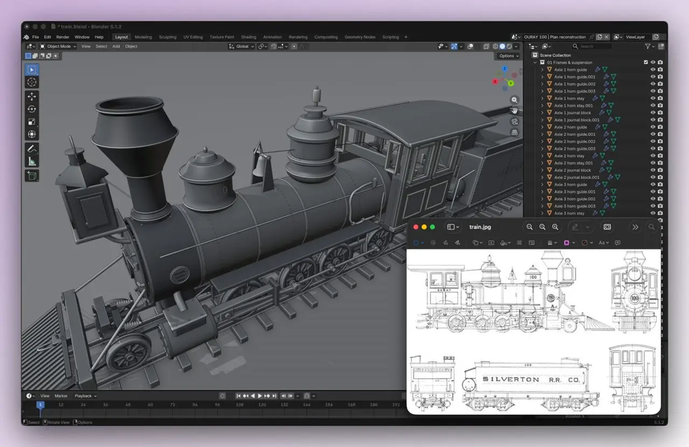</a><br>
<sub><a href="https://github.com/X-RayLuan/awesome-gpt-6-astra-prompts/blob/main/assets/videos/train-blender-readme.mp4">▶ 播放视频</a> · <a href="https://github.com/X-RayLuan/awesome-gpt-6-astra-prompts/releases/download/media-v1/train-blender-readme.mp4">下载 MP4</a></sub>

**提示词（英文原文）**

```text
Take a train line drawing and build a fully editable Blender model with a deep object hierarchy. Export stills + orbit.
```

**中文简述**

火车线稿建成可编辑 Blender 深层级模型；导出静帧+环绕。

[原帖](https://x.com/i/web/status/2095756085890310311) · [返回列表](#all-prompts)

---

### 水下浏览器游戏
<a id="underwater-browser-game"></a>

OpenAIDevs 长文

<a href="https://github.com/X-RayLuan/awesome-gpt-6-astra-prompts/blob/main/assets/videos/underwater-browser-game-readme.mp4">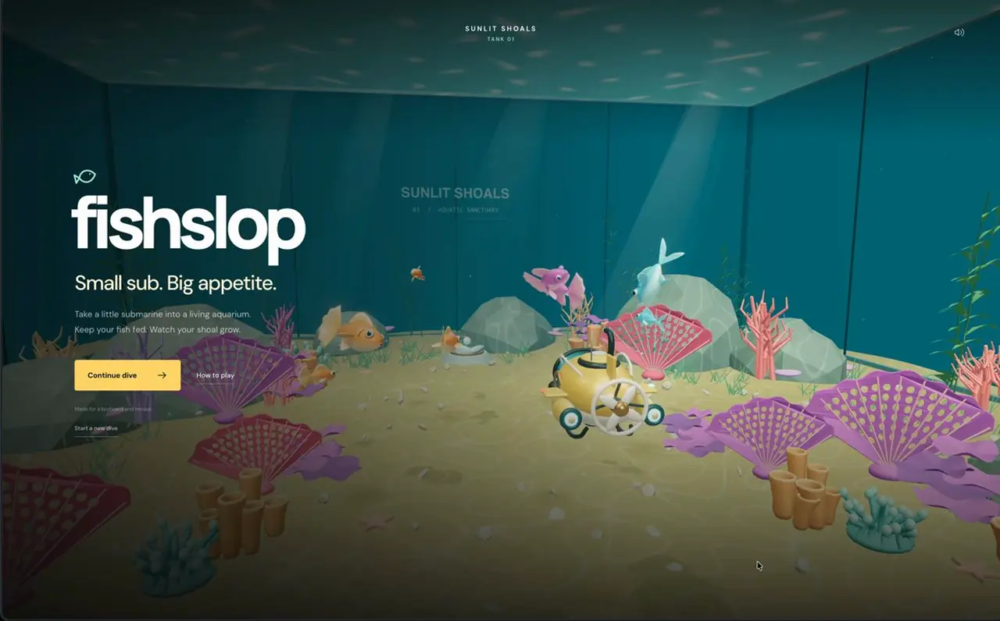</a><br>
<sub><a href="https://github.com/X-RayLuan/awesome-gpt-6-astra-prompts/blob/main/assets/videos/underwater-browser-game-readme.mp4">▶ 播放视频</a> · <a href="https://github.com/X-RayLuan/awesome-gpt-6-astra-prompts/releases/download/media-v1/underwater-browser-game-readme.mp4">下载 MP4</a></sub>

**提示词（英文原文）**

```text
Build an underwater browser game with Astra + Blender assets. Simple controls, polished feel.
```

**中文简述**

Astra+Blender 资产的水下浏览器游戏：简单操控、打磨手感。

[原帖](https://x.com/i/web/status/2095599934766764338) · [返回列表](#all-prompts)

---

### 图片 → 定制乐高式设计
<a id="lego-designs"></a>

OpenAIDevs 长文

<a href="https://github.com/X-RayLuan/awesome-gpt-6-astra-prompts/blob/main/assets/videos/lego-designs-readme.mp4">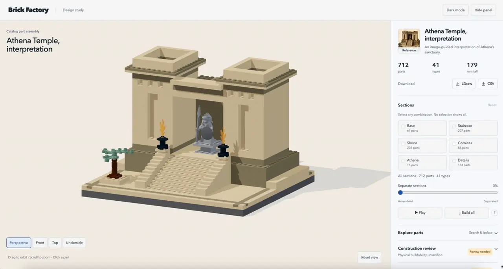</a><br>
<sub><a href="https://github.com/X-RayLuan/awesome-gpt-6-astra-prompts/blob/main/assets/videos/lego-designs-readme.mp4">▶ 播放视频</a> · <a href="https://github.com/X-RayLuan/awesome-gpt-6-astra-prompts/releases/download/media-v1/lego-designs-readme.mp4">下载 MP4</a></sub>

**提示词（英文原文）**

```text
Prototype images/ideas → custom LEGO-style designs with assembly steps. Keep designs original.
```

**中文简述**

图片/想法 → 定制乐高式设计与组装步骤；保持原创。

[原帖](https://x.com/i/web/status/2096377028945576370) · [返回列表](#all-prompts)

---

### 混合现实空管（Unity）
<a id="air-traffic-unity"></a>

OpenAIDevs 长文

<a href="https://github.com/X-RayLuan/awesome-gpt-6-astra-prompts/blob/main/assets/videos/air-traffic-unity-readme.mp4">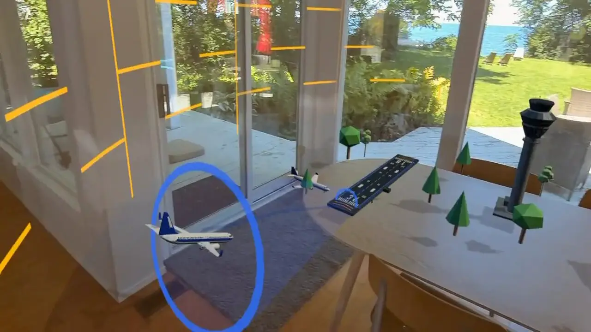</a><br>
<sub><a href="https://github.com/X-RayLuan/awesome-gpt-6-astra-prompts/blob/main/assets/videos/air-traffic-unity-readme.mp4">▶ 播放视频</a> · <a href="https://github.com/X-RayLuan/awesome-gpt-6-astra-prompts/releases/download/media-v1/air-traffic-unity-readme.mp4">下载 MP4</a></sub>

**提示词（英文原文）**

```text
Mixed-reality air traffic simulator in Unity with readable aircraft, routes, and scenario controls.
```

**中文简述**

Unity 混合现实空管：可读飞机、航线与情景控制。

[原帖](https://x.com/i/web/status/2096374716906745941) · [返回列表](#all-prompts)

---

### 录屏 → 可交互界面
<a id="screen-to-ui"></a>

OpenAIDevs 长文

<a href="https://github.com/X-RayLuan/awesome-gpt-6-astra-prompts/blob/main/assets/videos/screen-to-ui-readme.mp4">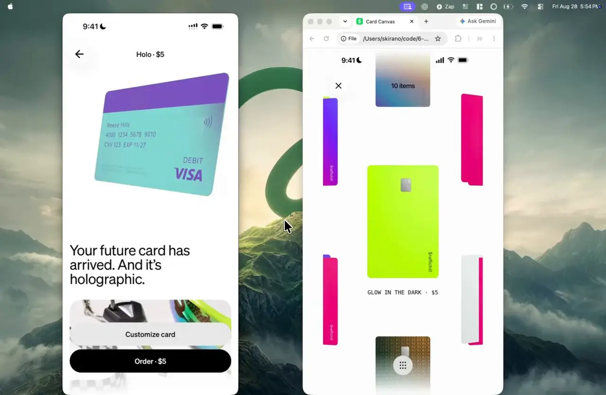</a><br>
<sub><a href="https://github.com/X-RayLuan/awesome-gpt-6-astra-prompts/blob/main/assets/videos/screen-to-ui-readme.mp4">▶ 播放视频</a> · <a href="https://github.com/X-RayLuan/awesome-gpt-6-astra-prompts/releases/download/media-v1/screen-to-ui-readme.mp4">下载 MP4</a></sub>

**提示词（英文原文）**

```text
From a screen recording, reconstruct an interactive interface including animations.
```

**中文简述**

从录屏重建含动画的可交互界面。

[原帖](https://x.com/i/web/status/2095595938534351231) · [返回列表](#all-prompts)

---

### 浏览器竞速（Three.js）
<a id="browser-racing"></a>

OpenAIDevs 长文

<a href="https://github.com/X-RayLuan/awesome-gpt-6-astra-prompts/blob/main/assets/videos/browser-racing-readme.mp4">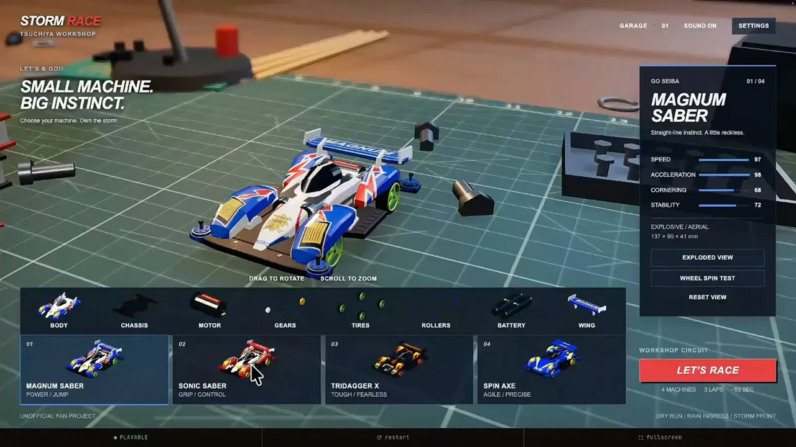</a><br>
<sub><a href="https://github.com/X-RayLuan/awesome-gpt-6-astra-prompts/blob/main/assets/videos/browser-racing-readme.mp4">▶ 播放视频</a> · <a href="https://github.com/X-RayLuan/awesome-gpt-6-astra-prompts/releases/download/media-v1/browser-racing-readme.mp4">下载 MP4</a></sub>

**提示词（英文原文）**

```text
Browser racing game with Three.js: satisfying handling, one track, instant retry.
```

**中文简述**

Three.js 浏览器竞速：手感、单赛道、秒重开。

[原帖](https://x.com/i/web/status/2096587056755638553) · [返回列表](#all-prompts)

---

### Blender 后室（VHS）
<a id="backrooms-blender"></a>

OpenAIDevs 长文

<a href="https://github.com/X-RayLuan/awesome-gpt-6-astra-prompts/blob/main/assets/videos/backrooms-blender-readme.mp4">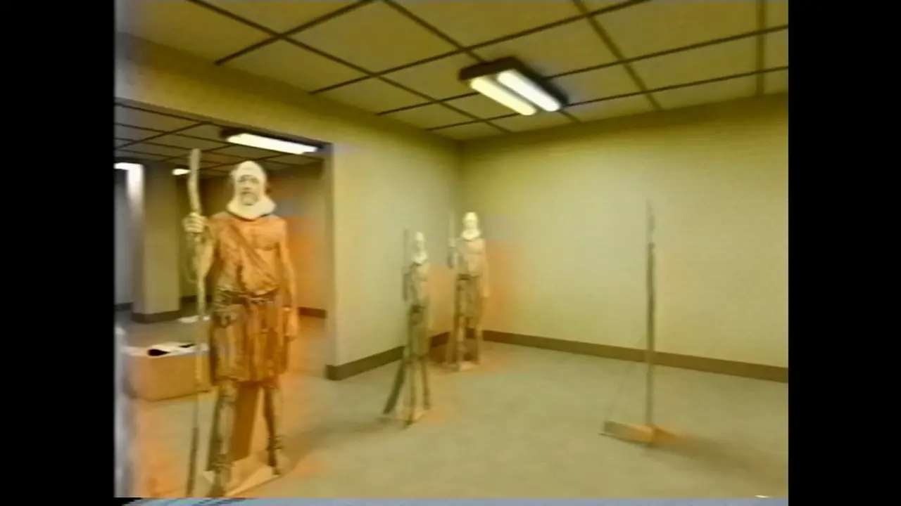</a><br>
<sub><a href="https://github.com/X-RayLuan/awesome-gpt-6-astra-prompts/blob/main/assets/videos/backrooms-blender-readme.mp4">▶ 播放视频</a> · <a href="https://github.com/X-RayLuan/awesome-gpt-6-astra-prompts/releases/download/media-v1/backrooms-blender-readme.mp4">下载 MP4</a></sub>

**提示词（英文原文）**

```text
First-person VHS-style Backrooms journey in Blender (~30s) with sound design notes.
```

**中文简述**

Blender 第一人称 VHS 后室旅程（约 30s）+ 声音设计笔记。

[原帖](https://x.com/i/web/status/2096003511104508411) · [返回列表](#all-prompts)

---

### ESP32 工作台可视化
<a id="esp32-workbench"></a>

OpenAIDevs 长文

**提示词（英文原文）**

```text
Workbench prototype visualizing ESP32 boards, components, and wiring with interactive callouts.
```

**中文简述**

ESP32 板卡/元件/接线可视化工作台，带互动标注。

[原帖](https://x.com/i/web/status/2096342954273054843) · [返回列表](#all-prompts)

---

### iPhone GPU 上的 Swift 光线追踪
<a id="swift-ray-tracer"></a>

OpenAIDevs 长文

<a href="https://github.com/X-RayLuan/awesome-gpt-6-astra-prompts/blob/main/assets/videos/swift-ray-tracer-readme.mp4">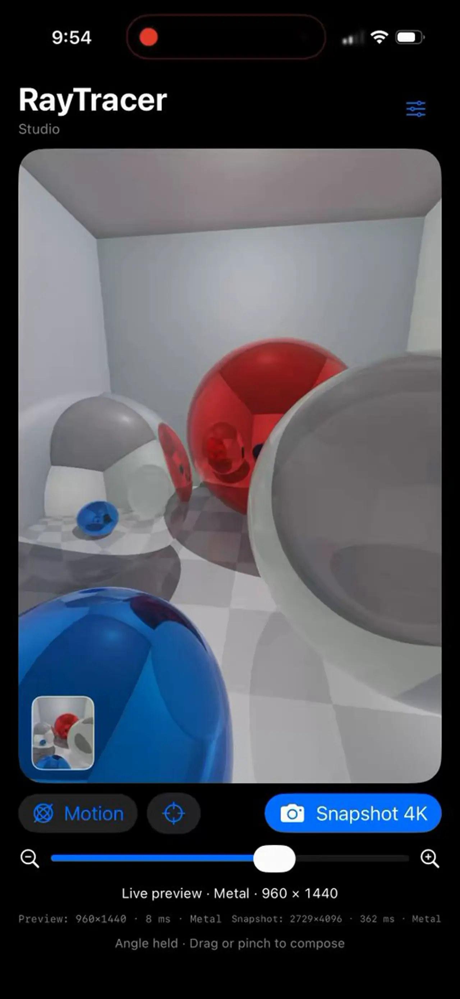</a><br>
<sub><a href="https://github.com/X-RayLuan/awesome-gpt-6-astra-prompts/blob/main/assets/videos/swift-ray-tracer-readme.mp4">▶ 播放视频</a> · <a href="https://github.com/X-RayLuan/awesome-gpt-6-astra-prompts/releases/download/media-v1/swift-ray-tracer-readme.mp4">下载 MP4</a></sub>

**提示词（英文原文）**

```text
Port a C++ ray tracer to Swift on the iPhone GPU. Show interactive frames and performance notes.
```

**中文简述**

C++ 光线追踪移植到 iPhone GPU 的 Swift；展示帧率与性能笔记。

[原帖](https://x.com/i/web/status/2095879835088293931) · [返回列表](#all-prompts)

---


### GPT-6 + Blender → Seedance 2.5 工作流
<a id="tanluai-gpt6-blender-seedance"></a>

[@TanLuAI](https://x.com/TanLuAI) · X 长文（非 Astra — GPT-6/Codex + Blender 白模 → Seedance 2.5）

<a href="https://github.com/X-RayLuan/awesome-gpt-6-astra-prompts/blob/main/assets/videos/tanluai-gpt6-blender-seedance-readme.mp4">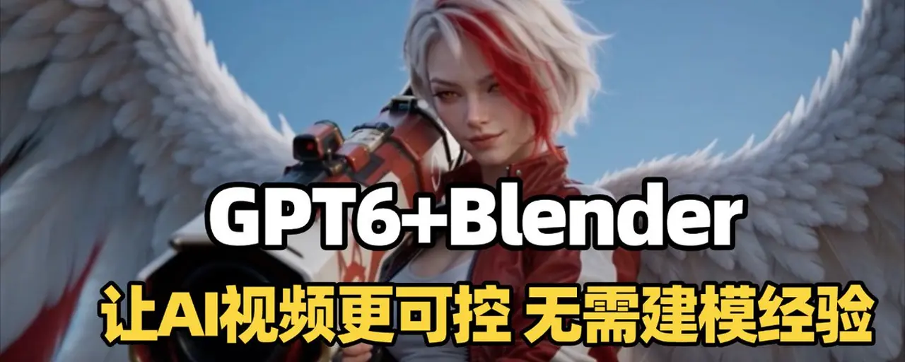</a><br>
<sub><a href="https://github.com/X-RayLuan/awesome-gpt-6-astra-prompts/blob/main/assets/videos/tanluai-gpt6-blender-seedance-readme.mp4">▶ 播放视频</a> · <a href="https://github.com/X-RayLuan/awesome-gpt-6-astra-prompts/releases/download/media-v1/tanluai-gpt6-blender-seedance-readme.mp4">下载 MP4</a></sub>

**提示词（英文原文）**（工作流摘要 — 完整运镜/对白/赛车提示词见原文）

```text
Workflow: (1) Send story beats to Codex/GPT-6 for a shot-by-shot script with camera notes for Blender.
(2) Generate a rough whitebox / proxy 3D preview (cubes OK) that locks blocking, camera, and timing.
(3) Iterate bad shots with the model. (4) Feed reference video + character/env stills into Seedance 2.5
with a detailed render prompt (asset anchors, timing, negatives). Example camera-control brief:
18s 16:9 cinematic urban fantasy — heroine kicks through a Tokyo rooftop door, three agents chase her
to the ledge, she leaps into mist, returns with red-white wings and a rocket launcher; follow the
projectile into a rooftop explosion. Keep geometry as placeholders only; regenerate natural motion.
```

**中文简述**

把灵感发给 Codex/GPT-6 做成带运镜的分镜脚本 → Blender 白模预演走位与镜头 → 多轮改分镜 → 参考视频+角色/场景资产图丢进 Seedance 2.5，用详细渲染提示词出片。示例：东京天台都市奇幻 18 秒复杂运镜。

[原帖](https://x.com/TanLuAI/status/2099124935285461329) · [长文](https://x.com/i/article/2099111135169384451) · [返回列表](#all-prompts)

---
### EasyVeo：拆解 → 分镜静帧 → 复刻
<a id="easyveo-remake-loop"></a>

[EasyVeo](https://easyveo.com) · 复刻爆款结构，保留你的产品

**提示词（英文原文）**

```text
Authorized short ad clip (≤30s). Decode hook / pacing / proof / CTA (~18 elements). Produce product-true stills, then a Seedance 2.5 / multi-model remake that keeps my SKU. No invented ROAS.
```

**中文简述**

授权广告短片（≤30s）拆解钩子/节奏/证据/CTA（约 18 元素）→ 产品真静帧 → Seedance 2.5 复刻，保留 SKU；不编造 ROAS。

[原帖](https://easyveo.com?utm_source=github&utm_medium=referral&utm_campaign=awesome_gpt6_astra_prompts&utm_content=entry_studio) · [返回列表](#all-prompts)

---


## 相关索引

- [astra.directory](https://astra.directory) — Astra 独立作品星系索引（联系收录：`hello@astra.directory`；参考帖 [@AnupPandey_X](https://x.com/AnupPandey_X/status/2098828020652093444)）
- [pmer.cn Astra projects](https://pmer.cn/en/ai-tools/astra-projects/) — 评分目录（[@ai_pmer](https://x.com/ai_pmer/status/2098932007741063179)）
- [thecrystalbears.com](https://www.thecrystalbears.com/) — 游戏/图书/站点（[@JulianJenkins](https://x.com/JulianJenkins/status/2098858237667737960)）
- 本仓库：欢迎经 [CONTRIBUTING.md](CONTRIBUTING.md) 提交案例；对外索引互链优先上述目录

## 分享好案例

欢迎提 PR — 见 [CONTRIBUTING.md](CONTRIBUTING.md)。预览帧放 `assets/`；完整视频留在 X。

## 致谢

Scraped from [@OpenAIDevs](https://x.com/OpenAIDevs) [GPT-6 Astra by our community](https://x.com/OpenAIDevs/status/2098827327832822014) article embeds + 回复线程. Layout inspired by public awesome-list formats (not Tripo media). Product CTA: [EasyVeo](https://easyveo.com).

详见 [RIGHTS.md](RIGHTS.md)。
