# Awesome GPT-6 Astra 提示词精选

[](https://github.com/sindresorhus/awesome) [](https://github.com/X-RayLuan/awesome-gpt-6-astra-prompts/stargazers) [](LICENSE) [](https://easyveo.com?utm_source=github&utm_medium=referral&utm_campaign=awesome_gpt6_astra_prompts&utm_content=zh_badge) [](CONTRIBUTING.md)

<p>
  <a href="README.md"></a>
  <a href="README.zh-CN.md"></a>
</p>

<a href="https://easyveo.com?utm_source=github&amp;utm_medium=referral&amp;utm_campaign=awesome_gpt6_astra_prompts&amp;utm_content=zh_readme_hero">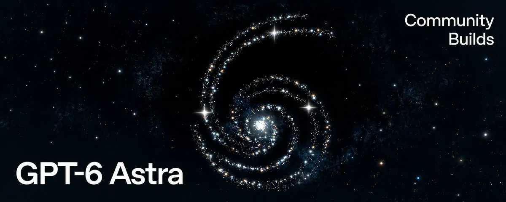</a>

**下一款 Astra 作品的起点 —— 或下一条 AI 视频广告复刻。**

精选整理自 [@OpenAIDevs](https://x.com/OpenAIDevs/status/2098827327832822014) （长文嵌入 + 评论区）的 GPT-6 Astra 社区演示，以及 EasyVeo 复刻提示词。

**78 个案例 · 中英双语文档 · EasyVeo 复刻车道 · CTA： [easyveo.com](https://easyveo.com?utm_source=github&utm_medium=referral&utm_campaign=awesome_gpt6_astra_prompts&utm_content=zh_lede)**

## 精选项目

<sub>点击缩略图或 ▶ 播放，在浏览器中直接播放。片段已压缩；完整原片在 X。下载链接仍指向 GitHub Release。</sub>

<table>
<tr>
<td width="50%" valign="top"><a href="https://cdn.jsdelivr.net/gh/X-RayLuan/awesome-gpt-6-astra-prompts@main/assets/videos/nurm-alex-inkstorm-readme.mp4">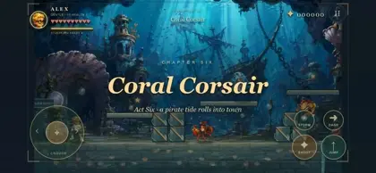</a><br><strong><a href="#alex-and-the-inkstorm">Alex 与墨雨风暴</a></strong><br><sub><a href="https://x.com/NURM_Dima/status/2096534403610562910">@NURM_Dima</a> · <a href="https://cdn.jsdelivr.net/gh/X-RayLuan/awesome-gpt-6-astra-prompts@main/assets/videos/nurm-alex-inkstorm-readme.mp4">▶ 播放</a></sub><br><a href="#alex-and-the-inkstorm">提示词 →</a></td>
<td width="50%" valign="top"><a href="https://cdn.jsdelivr.net/gh/X-RayLuan/awesome-gpt-6-astra-prompts@main/assets/videos/pallav-tron-lightcycle-readme.mp4">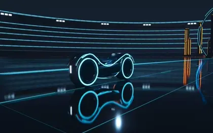</a><br><strong><a href="#tron-lightcycle-to-playable">光轮对战 → 可玩原型</a></strong><br><sub><a href="https://x.com/pallavmac/status/2097016391903657991">@pallavmac</a> · <a href="https://cdn.jsdelivr.net/gh/X-RayLuan/awesome-gpt-6-astra-prompts@main/assets/videos/pallav-tron-lightcycle-readme.mp4">▶ 播放</a></sub><br><a href="#tron-lightcycle-to-playable">提示词 →</a></td>
</tr>
<tr>
<td width="50%" valign="top"><a href="https://cdn.jsdelivr.net/gh/X-RayLuan/awesome-gpt-6-astra-prompts@main/assets/videos/miki-4d-chess-readme.mp4">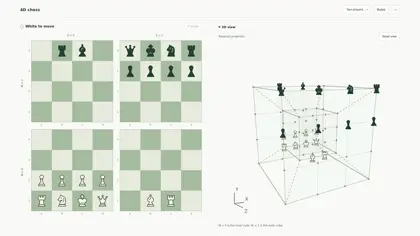</a><br><strong><a href="#miki-4d-chess">可玩四维象棋</a></strong><br><sub><a href="https://x.com/miki_code/status/2096132455652549117">@miki_code</a> · <a href="https://cdn.jsdelivr.net/gh/X-RayLuan/awesome-gpt-6-astra-prompts@main/assets/videos/miki-4d-chess-readme.mp4">▶ 播放</a></sub><br><a href="#miki-4d-chess">提示词 →</a></td>
<td width="50%" valign="top"><a href="https://cdn.jsdelivr.net/gh/X-RayLuan/awesome-gpt-6-astra-prompts@main/assets/videos/scribble-tanks-readme.mp4">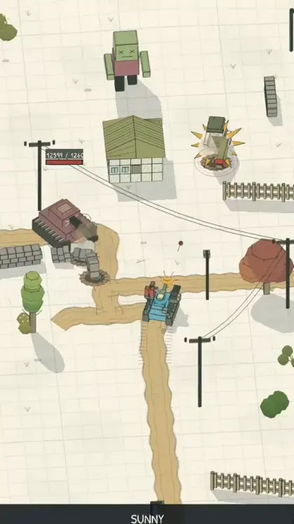</a><br><strong><a href="#scribble-tanks">Scribble Tanks 涂鸦坦克</a></strong><br><sub><a href="https://x.com/shortaktien/status/2098874536028410196">@shortaktien</a> · <a href="https://cdn.jsdelivr.net/gh/X-RayLuan/awesome-gpt-6-astra-prompts@main/assets/videos/scribble-tanks-readme.mp4">▶ 播放</a></sub><br><a href="#scribble-tanks">提示词 →</a></td>
</tr>
</table>

<a id="all-prompts"></a>

## 最新 Astra 提示词

<details>
<summary>浏览全部案例</summary>

- [Alex 与墨雨风暴](#alex-and-the-inkstorm) · video
- [光轮对战 → 可玩原型](#tron-lightcycle-to-playable) · video
- [可玩四维象棋](#miki-4d-chess) · @miki_code
- [Scribble Tanks 涂鸦坦克](#scribble-tanks) · @shortaktien
- [几何 Logo 动效风格](#openai-logo-geo) · @globalainomad
- [浏览器波表合成器](#wavetable-synth) · @android_stern
- [淹城上空的龙骑飞行](#panzer-dragon) · @yasei_no_otoko
- [Spline Rush 竞速](#spline-rush) · @dandumt23
- [Aetherfall：暮光广域](#aetherfall) · @dandumt23
- [SOLIFAN 爆炸视图职场](#solifan) · @solid_fdn
- [浏览器节奏游戏（Thumper 感）](#thumper-rhythm) · @GZhan57
- [Blob 物理小游戏](#blob-game) · @SimonasLTU1
- [Blender × Seedance 一镜到底](#blender-seedance) · @KanaWorks_AI
- [新干线崩溃恐慌短片](#shinkansen-panic) · @KanaWorks_AI
- [RP2040 PCB Studio 原型](#rp2040-pcb) · @PinoZlatan
- [互动高中数学课](#hs-math) · @Xian0063
- [Astra.directory 星系索引](#astra-directory) · @AnupPandey_X
- [2234 个解剖部件 3D 浏览器](#anatomical-atlas-3d)
- [Unreal 中的曼哈顿](#manhattan-unreal)
- [梵高画作 → 可走 Three.js 小镇](#van-gogh-threejs-town)
- [AR 扫地覆盖可视化](#sweep-ar)
- [火车线稿 → Blender（3295 物体）](#train-blender)
- [水下浏览器游戏](#underwater-browser-game)
- [图片 → 定制乐高式设计](#lego-designs)
- [混合现实空管（Unity）](#air-traffic-unity)
- [录屏 → 可交互界面](#screen-to-ui)
- [浏览器竞速（Three.js）](#browser-racing)
- [Blender 后室（VHS）](#backrooms-blender)
- [ESP32 工作台可视化](#esp32-workbench)
- [iPhone GPU 上的 Swift 光线追踪](#swift-ray-tracer)
- [GPT-6 + Blender → Seedance 2.5 工作流](#tanluai-gpt6-blender-seedance) · @TanLuAI
- [Kaiju Three.js 游戏](#majid-kaiju-threejs) · @majidmanzarpour · video
- [等距 ARPG → Blender 预告](#mengto-isometric-arpg) · @MengTo · video
- [PaperRoute](#builtbysketch-paperroute) · @builtbysketch · video
- [Weeping Angels 浏览器恐怖](#blendibyl-weeping-angels) · @BlendiByl · video
- [Mac 水族箱壁纸](#chaseleantj-aquarium-wallpaper) · @chaseleantj · video
- [The Crownless](#izkimar-crownless) · @Izkimar · video
- [带 AI 玩家的《卡坦岛》Three.js 游戏](#mengto-catan-threejs-game) · @MengTo · video
- [Astra 设计迷你 DJ 控制器](#eminimnim-mini-dj-controller) · @eminimnim · video
- [为即时战略游戏制作蝎形生物动画](#stefan-3d-ai-scorpid-animation) · @Stefan_3D_AI
- [为扫描的破损表面制作 3D 打印补片](#toyoshi-3d-printed-surface-patch) · @toyoshi · video
- [《奥德赛》复古 3D 浏览器游戏](#jasoncjs--odyssey-retro-3d-game) · @jasoncjs_ · video
- [用 Astra 和 Tripo AI 制作 3D 版泡泡堂](#jaredliu-bravo-3d-bubble-hall) · @jaredliu_bravo
- [用 Astra 反复打磨的 3D 场景](#m1astra-iteratively-refined-3d-scene) · @M1Astra · video
- [颐和园佛香阁 3D 场景](#saccc-c-summer-palace-buddhist-incense-tower) · @Saccc_c · video
- [《神经漫游者》海报风格字体与动态展示](#maxescu-neuromancer-inspired-font-showcase) · @maxescu · video
- [现代版红警风格策略游戏](#hd-lhn783wtlkppr-modern-red-alert-strategy-game) · @HDLhN783wtLkpPR · video
- [Three.js 互动模型铁路](#nickfromlater-interactive-model-railroad) · @nickfromlater · video
- [Astra 创作巴赫风格赋格曲](#aug5thmusic-bach-style-fugue) · @aug5thmusic · video
- [用九张照片制作可交互的工作室 3D 模型](#rpnickson-interactive-3d-studio) · @rpnickson · video
- [Codex 脚本生成 After Effects 视频](#nyto-vd-codex-after-effects-video) · @Nyto_vd
- [360°全景视频工坊](#kanaworks-ai-360-panorama-video-workshop) · @KanaWorks_AI
- [《英雄无敌 3》墓园阵营画面重制](#ye-combinator-homm3-necropolis-remake) · @ye_combinator
- [金属方块加工厂游戏原型](#chod3s-metal-cube-factory) · @chod3s
- [GPT-6 Astra 与 DeepSeek V4.1 Flash 的 Three.js 游戏对比](#opendesignhq-threejs-game-comparison) · @OpenDesignHQ
- [浏览器单人即时战略游戏](#mustafaakin-browser-rts-game) · @mustafaakin
- [Hollowflux](#openai-showcase-hollowflux) · GPT-6 Astra
- [Sunwake](#openai-showcase-sunwake) · GPT-6 Astra
- [Void Explorer](#openai-showcase-void-explorer) · GPT-6 Astra
- [Frame Studio](#openai-showcase-frame-studio) · GPT-6 Astra
- [Tidegarden](#openai-showcase-tidegarden) · GPT-6 Astra
- [Nightjar Listening Room](#openai-showcase-nightjar-listening-room) · GPT-6 Astra
- [Pattern Studio](#openai-showcase-pattern-studio) · GPT-6 Astra
- [Ridge Pack](#openai-showcase-ridge-pack) · GPT-6 Astra
- [Tidal House](#openai-showcase-tidal-house) · GPT-6 Astra
- [Type Field](#openai-showcase-type-field) · GPT-6 Astra
- [EasyVeo：拆解 → 分镜静帧 → 复刻](#easyveo-remake-loop)
- [班加罗尔外环路赛车游戏](#ravithejads-bengaluru-orr-racing-game) · @ravithejads · video
**OpenAI Showcase**
- [小小仪式](#openai-showcase-little-ritual) · GPT-6 Astra · video
- [速度回路](#openai-showcase-velocity-loop) · GPT-6 Astra · video
- [深渊 Abyssal](#openai-showcase-abyssal-bioluminescent-ecosystem) · GPT-6 Astra
- [发条天文台](#openai-showcase-impossible-kinetic-architecture) · GPT-6 Astra
- [活细胞剖面](#openai-showcase-living-cell-cross-section) · GPT-6 Astra
- [海面之下](#openai-showcase-below-the-surface) · GPT-6 Astra
- [庭院住宅](#openai-showcase-courtyard-house) · GPT-6 Astra
- [物理博物馆](#openai-showcase-physics-museum) · GPT-6 Astra
- [建筑工作室](#openai-showcase-architecture-studio) · GPT-6 Astra
- [定格动画工作台](#openai-showcase-stop-motion-desk) · GPT-6 Astra · video

</details>

---

### Alex 与墨雨风暴
<a id="alex-and-the-inkstorm"></a>

[NURM_Dima](https://x.com/NURM_Dima) · 回复线程

<a href="https://cdn.jsdelivr.net/gh/X-RayLuan/awesome-gpt-6-astra-prompts@main/assets/videos/nurm-alex-inkstorm-readme.mp4">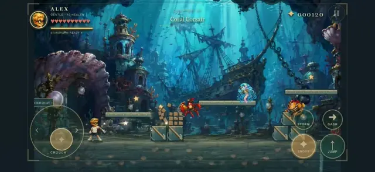</a><br>
<sub><a href="https://cdn.jsdelivr.net/gh/X-RayLuan/awesome-gpt-6-astra-prompts@main/assets/videos/nurm-alex-inkstorm-readme.mp4">▶ 播放视频</a> · <a href="https://github.com/X-RayLuan/awesome-gpt-6-astra-prompts/releases/download/media-v1/nurm-alex-inkstorm-readme.mp4">下载 MP4</a></sub>

**提示词（英文原文）**

```text
I uploaded a photo. Make this person the hero of an original platformer with multiple worlds, distinct enemies and bosses, and a gentle difficulty mode. Deliver a playable prototype plan (web or iOS). Do not copy commercial game IP.
```

**中文简述**

上传一张照片，让此人成为原创平台跳跃游戏主角：多世界、独立敌人与 Boss、温和难度；交付可玩原型方案（Web/iOS），勿抄商业 IP。

[原帖](https://x.com/NURM_Dima/status/2096534403610562910) · [返回列表](#all-prompts)

---

### 光轮对战 → 可玩原型
<a id="tron-lightcycle-to-playable"></a>

[pallavmac](https://x.com/pallavmac) · 回复线程

<a href="https://cdn.jsdelivr.net/gh/X-RayLuan/awesome-gpt-6-astra-prompts@main/assets/videos/pallav-tron-lightcycle-readme.mp4">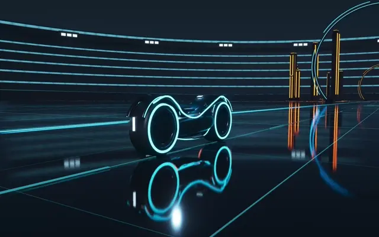</a><br>
<sub><a href="https://cdn.jsdelivr.net/gh/X-RayLuan/awesome-gpt-6-astra-prompts@main/assets/videos/pallav-tron-lightcycle-readme.mp4">▶ 播放视频</a> · <a href="https://github.com/X-RayLuan/awesome-gpt-6-astra-prompts/releases/download/media-v1/pallav-tron-lightcycle-readme.mp4">下载 MP4</a></sub>

**提示词（英文原文）**

```text
Render a lightcycle-style arena battle in Blender, then port a playable slice to Unreal (or Three.js) for desktop and ideally iOS. Prioritize feel. Do not bundle copyrighted audio without a license.
```

**中文简述**

先做光轮竞技场渲染，再移植可玩切片到 Unreal/Three.js；优先手感，勿擅自打包无版权音频。

[原帖](https://x.com/pallavmac/status/2097016391903657991) · [返回列表](#all-prompts)

---

### 可玩四维象棋
<a id="miki-4d-chess"></a>

[@miki_code](https://x.com/miki_code) · 回复线程

<a href="https://cdn.jsdelivr.net/gh/X-RayLuan/awesome-gpt-6-astra-prompts@main/assets/videos/miki-4d-chess-readme.mp4"></a><br>
<sub><a href="https://cdn.jsdelivr.net/gh/X-RayLuan/awesome-gpt-6-astra-prompts@main/assets/videos/miki-4d-chess-readme.mp4">▶ 播放视频</a> · <a href="https://github.com/X-RayLuan/awesome-gpt-6-astra-prompts/releases/download/media-v1/miki-4d-chess-readme.mp4">下载 MP4</a></sub>

**提示词（英文原文）**

```text
Build a playable 4D chess prototype with clear piece moves across a fourth dimension and readable UI.
```

**中文简述**

做可玩四维象棋原型：第四维走法清晰、UI 可读。

[原帖](https://x.com/miki_code/status/2096132455652549117) · [返回列表](#all-prompts)

---

### Scribble Tanks 涂鸦坦克
<a id="scribble-tanks"></a>

[@shortaktien](https://x.com/shortaktien) · 回复线程

<a href="https://cdn.jsdelivr.net/gh/X-RayLuan/awesome-gpt-6-astra-prompts@main/assets/videos/scribble-tanks-readme.mp4"></a><br>
<sub><a href="https://cdn.jsdelivr.net/gh/X-RayLuan/awesome-gpt-6-astra-prompts@main/assets/videos/scribble-tanks-readme.mp4">▶ 播放视频</a> · <a href="https://github.com/X-RayLuan/awesome-gpt-6-astra-prompts/releases/download/media-v1/scribble-tanks-readme.mp4">下载 MP4</a></sub>

**提示词（英文原文）**

```text
Build Scribble Tanks 涂鸦坦克: a playful tank sandbox with weather, physics, animals, water, and zombies. Prioritize feel.
```

**中文简述**

涂鸦坦克沙盒：天气、物理、动物、水与僵尸；优先手感。

[原帖](https://x.com/shortaktien/status/2098874536028410196) · [返回列表](#all-prompts)

---

### 几何 Logo 动效风格
<a id="openai-logo-geo"></a>

[@globalainomad](https://x.com/globalainomad) · 回复线程

<a href="https://x.com/globalainomad/status/2098833443501310063">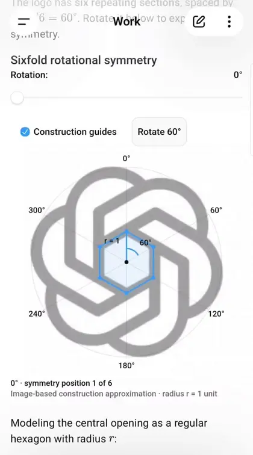</a>

**提示词（英文原文）**

```text
Generate a geometric, motion-friendly take inspired by a logo silhouette. Keep it original; do not copy trademarked marks into a commercial asset.
```

**中文简述**

几何、适合动效的剪影风格；保持原创，勿把商标直接做成商用素材。

[原帖](https://x.com/globalainomad/status/2098833443501310063) · [返回列表](#all-prompts)

---

### 浏览器波表合成器
<a id="wavetable-synth"></a>

[@android_stern](https://x.com/android_stern) · 回复线程

<a href="https://x.com/android_stern/status/2098834316126028265">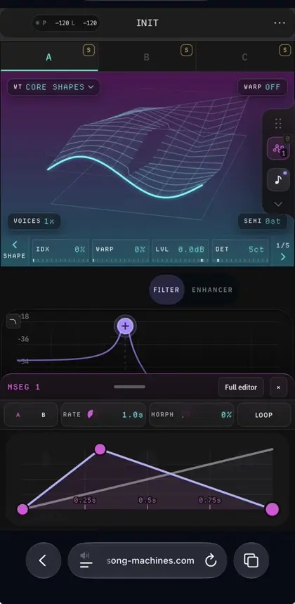</a>

**提示词（英文原文）**

```text
Build a browser wavetable synth with modulation, an FX graph, and bounce-to-sampler. Ship a playable web demo.
```

**中文简述**

浏览器波表合成器：调制、FX 图、导出采样；交付可玩网页 Demo。

[原帖](https://x.com/android_stern/status/2098834316126028265) · [返回列表](#all-prompts)

---

### 淹城上空的龙骑飞行
<a id="panzer-dragon"></a>

[@yasei_no_otoko](https://x.com/yasei_no_otoko) · 回复线程

<a href="https://cdn.jsdelivr.net/gh/X-RayLuan/awesome-gpt-6-astra-prompts@main/assets/videos/panzer-dragon-readme.mp4">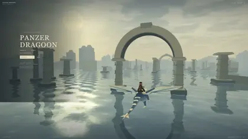</a><br>
<sub><a href="https://cdn.jsdelivr.net/gh/X-RayLuan/awesome-gpt-6-astra-prompts@main/assets/videos/panzer-dragon-readme.mp4">▶ 播放视频</a> · <a href="https://github.com/X-RayLuan/awesome-gpt-6-astra-prompts/releases/download/media-v1/panzer-dragon-readme.mp4">下载 MP4</a></sub>

**提示词（英文原文）**

```text
Create a Panzer Dragoon–style dragon flight over a flooded city. Original creatures and city; do not copy commercial IP art.
```

**中文简述**

淹城上空龙骑飞行（Panzer Dragoon 感）；原创生物与城市，勿抄商业 IP 美术。

[原帖](https://x.com/yasei_no_otoko/status/2098833173623005666) · [返回列表](#all-prompts)

---

### Spline Rush 竞速
<a id="spline-rush"></a>

[@dandumt23](https://x.com/dandumt23) · 回复线程

<a href="https://cdn.jsdelivr.net/gh/X-RayLuan/awesome-gpt-6-astra-prompts@main/assets/videos/spline-rush-readme.mp4">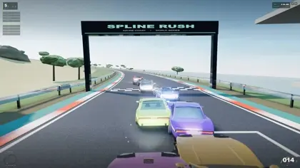</a><br>
<sub><a href="https://cdn.jsdelivr.net/gh/X-RayLuan/awesome-gpt-6-astra-prompts@main/assets/videos/spline-rush-readme.mp4">▶ 播放视频</a> · <a href="https://github.com/X-RayLuan/awesome-gpt-6-astra-prompts/releases/download/media-v1/spline-rush-readme.mp4">下载 MP4</a></sub>

**提示词（英文原文）**

```text
One-shot racing game Spline Rush on Azure Coast: satisfying handling, instant retry, polished track.
```

**中文简述**

一镜竞速 Spline Rush：操控爽、秒重开、赛道打磨。

[原帖](https://x.com/dandumt23/status/2098839458195939612) · [返回列表](#all-prompts)

---

### Aetherfall：暮光广域
<a id="aetherfall"></a>

[@dandumt23](https://x.com/dandumt23) · 回复线程

<a href="https://cdn.jsdelivr.net/gh/X-RayLuan/awesome-gpt-6-astra-prompts@main/assets/videos/aetherfall-readme.mp4">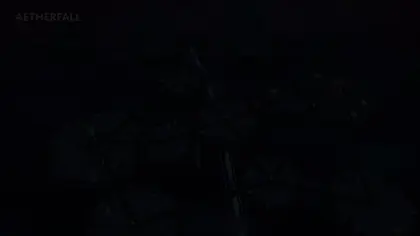</a><br>
<sub><a href="https://cdn.jsdelivr.net/gh/X-RayLuan/awesome-gpt-6-astra-prompts@main/assets/videos/aetherfall-readme.mp4">▶ 播放视频</a> · <a href="https://github.com/X-RayLuan/awesome-gpt-6-astra-prompts/releases/download/media-v1/aetherfall-readme.mp4">下载 MP4</a></sub>

**提示词（英文原文）**

```text
Dark platformer across linked islands: Aetherfall — Twilight Expanse. Readable silhouettes, tight jumps.
```

**中文简述**

跨岛黑暗平台跳跃：剪影可读、跳跃紧。

[原帖](https://x.com/dandumt23/status/2098839718020382983) · [返回列表](#all-prompts)

---

### SOLIFAN 爆炸视图职场
<a id="solifan"></a>

[@solid_fdn](https://x.com/solid_fdn) · 回复线程

<a href="https://cdn.jsdelivr.net/gh/X-RayLuan/awesome-gpt-6-astra-prompts@main/assets/videos/solifan-readme.mp4">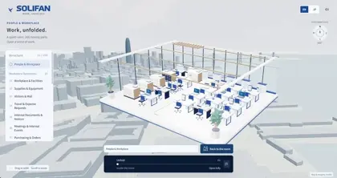</a><br>
<sub><a href="https://cdn.jsdelivr.net/gh/X-RayLuan/awesome-gpt-6-astra-prompts@main/assets/videos/solifan-readme.mp4">▶ 播放视频</a> · <a href="https://github.com/X-RayLuan/awesome-gpt-6-astra-prompts/releases/download/media-v1/solifan-readme.mp4">下载 MP4</a></sub>

**提示词（英文原文）**

```text
Exploded 3D workplace over a city map with hundreds of moving parts and clear camera choreography.
```

**中文简述**

城市地图上的爆炸视图职场：数百活动件 + 清晰镜头编排。

[原帖](https://x.com/solid_fdn/status/2098910304163991874) · [返回列表](#all-prompts)

---

### 浏览器节奏游戏（Thumper 感）
<a id="thumper-rhythm"></a>

[@GZhan57](https://x.com/GZhan57) · 回复线程

<a href="https://cdn.jsdelivr.net/gh/X-RayLuan/awesome-gpt-6-astra-prompts@main/assets/videos/thumper-rhythm-readme.mp4">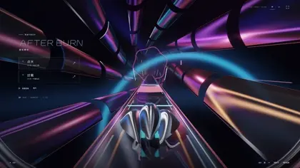</a><br>
<sub><a href="https://cdn.jsdelivr.net/gh/X-RayLuan/awesome-gpt-6-astra-prompts@main/assets/videos/thumper-rhythm-readme.mp4">▶ 播放视频</a> · <a href="https://github.com/X-RayLuan/awesome-gpt-6-astra-prompts/releases/download/media-v1/thumper-rhythm-readme.mp4">下载 MP4</a></sub>

**提示词（英文原文）**

```text
Browser rhythm game inspired by Thumper feel using WASM + WebGPU. Original track art; do not copy commercial IP.
```

**中文简述**

WASM+WebGPU 浏览器节奏游戏（Thumper 感）；原创轨道美术，勿抄商业 IP。

[原帖](https://x.com/GZhan57/status/2098555255596450022) · [返回列表](#all-prompts)

---

### Blob 物理小游戏
<a id="blob-game"></a>

[@SimonasLTU1](https://x.com/SimonasLTU1) · 回复线程

<a href="https://x.com/SimonasLTU1/status/2098011856128332214">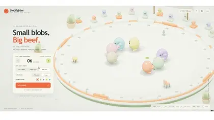</a>

**提示词（英文原文）**

```text
Build a polished blob physics game. Note model used (Astra or other) in the README.
```

**中文简述**

打磨 Blob 物理小游戏；在 README 注明所用模型。

[原帖](https://x.com/SimonasLTU1/status/2098011856128332214) · [返回列表](#all-prompts)

---

### Blender × Seedance 一镜到底
<a id="blender-seedance"></a>

[@KanaWorks_AI](https://x.com/KanaWorks_AI) · 回复线程

<a href="https://cdn.jsdelivr.net/gh/X-RayLuan/awesome-gpt-6-astra-prompts@main/assets/videos/blender-seedance-readme.mp4">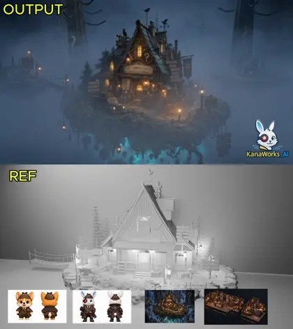</a><br>
<sub><a href="https://cdn.jsdelivr.net/gh/X-RayLuan/awesome-gpt-6-astra-prompts@main/assets/videos/blender-seedance-readme.mp4">▶ 播放视频</a> · <a href="https://github.com/X-RayLuan/awesome-gpt-6-astra-prompts/releases/download/media-v1/blender-seedance-readme.mp4">下载 MP4</a></sub>

**提示词（英文原文）**

```text
Blender × Seedance 2.5 one-take: prefer open scenes over cluttered interiors; keep camera continuous.
```

**中文简述**

Blender × Seedance 2.5 一镜：偏开阔场景，镜头连续。

[原帖](https://x.com/KanaWorks_AI/status/2098586768174203155) · [返回列表](#all-prompts)

---

### 新干线崩溃恐慌短片
<a id="shinkansen-panic"></a>

[@KanaWorks_AI](https://x.com/KanaWorks_AI) · 回复线程

<a href="https://x.com/KanaWorks_AI/status/2097604098900021513">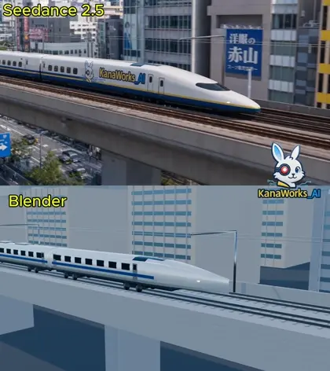</a>

**提示词（英文原文）**

```text
Blender × Seedance panic-film piece with a shinkansen crash motif. Fictional; no real-incident claims.
```

**中文简述**

Blender × Seedance 恐慌短片（新干线崩溃母题）；虚构，勿声称真实事故。

[原帖](https://x.com/KanaWorks_AI/status/2097604098900021513) · [返回列表](#all-prompts)

---

### RP2040 PCB Studio 原型
<a id="rp2040-pcb"></a>

[@PinoZlatan](https://x.com/PinoZlatan) · 回复线程

<a href="https://x.com/PinoZlatan/status/2098945126563205268">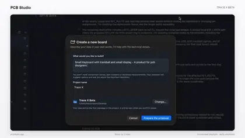</a>

**提示词（英文原文）**

```text
RP2040 controller: schematic, BOM, provisional 3D in a PCB studio app. Document assumptions.
```

**中文简述**

RP2040：原理图、BOM、PCB Studio 临时 3D；写清假设。

[原帖](https://x.com/PinoZlatan/status/2098945126563205268) · [返回列表](#all-prompts)

---

### 互动高中数学课
<a id="hs-math"></a>

[@Xian0063](https://x.com/Xian0063) · 回复线程

<a href="https://x.com/Xian0063/status/2096046406951903398"></a>

**提示词（英文原文）**

```text
互动高中数学课 course with lessons, manipulables, and software delivery.
```

**中文简述**

互动高中数学：课时、可操作控件、软件交付。

[原帖](https://x.com/Xian0063/status/2096046406951903398) · [返回列表](#all-prompts)

---

### Astra.directory 星系索引
<a id="astra-directory"></a>

[@AnupPandey_X](https://x.com/AnupPandey_X) · 回复线程

<a href="https://x.com/AnupPandey_X/status/2098828020652093444">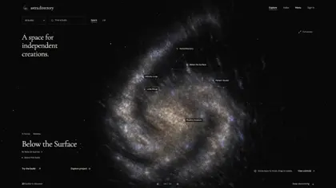</a>

**提示词（英文原文）**

```text
Galaxy-style index of independent Astra builds with links out to each project.
```

**中文简述**

星系风格索引，链出各独立 Astra 项目。

[原帖](https://x.com/AnupPandey_X/status/2098828020652093444) · [返回列表](#all-prompts)

---

### 2234 个解剖部件 3D 浏览器
<a id="anatomical-atlas-3d"></a>

OpenAIDevs 长文

<a href="https://cdn.jsdelivr.net/gh/X-RayLuan/awesome-gpt-6-astra-prompts@main/assets/videos/anatomical-atlas-3d-readme.mp4">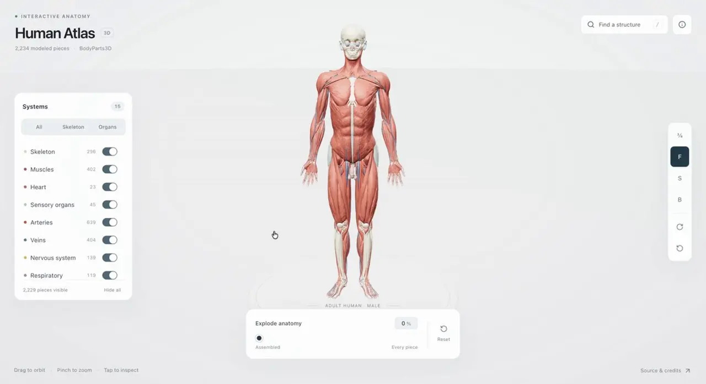</a><br>
<sub><a href="https://cdn.jsdelivr.net/gh/X-RayLuan/awesome-gpt-6-astra-prompts@main/assets/videos/anatomical-atlas-3d-readme.mp4">▶ 播放视频</a> · <a href="https://github.com/X-RayLuan/awesome-gpt-6-astra-prompts/releases/download/media-v1/anatomical-atlas-3d-readme.mp4">下载 MP4</a></sub>

**提示词（英文原文）**

```text
Build an interactive 3D anatomical explorer with thousands of selectable parts, layered visibility, search, and a clean educational UI. Use appropriately licensed meshes. Do not claim clinical validation.
```

**中文简述**

数千可点选解剖部件的互动 3D 浏览器；用合规网格，勿宣称临床验证。

[原帖](https://x.com/i/web/status/2096221988763173186) · [返回列表](#all-prompts)

---

### Unreal 中的曼哈顿
<a id="manhattan-unreal"></a>

OpenAIDevs 长文

<a href="https://cdn.jsdelivr.net/gh/X-RayLuan/awesome-gpt-6-astra-prompts@main/assets/videos/manhattan-unreal-readme.mp4">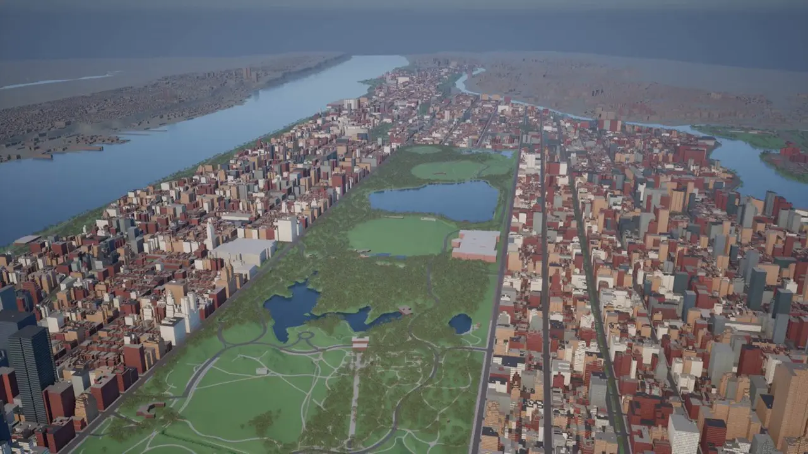</a><br>
<sub><a href="https://cdn.jsdelivr.net/gh/X-RayLuan/awesome-gpt-6-astra-prompts@main/assets/videos/manhattan-unreal-readme.mp4">▶ 播放视频</a> · <a href="https://github.com/X-RayLuan/awesome-gpt-6-astra-prompts/releases/download/media-v1/manhattan-unreal-readme.mp4">下载 MP4</a></sub>

**提示词（英文原文）**

```text
Recreate a recognizable Manhattan slice in Unreal Engine with readable landmarks, daylight, and a flythrough camera.
```

**中文简述**

在 Unreal 复刻可读曼哈顿切片：地标、日光、飞越镜头。

[原帖](https://x.com/i/web/status/2095609734845927525) · [返回列表](#all-prompts)

---

### 梵高画作 → 可走 Three.js 小镇
<a id="van-gogh-threejs-town"></a>

OpenAIDevs 长文

<a href="https://cdn.jsdelivr.net/gh/X-RayLuan/awesome-gpt-6-astra-prompts@main/assets/videos/van-gogh-threejs-town-readme.mp4">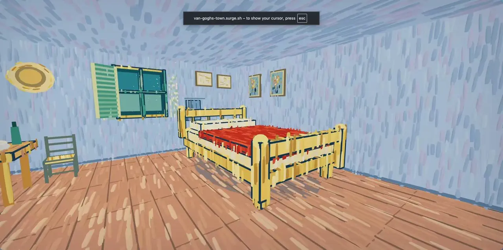</a><br>
<sub><a href="https://cdn.jsdelivr.net/gh/X-RayLuan/awesome-gpt-6-astra-prompts@main/assets/videos/van-gogh-threejs-town-readme.mp4">▶ 播放视频</a> · <a href="https://github.com/X-RayLuan/awesome-gpt-6-astra-prompts/releases/download/media-v1/van-gogh-threejs-town-readme.mp4">下载 MP4</a></sub>

**提示词（英文原文）**

```text
Turn a set of paintings into a walkable miniature town in Three.js. Preserve motifs, prioritize camera readability, ship one self-contained HTML demo.
```

**中文简述**

一组画作变成可走的 Three.js 微缩镇；保留母题，优先镜头可读。

[原帖](https://x.com/i/web/status/2095776685807346105) · [返回列表](#all-prompts)

---

### AR 扫地覆盖可视化
<a id="sweep-ar"></a>

OpenAIDevs 长文

<a href="https://cdn.jsdelivr.net/gh/X-RayLuan/awesome-gpt-6-astra-prompts@main/assets/videos/sweep-ar-readme.mp4">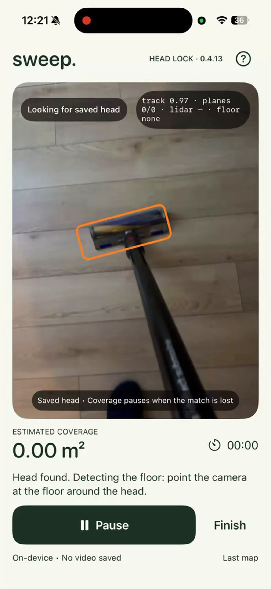</a><br>
<sub><a href="https://cdn.jsdelivr.net/gh/X-RayLuan/awesome-gpt-6-astra-prompts@main/assets/videos/sweep-ar-readme.mp4">▶ 播放视频</a> · <a href="https://github.com/X-RayLuan/awesome-gpt-6-astra-prompts/releases/download/media-v1/sweep-ar-readme.mp4">下载 MP4</a></sub>

**提示词（英文原文）**

```text
Build an AR prototype that visualizes vacuum / coverage maps over a room with clear progress feedback.
```

**中文简述**

AR 原型：房间覆盖/清扫进度可视化。

[原帖](https://x.com/i/web/status/2096711155762782411) · [返回列表](#all-prompts)

---

### 火车线稿 → Blender（3295 物体）
<a id="train-blender"></a>

OpenAIDevs 长文

<a href="https://cdn.jsdelivr.net/gh/X-RayLuan/awesome-gpt-6-astra-prompts@main/assets/videos/train-blender-readme.mp4">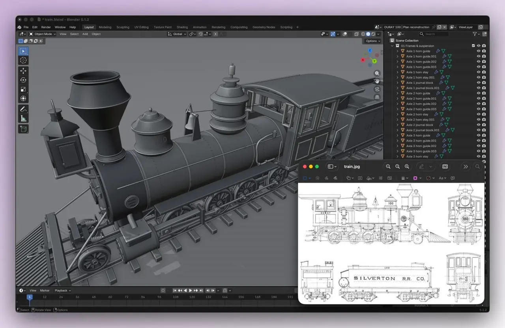</a><br>
<sub><a href="https://cdn.jsdelivr.net/gh/X-RayLuan/awesome-gpt-6-astra-prompts@main/assets/videos/train-blender-readme.mp4">▶ 播放视频</a> · <a href="https://github.com/X-RayLuan/awesome-gpt-6-astra-prompts/releases/download/media-v1/train-blender-readme.mp4">下载 MP4</a></sub>

**提示词（英文原文）**

```text
Take a train line drawing and build a fully editable Blender model with a deep object hierarchy. Export stills + orbit.
```

**中文简述**

火车线稿建成可编辑 Blender 深层级模型；导出静帧+环绕。

[原帖](https://x.com/i/web/status/2095756085890310311) · [返回列表](#all-prompts)

---

### 水下浏览器游戏
<a id="underwater-browser-game"></a>

OpenAIDevs 长文

<a href="https://cdn.jsdelivr.net/gh/X-RayLuan/awesome-gpt-6-astra-prompts@main/assets/videos/underwater-browser-game-readme.mp4">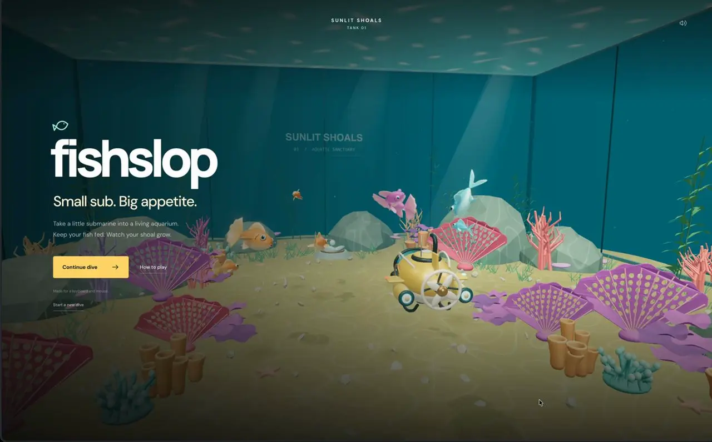</a><br>
<sub><a href="https://cdn.jsdelivr.net/gh/X-RayLuan/awesome-gpt-6-astra-prompts@main/assets/videos/underwater-browser-game-readme.mp4">▶ 播放视频</a> · <a href="https://github.com/X-RayLuan/awesome-gpt-6-astra-prompts/releases/download/media-v1/underwater-browser-game-readme.mp4">下载 MP4</a></sub>

**提示词（英文原文）**

```text
Build an underwater browser game with Astra + Blender assets. Simple controls, polished feel.
```

**中文简述**

Astra+Blender 资产的水下浏览器游戏：简单操控、打磨手感。

[原帖](https://x.com/i/web/status/2095599934766764338) · [返回列表](#all-prompts)

---

### 图片 → 定制乐高式设计
<a id="lego-designs"></a>

OpenAIDevs 长文

<a href="https://cdn.jsdelivr.net/gh/X-RayLuan/awesome-gpt-6-astra-prompts@main/assets/videos/lego-designs-readme.mp4">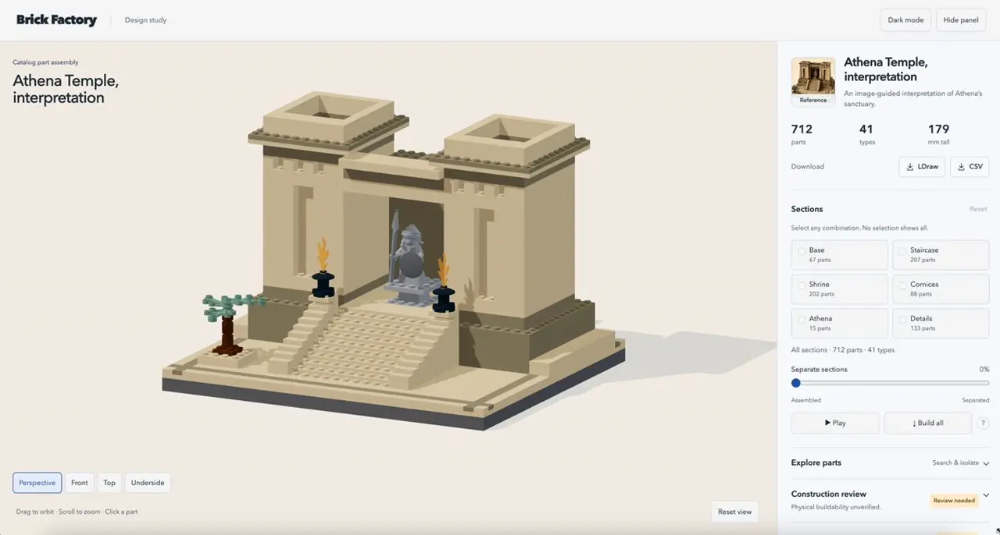</a><br>
<sub><a href="https://cdn.jsdelivr.net/gh/X-RayLuan/awesome-gpt-6-astra-prompts@main/assets/videos/lego-designs-readme.mp4">▶ 播放视频</a> · <a href="https://github.com/X-RayLuan/awesome-gpt-6-astra-prompts/releases/download/media-v1/lego-designs-readme.mp4">下载 MP4</a></sub>

**提示词（英文原文）**

```text
Prototype images/ideas → custom LEGO-style designs with assembly steps. Keep designs original.
```

**中文简述**

图片/想法 → 定制乐高式设计与组装步骤；保持原创。

[原帖](https://x.com/i/web/status/2096377028945576370) · [返回列表](#all-prompts)

---

### 混合现实空管（Unity）
<a id="air-traffic-unity"></a>

OpenAIDevs 长文

<a href="https://cdn.jsdelivr.net/gh/X-RayLuan/awesome-gpt-6-astra-prompts@main/assets/videos/air-traffic-unity-readme.mp4">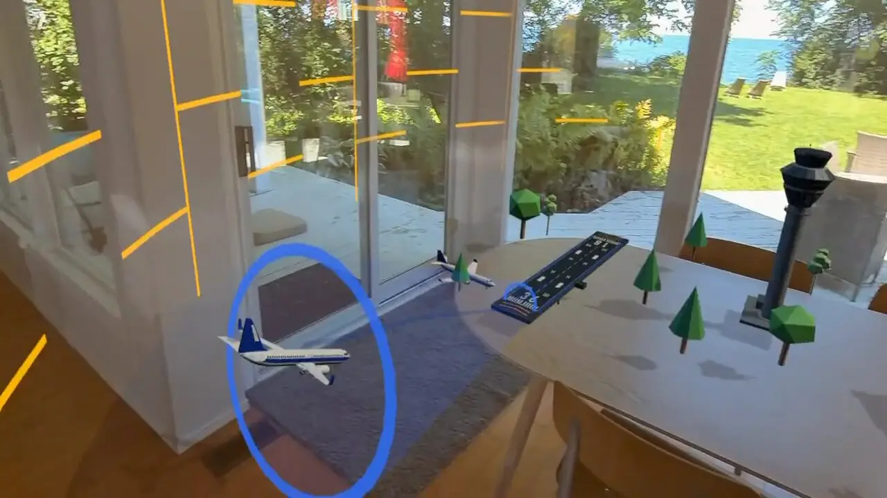</a><br>
<sub><a href="https://cdn.jsdelivr.net/gh/X-RayLuan/awesome-gpt-6-astra-prompts@main/assets/videos/air-traffic-unity-readme.mp4">▶ 播放视频</a> · <a href="https://github.com/X-RayLuan/awesome-gpt-6-astra-prompts/releases/download/media-v1/air-traffic-unity-readme.mp4">下载 MP4</a></sub>

**提示词（英文原文）**

```text
Mixed-reality air traffic simulator in Unity with readable aircraft, routes, and scenario controls.
```

**中文简述**

Unity 混合现实空管：可读飞机、航线与情景控制。

[原帖](https://x.com/i/web/status/2096374716906745941) · [返回列表](#all-prompts)

---

### 录屏 → 可交互界面
<a id="screen-to-ui"></a>

OpenAIDevs 长文

<a href="https://cdn.jsdelivr.net/gh/X-RayLuan/awesome-gpt-6-astra-prompts@main/assets/videos/screen-to-ui-readme.mp4">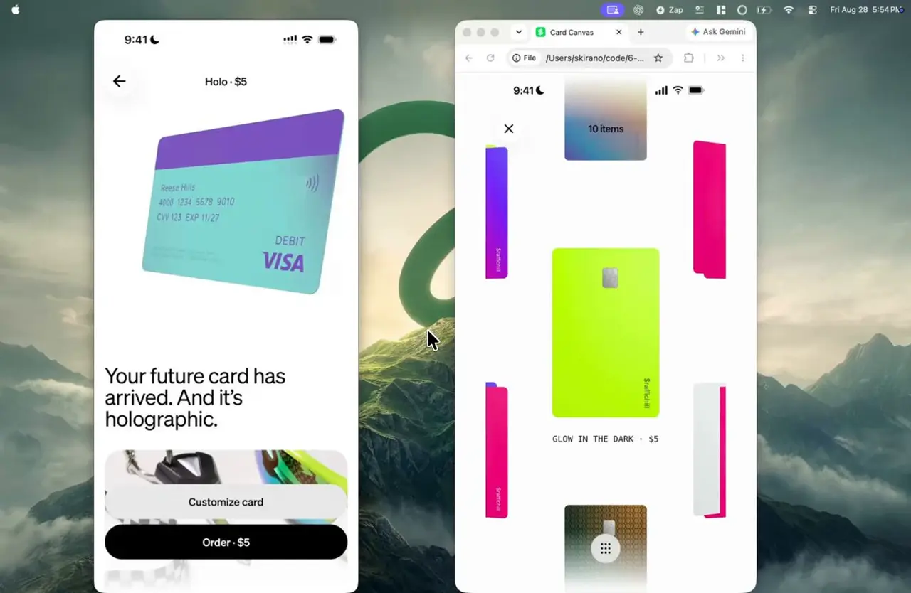</a><br>
<sub><a href="https://cdn.jsdelivr.net/gh/X-RayLuan/awesome-gpt-6-astra-prompts@main/assets/videos/screen-to-ui-readme.mp4">▶ 播放视频</a> · <a href="https://github.com/X-RayLuan/awesome-gpt-6-astra-prompts/releases/download/media-v1/screen-to-ui-readme.mp4">下载 MP4</a></sub>

**提示词（英文原文）**

```text
From a screen recording, reconstruct an interactive interface including animations.
```

**中文简述**

从录屏重建含动画的可交互界面。

[原帖](https://x.com/i/web/status/2095595938534351231) · [返回列表](#all-prompts)

---

### 浏览器竞速（Three.js）
<a id="browser-racing"></a>

OpenAIDevs 长文

<a href="https://cdn.jsdelivr.net/gh/X-RayLuan/awesome-gpt-6-astra-prompts@main/assets/videos/browser-racing-readme.mp4">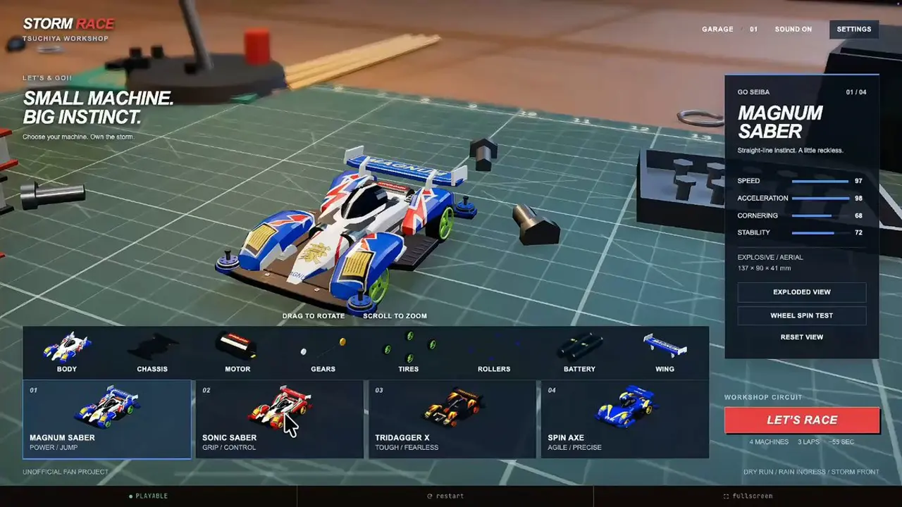</a><br>
<sub><a href="https://cdn.jsdelivr.net/gh/X-RayLuan/awesome-gpt-6-astra-prompts@main/assets/videos/browser-racing-readme.mp4">▶ 播放视频</a> · <a href="https://github.com/X-RayLuan/awesome-gpt-6-astra-prompts/releases/download/media-v1/browser-racing-readme.mp4">下载 MP4</a></sub>

**提示词（英文原文）**

```text
Browser racing game with Three.js: satisfying handling, one track, instant retry.
```

**中文简述**

Three.js 浏览器竞速：手感、单赛道、秒重开。

[原帖](https://x.com/i/web/status/2096587056755638553) · [返回列表](#all-prompts)

---

### Blender 后室（VHS）
<a id="backrooms-blender"></a>

OpenAIDevs 长文

<a href="https://cdn.jsdelivr.net/gh/X-RayLuan/awesome-gpt-6-astra-prompts@main/assets/videos/backrooms-blender-readme.mp4">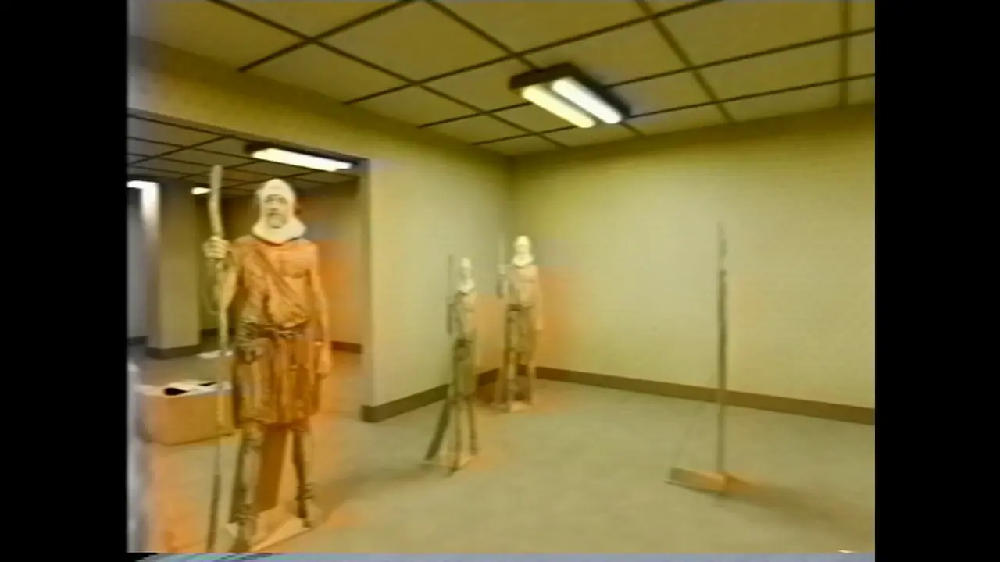</a><br>
<sub><a href="https://cdn.jsdelivr.net/gh/X-RayLuan/awesome-gpt-6-astra-prompts@main/assets/videos/backrooms-blender-readme.mp4">▶ 播放视频</a> · <a href="https://github.com/X-RayLuan/awesome-gpt-6-astra-prompts/releases/download/media-v1/backrooms-blender-readme.mp4">下载 MP4</a></sub>

**提示词（英文原文）**

```text
First-person VHS-style Backrooms journey in Blender (~30s) with sound design notes.
```

**中文简述**

Blender 第一人称 VHS 后室旅程（约 30s）+ 声音设计笔记。

[原帖](https://x.com/i/web/status/2096003511104508411) · [返回列表](#all-prompts)

---

### ESP32 工作台可视化
<a id="esp32-workbench"></a>

OpenAIDevs 长文

**提示词（英文原文）**

```text
Workbench prototype visualizing ESP32 boards, components, and wiring with interactive callouts.
```

**中文简述**

ESP32 板卡/元件/接线可视化工作台，带互动标注。

[原帖](https://x.com/i/web/status/2096342954273054843) · [返回列表](#all-prompts)

---

### iPhone GPU 上的 Swift 光线追踪
<a id="swift-ray-tracer"></a>

OpenAIDevs 长文

<a href="https://cdn.jsdelivr.net/gh/X-RayLuan/awesome-gpt-6-astra-prompts@main/assets/videos/swift-ray-tracer-readme.mp4">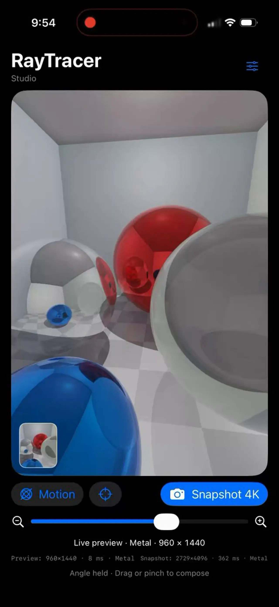</a><br>
<sub><a href="https://cdn.jsdelivr.net/gh/X-RayLuan/awesome-gpt-6-astra-prompts@main/assets/videos/swift-ray-tracer-readme.mp4">▶ 播放视频</a> · <a href="https://github.com/X-RayLuan/awesome-gpt-6-astra-prompts/releases/download/media-v1/swift-ray-tracer-readme.mp4">下载 MP4</a></sub>

**提示词（英文原文）**

```text
Port a C++ ray tracer to Swift on the iPhone GPU. Show interactive frames and performance notes.
```

**中文简述**

C++ 光线追踪移植到 iPhone GPU 的 Swift；展示帧率与性能笔记。

[原帖](https://x.com/i/web/status/2095879835088293931) · [返回列表](#all-prompts)

---


### GPT-6 + Blender → Seedance 2.5 工作流
<a id="tanluai-gpt6-blender-seedance"></a>

[@TanLuAI](https://x.com/TanLuAI) · X 长文（非 Astra — GPT-6/Codex + Blender 白模 → Seedance 2.5）

<a href="https://cdn.jsdelivr.net/gh/X-RayLuan/awesome-gpt-6-astra-prompts@main/assets/videos/tanluai-gpt6-blender-seedance-readme.mp4">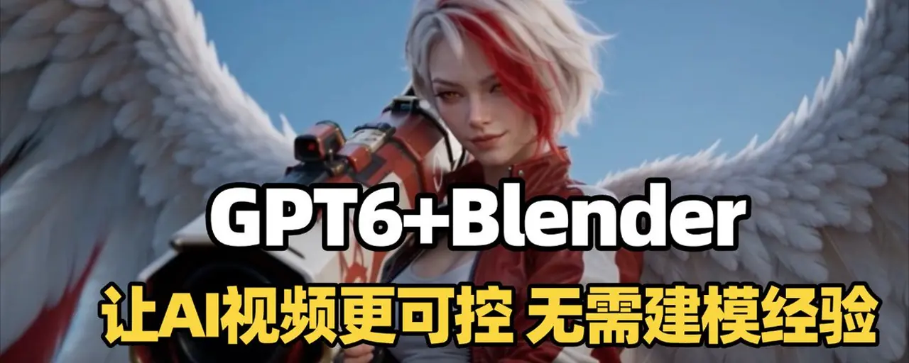</a><br>
<sub><a href="https://cdn.jsdelivr.net/gh/X-RayLuan/awesome-gpt-6-astra-prompts@main/assets/videos/tanluai-gpt6-blender-seedance-readme.mp4">▶ 播放视频</a> · <a href="https://github.com/X-RayLuan/awesome-gpt-6-astra-prompts/releases/download/media-v1/tanluai-gpt6-blender-seedance-readme.mp4">下载 MP4</a></sub>

**提示词（英文原文）**（工作流摘要 — 完整运镜/对白/赛车提示词见原文）

```text
Workflow: (1) Send story beats to Codex/GPT-6 for a shot-by-shot script with camera notes for Blender.
(2) Generate a rough whitebox / proxy 3D preview (cubes OK) that locks blocking, camera, and timing.
(3) Iterate bad shots with the model. (4) Feed reference video + character/env stills into Seedance 2.5
with a detailed render prompt (asset anchors, timing, negatives). Example camera-control brief:
18s 16:9 cinematic urban fantasy — heroine kicks through a Tokyo rooftop door, three agents chase her
to the ledge, she leaps into mist, returns with red-white wings and a rocket launcher; follow the
projectile into a rooftop explosion. Keep geometry as placeholders only; regenerate natural motion.
```

**中文简述**

把灵感发给 Codex/GPT-6 做成带运镜的分镜脚本 → Blender 白模预演走位与镜头 → 多轮改分镜 → 参考视频+角色/场景资产图丢进 Seedance 2.5，用详细渲染提示词出片。示例：东京天台都市奇幻 18 秒复杂运镜。

[原帖](https://x.com/TanLuAI/status/2099124935285461329) · [长文](https://x.com/i/article/2099111135169384451) · [返回列表](#all-prompts)

---
### Kaiju Three.js game
<a id="majid-kaiju-threejs"></a>

[majidmanzarpour](https://x.com/majidmanzarpour) · 社区演示 · GPT-6 Astra

<a href="https://cdn.jsdelivr.net/gh/X-RayLuan/awesome-gpt-6-astra-prompts@main/assets/videos/majid-kaiju-threejs-readme.mp4">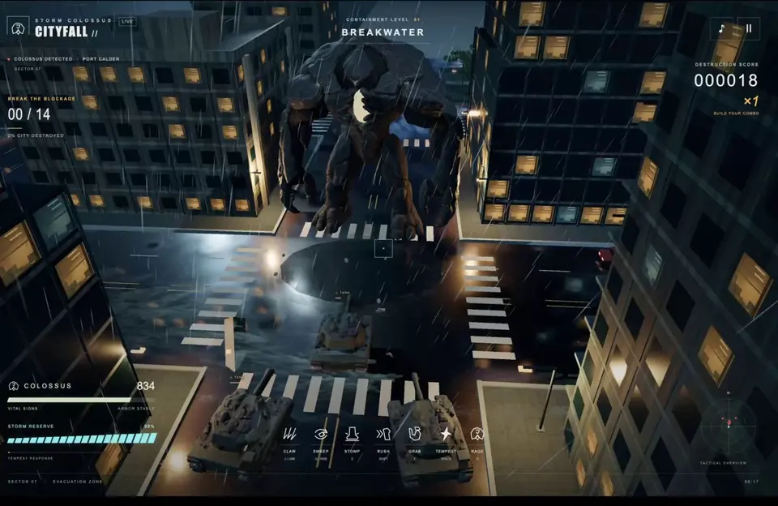</a><br>
<sub><a href="https://cdn.jsdelivr.net/gh/X-RayLuan/awesome-gpt-6-astra-prompts@main/assets/videos/majid-kaiju-threejs-readme.mp4">▶ 播放视频</a> · <a href="https://x.com/majidmanzarpour/status/2096251574918013135">Original on X</a></sub>

_Kaiju-inspired playable Three.js game; models via Tripo, sound via ElevenLabs. Skill pack on GitHub._

**提示词（英文原文）**

```text
Pair GPT-6 Astra with a Three.js game-dev skill pack to build an original kaiju-inspired playable browser game. Prioritize feel and polish. Use original creatures and arenas; do not copy commercial kaiju IP art. Credit third-party model/audio tools separately.
```

[原帖](https://x.com/majidmanzarpour/status/2096251574918013135) · [用 EasyVeo 复刻](https://easyveo.com?utm_source=github&utm_medium=referral&utm_campaign=awesome_gpt6_astra_prompts&utm_content=majid_kaiju_threejs) · [返回列表](#all-prompts)

---

### Isometric ARPG → Blender trailer
<a id="mengto-isometric-arpg"></a>

[MengTo](https://x.com/MengTo) · 社区演示 · GPT-6 Astra

<a href="https://cdn.jsdelivr.net/gh/X-RayLuan/awesome-gpt-6-astra-prompts@main/assets/videos/mengto-isometric-arpg-readme.mp4">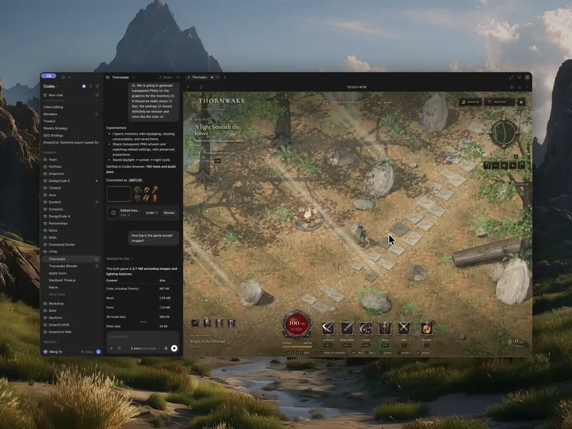</a><br>
<sub><a href="https://cdn.jsdelivr.net/gh/X-RayLuan/awesome-gpt-6-astra-prompts@main/assets/videos/mengto-isometric-arpg-readme.mp4">▶ 播放视频</a> · <a href="https://x.com/MengTo/status/2096213835460084184">Original on X</a></sub>

_Procedural isometric action RPG in Three.js (<2MB before images/music), then every scene rebuilt in Blender for a trailer. UI icons via GPT Image 2._

**提示词（英文原文）**

```text
Build an original isometric action RPG in Three.js mixing Elden Ring–paced exploration with Diablo-style loot, starting in a daytime forest. Keep geometry procedural (no asset packs) so the playable core stays tiny. Then recreate key scenes in Blender and cut a short trailer. Original world and creatures only — do not copy commercial game IP.
```

[原帖](https://x.com/MengTo/status/2096213835460084184) · [用 EasyVeo 复刻](https://easyveo.com?utm_source=github&utm_medium=referral&utm_campaign=awesome_gpt6_astra_prompts&utm_content=mengto_isometric_arpg) · [返回列表](#all-prompts)

---

### PaperRoute
<a id="builtbysketch-paperroute"></a>

[@builtbysketch](https://x.com/builtbysketch) · Emm Tee · 社区演示 · GPT-6 Astra

<a href="https://cdn.jsdelivr.net/gh/X-RayLuan/awesome-gpt-6-astra-prompts@main/assets/videos/builtbysketch-paperroute-readme.mp4">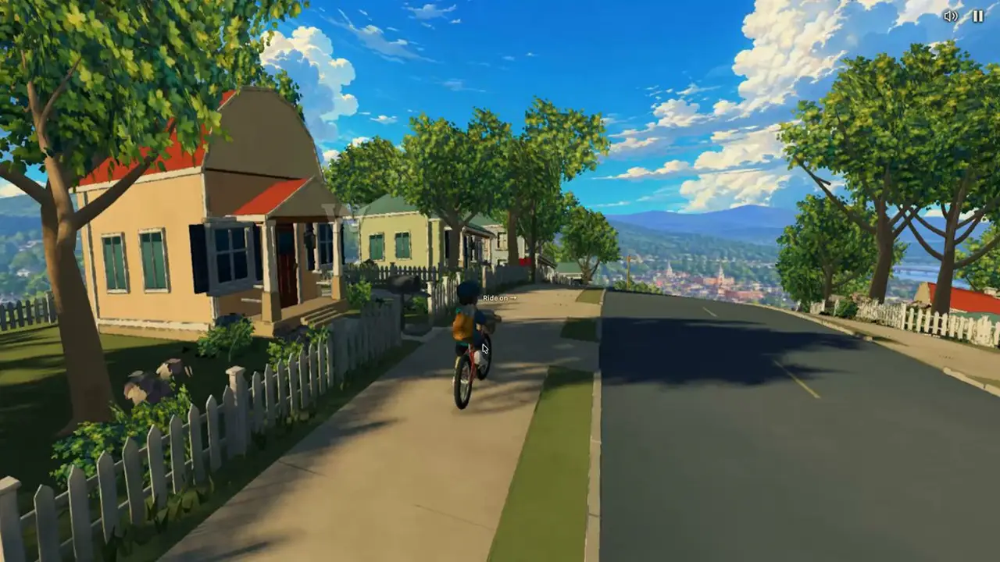</a><br>
<sub><a href="https://cdn.jsdelivr.net/gh/X-RayLuan/awesome-gpt-6-astra-prompts@main/assets/videos/builtbysketch-paperroute-readme.mp4">▶ 播放视频</a> · <a href="https://x.com/builtbysketch/status/2098777028078211283">X 原帖</a></sub>

_Finished Paperboy-inspired browser delivery game (Cedar Hollow / paperroute.lol). Blender street props via Python, Meshy rider characters, GPT-6 Astra for mechanics + polish. Author reports ~1.6B tokens._

**提示词（英文原文）**

```text
Build an original newspaper-delivery bike game for the browser: Mon–Sun routes, subscribers vs non-subscribers, mailboxes, cars, dogs, ballistic paper throws, lives, scoring, and a short park finish. Separate game-mechanics work from art direction. Generate Blender street props (houses, trees, fences, mailboxes) via reproducible Python/GLB exports; use original stylized characters (concept → mesh → reduce/rig/fit) rather than cloning commercial Paperboy assets. Add weather, window-smash flourishes, and a newspaper-themed results UI. Ship a playable web build.
```

[原帖](https://x.com/builtbysketch/status/2098777028078211283) · [试玩](https://paperroute.lol) · [用 EasyVeo 复刻](https://easyveo.com?utm_source=github&utm_medium=referral&utm_campaign=awesome_gpt6_astra_prompts&utm_content=builtbysketch_paperroute) · [返回列表](#all-prompts)

---

### Weeping Angels 浏览器恐怖
<a id="blendibyl-weeping-angels"></a>

[@BlendiByl](https://x.com/BlendiByl) · Blendi · 社区演示 · GPT-6 Astra

<a href="https://cdn.jsdelivr.net/gh/X-RayLuan/awesome-gpt-6-astra-prompts@main/assets/videos/blendibyl-weeping-angels-readme.mp4">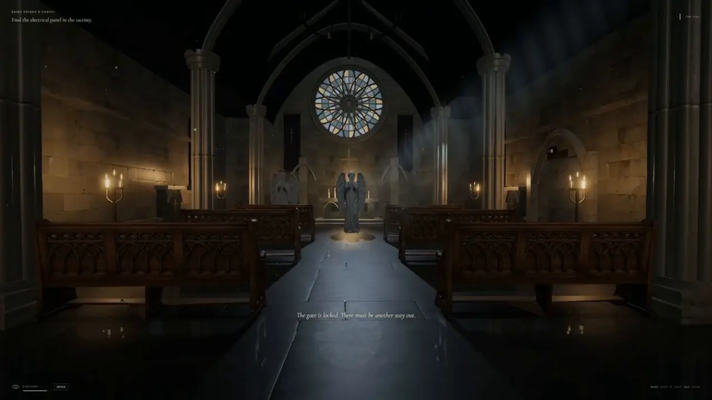</a><br>
<sub><a href="https://cdn.jsdelivr.net/gh/X-RayLuan/awesome-gpt-6-astra-prompts@main/assets/videos/blendibyl-weeping-angels-readme.mp4">▶ 播放视频</a> · <a href="https://x.com/BlendiByl/status/2100442177159729336">X 原帖</a></sub>

_浏览器第一人称恐怖（「别移开视线」）：石像只在你不看它时移动。fal 资产管线（参考图 → Meshy 网格 → 材质/音效）+ Blender 姿势清理后装入 Three.js；用 Codex 里的 GPT-6 Astra 迭代玩法、光照与音频。成品资产可玩 — 无需在线 API Key。_

**提示词（英文原文）**

```text
Build an original browser first-person horror demo where stone statues only move when the player is not looking at them (Weeping Angels–style mechanic, not licensed Doctor Who art). Short candlelight window, flashlight, pitch-dark moments where staring alone should not always save you — even a sliver of a wing beside a column must freeze the whole figure. Generate reference images and 3D meshes via an external asset pipeline, clean poses in Blender, then assemble in Three.js with baked assets so the build runs offline in the browser. Iterate gameplay, lighting, and audio with GPT-6 Astra in Codex until the look-away rules feel fair and scary.
```

[原帖](https://x.com/BlendiByl/status/2100442177159729336) · [试玩](https://weeping-angels.vercel.app/) · [代码](https://github.com/blendi-remade/weeping-angels) · [用 EasyVeo 复刻](https://easyveo.com?utm_source=github&utm_medium=referral&utm_campaign=awesome_gpt6_astra_prompts&utm_content=blendibyl_weeping_angels) · [返回列表](#all-prompts)

---

### Mac 水族箱壁纸
<a id="chaseleantj-aquarium-wallpaper"></a>

[@chaseleantj](https://x.com/chaseleantj) · Chase Lean · 社区演示 · GPT-6 Astra

<a href="https://cdn.jsdelivr.net/gh/X-RayLuan/awesome-gpt-6-astra-prompts@main/assets/videos/chaseleantj-aquarium-readme.mp4">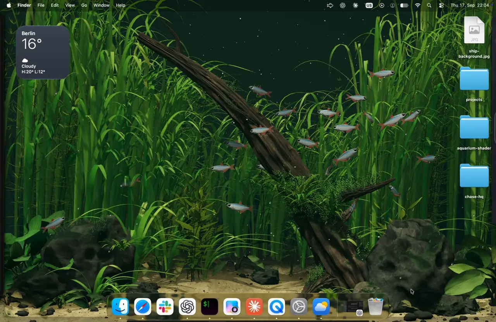</a><br>
<sub><a href="https://cdn.jsdelivr.net/gh/X-RayLuan/awesome-gpt-6-astra-prompts@main/assets/videos/chaseleantj-aquarium-readme.mp4">▶ 播放视频</a> · <a href="https://x.com/chaseleantj/status/2100663203076128908">X 原帖</a></sub>

_互动式 Mac 桌面水族箱壁纸：鱼群随光标移动而转向。仍是原型 — 作者还在优化续航/GPU，尚未公开发布。_

**提示词（英文原文）**

```text
Create an interactive aquarium wallpaper for macOS. Fill the desktop with a lightweight underwater scene where schools of fish respond in real time to the cursor (treat the pointer like bait). Prefer a smooth, always-on feel suitable as a daily wallpaper; keep rendering cheap enough that it does not drain the laptop battery. Ship a working visual prototype first, then optimize frame rate and GPU use for all-day use.
```

[原帖](https://x.com/chaseleantj/status/2100663203076128908) · [用 EasyVeo 复刻](https://easyveo.com?utm_source=github&utm_medium=referral&utm_campaign=awesome_gpt6_astra_prompts&utm_content=chaseleantj_aquarium_wallpaper) · [返回列表](#all-prompts)

---

### The Crownless
<a id="izkimar-crownless"></a>

[@Izkimar](https://x.com/Izkimar) · Izkimar · 社区演示 · GPT-6 Astra

<a href="https://cdn.jsdelivr.net/gh/X-RayLuan/awesome-gpt-6-astra-prompts@main/assets/videos/izkimar-crownless-readme.mp4">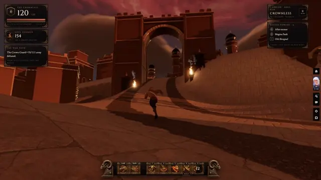</a><br>
<sub><a href="https://cdn.jsdelivr.net/gh/X-RayLuan/awesome-gpt-6-astra-prompts@main/assets/videos/izkimar-crownless-readme.mp4">▶ 播放视频</a> · <a href="https://x.com/Izkimar/status/2100753871903855095">X 原帖</a></sub>

_《无冕之王》是一款用 GPT-6 Astra 在 Spawn 中构建的动作 Roguelike：开始游戏、发现问题、告诉智能体并在同一局中修补 — 无需停下来重新部署。整个过程只花了一天多一点。_

**提示词（英文原文）**

```text
Build an original action roguelike you can play in the browser (or a Spawn session). Keep the loop tight: start a run, fight, pick upgrades, die, repeat. Prefer editing the live game with GPT-6 Astra while you play — when something feels off or you get an idea, ask the agent to change it in-session instead of stopping to redeploy. Ship a playable build with clear feedback on hits, risk, and progression.
```

[原帖](https://x.com/Izkimar/status/2100753871903855095) · [试玩](https://www.spawn.co/@izkimar/the-crownless/play) · [用 EasyVeo 复刻](https://easyveo.com?utm_source=github&utm_medium=referral&utm_campaign=awesome_gpt6_astra_prompts&utm_content=izkimar_crownless) · [返回列表](#all-prompts)

---

### 带 AI 玩家的《卡坦岛》Three.js 游戏
<a id="mengto-catan-threejs-game"></a>

[@MengTo](https://x.com/MengTo) · Meng To · 社区演示 · GPT-6 Astra

<a href="https://cdn.jsdelivr.net/gh/X-RayLuan/awesome-gpt-6-astra-prompts@main/assets/videos/mengto-catan-threejs-game-readme.mp4">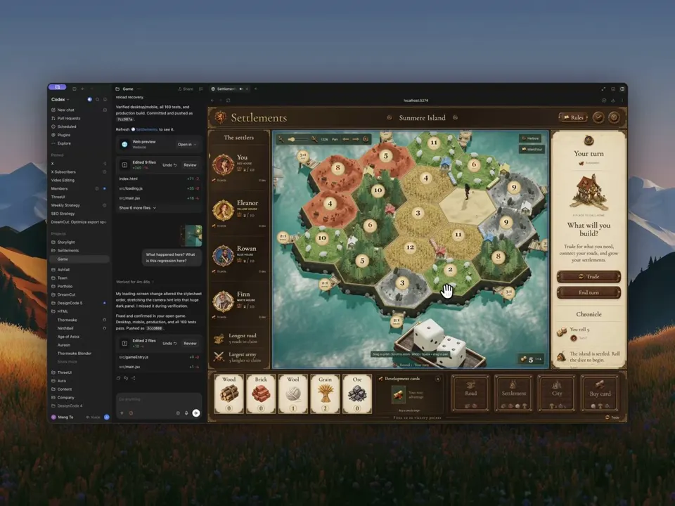</a><br>
<sub><a href="https://cdn.jsdelivr.net/gh/X-RayLuan/awesome-gpt-6-astra-prompts@main/assets/videos/mengto-catan-threejs-game-readme.mp4">▶ 播放视频</a> · <a href="https://x.com/MengTo/status/2097291240672993773">X 原帖</a></sub>

_Meng To 表示，Astra 用 three.js 制作了一款受《卡坦岛》启发的游戏，包含动画、玩法说明、信息卡片、AI 玩家和交易功能。Astra 参考了他此前开始制作的另一款游戏，复用了界面、3D 模型、页面和声音等元素。_

**提示词** · _作者未公开。_

[原帖](https://x.com/MengTo/status/2097291240672993773) · [用 EasyVeo 复刻](https://easyveo.com?utm_source=github&utm_medium=referral&utm_campaign=awesome_gpt6_astra_prompts&utm_content=mengto_catan_threejs_game) · [返回列表](#all-prompts)

---

### Astra 设计迷你 DJ 控制器
<a id="eminimnim-mini-dj-controller"></a>

[@eminimnim](https://x.com/eminimnim) · nim · 社区演示 · GPT-6 Astra

<a href="https://cdn.jsdelivr.net/gh/X-RayLuan/awesome-gpt-6-astra-prompts@main/assets/videos/eminimnim-mini-dj-controller-readme.mp4">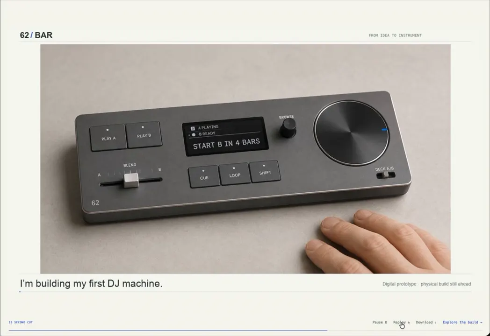</a><br>
<sub><a href="https://cdn.jsdelivr.net/gh/X-RayLuan/awesome-gpt-6-astra-prompts@main/assets/videos/eminimnim-mini-dj-controller-readme.mp4">▶ 播放视频</a> · <a href="https://x.com/eminimnim/status/2098072497182666987">X 原帖</a></sub>

_作者请 Astra 设计一款 Teenage Engineering 风格的迷你 DJ 控制器。据作者介绍，它生成了概念图、寻找零件、阅读中文数据手册、建立 CAD 模型、订购零件，并制作了展示组装过程的 Blender 动画。_

**提示词** · _作者未公开。_

[原帖](https://x.com/eminimnim/status/2098072497182666987) · [用 EasyVeo 复刻](https://easyveo.com?utm_source=github&utm_medium=referral&utm_campaign=awesome_gpt6_astra_prompts&utm_content=eminimnim_mini_dj_controller) · [返回列表](#all-prompts)

---

### 为即时战略游戏制作蝎形生物动画
<a id="stefan-3d-ai-scorpid-animation"></a>

[@Stefan_3D_AI](https://x.com/Stefan_3D_AI) · Stefan 3D AI · 社区演示 · GPT-6 Astra

_作者使用 GPT-6 Astra，根据 Tripo P2.0 制作的模型和动作视频参考，为一只蝎形生物制作动画，再将其导入 Unity。作者称，制作五段可用于游戏的动画花了约一个半小时，又花一小时让它在游戏中运行。_

**提示词** · _作者未公开。_

[原帖](https://x.com/Stefan_3D_AI/status/2098387407565730203) · [用 EasyVeo 复刻](https://easyveo.com?utm_source=github&utm_medium=referral&utm_campaign=awesome_gpt6_astra_prompts&utm_content=stefan_3d_ai_scorpid_animation) · [返回列表](#all-prompts)

---

### 为扫描的破损表面制作 3D 打印补片
<a id="toyoshi-3d-printed-surface-patch"></a>

[@toyoshi](https://x.com/toyoshi) · とよし🍅株式会社トクイテン代表 · 社区演示 · GPT-6 Astra

<a href="https://cdn.jsdelivr.net/gh/X-RayLuan/awesome-gpt-6-astra-prompts@main/assets/videos/toyoshi-3d-printed-surface-patch-readme.mp4">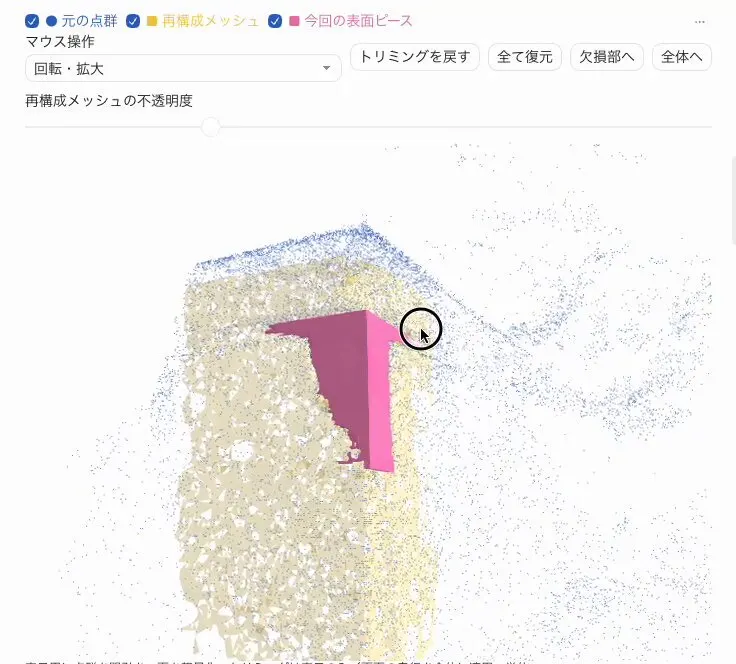</a><br>
<sub><a href="https://cdn.jsdelivr.net/gh/X-RayLuan/awesome-gpt-6-astra-prompts@main/assets/videos/toyoshi-3d-printed-surface-patch-readme.mp4">▶ 播放视频</a> · <a href="https://x.com/toyoshi/status/2098690472193695756">X 原帖</a></sub>

_作者用 iPhone 和 Scaniverse 扫描破损表面，再将 PLY 格式的点云数据交给 GPT-6 Astra，制作可 3D 打印的补片。作者表示，自己没有指出缺损位置，首次打印后还做了一些调整。_

**提示词** · _作者未公开。_

[原帖](https://x.com/toyoshi/status/2098690472193695756) · [用 EasyVeo 复刻](https://easyveo.com?utm_source=github&utm_medium=referral&utm_campaign=awesome_gpt6_astra_prompts&utm_content=toyoshi_3d_printed_surface_patch) · [返回列表](#all-prompts)

---

### 《奥德赛》复古 3D 浏览器游戏
<a id="jasoncjs--odyssey-retro-3d-game"></a>

[@jasoncjs_](https://x.com/jasoncjs_) · Jason Chew · 社区演示 · GPT-6 Astra

<a href="https://cdn.jsdelivr.net/gh/X-RayLuan/awesome-gpt-6-astra-prompts@main/assets/videos/jasoncjs--odyssey-retro-3d-game-readme.mp4">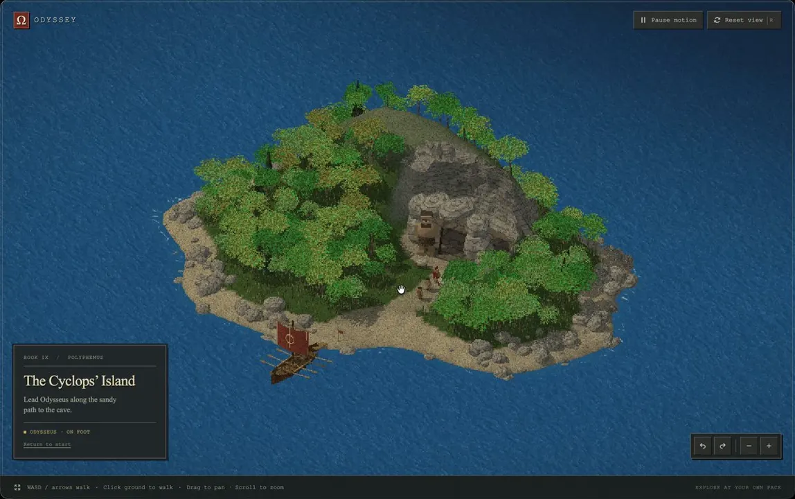</a><br>
<sub><a href="https://cdn.jsdelivr.net/gh/X-RayLuan/awesome-gpt-6-astra-prompts@main/assets/videos/jasoncjs--odyssey-retro-3d-game-readme.mp4">▶ 播放视频</a> · <a href="https://x.com/jasoncjs_/status/2099414001851449430">X 原帖</a></sub>

_作者称，他们用一条提示词让 Astra 将荷马的《奥德赛》做成复古 3D 游戏。提示词要求制作以独眼巨人之岛为背景、可游玩的等距像素风浏览器体验。_

**提示词** · 原文摘自[作者帖子](https://x.com/jasoncjs_/status/2099414001851449430)（保留原文，不翻译）

```text
Build an interactive browser experience based on Homer’s Odyssey - The Cyclops’ Island.

Create a polished isometric pixel-art 3D diorama of a small Greek island surrounded by animated ocean. Include a sandy shore, dense forest, rocky cliffs, a large cave, Odysseus and his crew, the Cyclops, and their ship offshore.

Make it feel like a small playable game:

Control Odysseus with WASD or arrow keys
Click the ground to walk
Drag to pan the camera
Scroll to zoom
Add subtle water, tree, character, and environmental animation
Add camera rotate, zoom, reset-view, and pause controls
Use collision so the player cannot walk through rocks, trees, or water

Add a dark literary UI panel in the bottom-left:

“Lead Odysseus along the sandy path to the cave.”
Show the current character and movement state below it.
Art direction: detailed 1990s isometric strategy/RPG pixel art, muted Mediterranean colors, textured terrain, warm parchment typography, subtle grain, and premium game UI. It should look like an old illustrated map brought to life.
Make the whole experience fill the browser window and work immediately. Do not make a mockup. Build the complete interactive experience.
```

[原帖](https://x.com/jasoncjs_/status/2099414001851449430) · [用 EasyVeo 复刻](https://easyveo.com?utm_source=github&utm_medium=referral&utm_campaign=awesome_gpt6_astra_prompts&utm_content=jasoncjs__odyssey_retro_3d_game) · [返回列表](#all-prompts)

---

### 用 Astra 和 Tripo AI 制作 3D 版泡泡堂
<a id="jaredliu-bravo-3d-bubble-hall"></a>

[@jaredliu_bravo](https://x.com/jaredliu_bravo) · Jared 宗源 · 社区演示 · GPT-6 Astra

_作者使用 Astra 和 Tripo AI 一次生成了 3D 版《泡泡堂》。帖子附有提示词页面链接，但未包含提示词原文。_

**提示词** · _作者未公开。_

[原帖](https://x.com/jaredliu_bravo/status/2102300855387205871) · [用 EasyVeo 复刻](https://easyveo.com?utm_source=github&utm_medium=referral&utm_campaign=awesome_gpt6_astra_prompts&utm_content=jaredliu_bravo_3d_bubble_hall) · [返回列表](#all-prompts)

---

### 用 Astra 反复打磨的 3D 场景
<a id="m1astra-iteratively-refined-3d-scene"></a>

[@M1Astra](https://x.com/M1Astra) · M1 · 社区演示 · GPT-6 Astra

<a href="https://cdn.jsdelivr.net/gh/X-RayLuan/awesome-gpt-6-astra-prompts@main/assets/videos/m1astra-iteratively-refined-3d-scene-readme.mp4"></a><br>
<sub><a href="https://cdn.jsdelivr.net/gh/X-RayLuan/awesome-gpt-6-astra-prompts@main/assets/videos/m1astra-iteratively-refined-3d-scene-readme.mp4">▶ 播放视频</a> · <a href="https://x.com/M1Astra/status/2103152489772073421">X 原帖</a></sub>

_作者通过反复提示 Astra、参考研究资料并持续改进，制作了一个细节丰富的 3D 场景。作者称使用了 Blender 和 Premiere，建模时使用无界面脚本，而非 MCP 或 CUA。_

**提示词** · _作者未公开。_

[原帖](https://x.com/M1Astra/status/2103152489772073421) · [用 EasyVeo 复刻](https://easyveo.com?utm_source=github&utm_medium=referral&utm_campaign=awesome_gpt6_astra_prompts&utm_content=m1astra_iteratively_refined_3d_scene) · [返回列表](#all-prompts)

---

### 颐和园佛香阁 3D 场景
<a id="saccc-c-summer-palace-buddhist-incense-tower"></a>

[@Saccc_c](https://x.com/Saccc_c) · Sac · 社区演示 · GPT-6 Astra

<a href="https://cdn.jsdelivr.net/gh/X-RayLuan/awesome-gpt-6-astra-prompts@main/assets/videos/saccc-c-summer-palace-buddhist-incense-tower-readme.mp4"></a><br>
<sub><a href="https://cdn.jsdelivr.net/gh/X-RayLuan/awesome-gpt-6-astra-prompts@main/assets/videos/saccc-c-summer-palace-buddhist-incense-tower-readme.mp4">▶ 播放视频</a> · <a href="https://x.com/Saccc_c/status/2097225315089256814">X 原帖</a></sub>

_作者使用 GPT-6 Astra 和 Blender 制作了颐和园佛香阁的 3D 场景。据作者介绍，Astra 自行从网上收集真实照片，通过 Blender CLI 反复迭代，并在完成建模后制作了演示视频。_

**提示词** · _作者未公开。_

[原帖](https://x.com/Saccc_c/status/2097225315089256814) · [用 EasyVeo 复刻](https://easyveo.com?utm_source=github&utm_medium=referral&utm_campaign=awesome_gpt6_astra_prompts&utm_content=saccc_c_summer_palace_buddhist_incense_tower) · [返回列表](#all-prompts)

---

### 《神经漫游者》海报风格字体与动态展示
<a id="maxescu-neuromancer-inspired-font-showcase"></a>

[@maxescu](https://x.com/maxescu) · Alex Patrascu · 社区演示 · GPT-6 Astra

<a href="https://cdn.jsdelivr.net/gh/X-RayLuan/awesome-gpt-6-astra-prompts@main/assets/videos/maxescu-neuromancer-inspired-font-showcase-readme.mp4">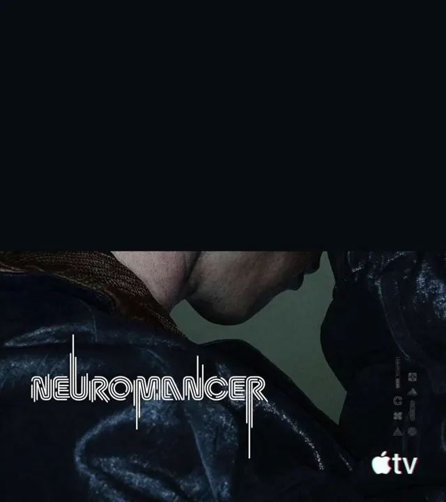</a><br>
<sub><a href="https://cdn.jsdelivr.net/gh/X-RayLuan/awesome-gpt-6-astra-prompts@main/assets/videos/maxescu-neuromancer-inspired-font-showcase-readme.mp4">▶ 播放视频</a> · <a href="https://x.com/maxescu/status/2097256565824774332">X 原帖</a></sub>

_作者将一张《神经漫游者》海报交给 GPT-6 Astra，请它制作风格相近的字体，并使用 Higgsfield 插件制作动态展示。作者称，它在 13 分 19 秒内做出了可用的 Regular 和 Signal 两种字型。_

**提示词** · 原文摘自[作者帖子](https://x.com/maxescu/status/2097256565824774332)（保留原文，不翻译）

```text
Create a full font similar to the one in the attached poster, and animate a showcase presentation for the font using the Higgsfield plugin
```

[原帖](https://x.com/maxescu/status/2097256565824774332) · [用 EasyVeo 复刻](https://easyveo.com?utm_source=github&utm_medium=referral&utm_campaign=awesome_gpt6_astra_prompts&utm_content=maxescu_neuromancer_inspired_font_showcase) · [返回列表](#all-prompts)

---

### 现代版红警风格策略游戏
<a id="hd-lhn783wtlkppr-modern-red-alert-strategy-game"></a>

[@HDLhN783wtLkpPR](https://x.com/HDLhN783wtLkpPR) · DuaDu · 社区演示 · GPT-6 Astra

<a href="https://cdn.jsdelivr.net/gh/X-RayLuan/awesome-gpt-6-astra-prompts@main/assets/videos/hd-lhn783wtlkppr-modern-red-alert-strategy-game-readme.mp4">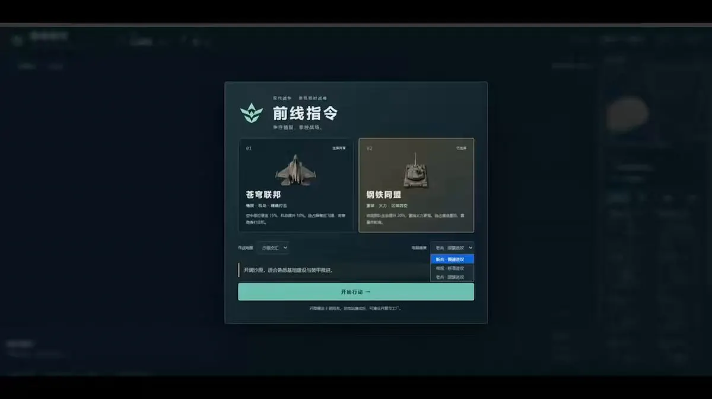</a><br>
<sub><a href="https://cdn.jsdelivr.net/gh/X-RayLuan/awesome-gpt-6-astra-prompts@main/assets/videos/hd-lhn783wtlkppr-modern-red-alert-strategy-game-readme.mp4">▶ 播放视频</a> · <a href="https://x.com/HDLhN783wtLkpPR/status/2097321360641122393">X 原帖</a></sub>

_作者表示用 GPT Astra 制作了一款可玩的策略游戏，包含基地建设、资源采集、造兵、进攻和对战。作者在回复中提供了游戏链接。_

**提示词** · _作者未公开。_

[原帖](https://x.com/HDLhN783wtLkpPR/status/2097321360641122393) · [用 EasyVeo 复刻](https://easyveo.com?utm_source=github&utm_medium=referral&utm_campaign=awesome_gpt6_astra_prompts&utm_content=hd_lhn783wtlkppr_modern_red_alert_strategy_game) · [返回列表](#all-prompts)

---

### Three.js 互动模型铁路
<a id="nickfromlater-interactive-model-railroad"></a>

[@nickfromlater](https://x.com/nickfromlater) · Probably Nick · 社区演示 · GPT-6 Astra

<a href="https://cdn.jsdelivr.net/gh/X-RayLuan/awesome-gpt-6-astra-prompts@main/assets/videos/nickfromlater-interactive-model-railroad-readme.mp4">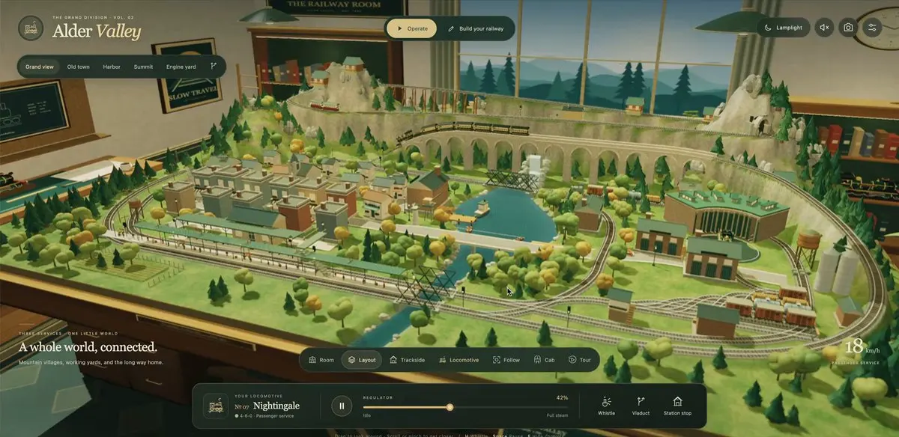</a><br>
<sub><a href="https://cdn.jsdelivr.net/gh/X-RayLuan/awesome-gpt-6-astra-prompts@main/assets/videos/nickfromlater-interactive-model-railroad-readme.mp4">▶ 播放视频</a> · <a href="https://x.com/nickfromlater/status/2097355845524726084">X 原帖</a></sub>

_一个用 Astra 和 Three.js 构建的互动模型铁路，作者提供了试玩链接。_

**提示词** · _作者未公开。_

[原帖](https://x.com/nickfromlater/status/2097355845524726084) · [用 EasyVeo 复刻](https://easyveo.com?utm_source=github&utm_medium=referral&utm_campaign=awesome_gpt6_astra_prompts&utm_content=nickfromlater_interactive_model_railroad) · [返回列表](#all-prompts)

---

### Astra 创作巴赫风格赋格曲
<a id="aug5thmusic-bach-style-fugue"></a>

[@aug5thmusic](https://x.com/aug5thmusic) · Auggie · 社区演示 · GPT-6 Astra

<a href="https://cdn.jsdelivr.net/gh/X-RayLuan/awesome-gpt-6-astra-prompts@main/assets/videos/aug5thmusic-bach-style-fugue-readme.mp4">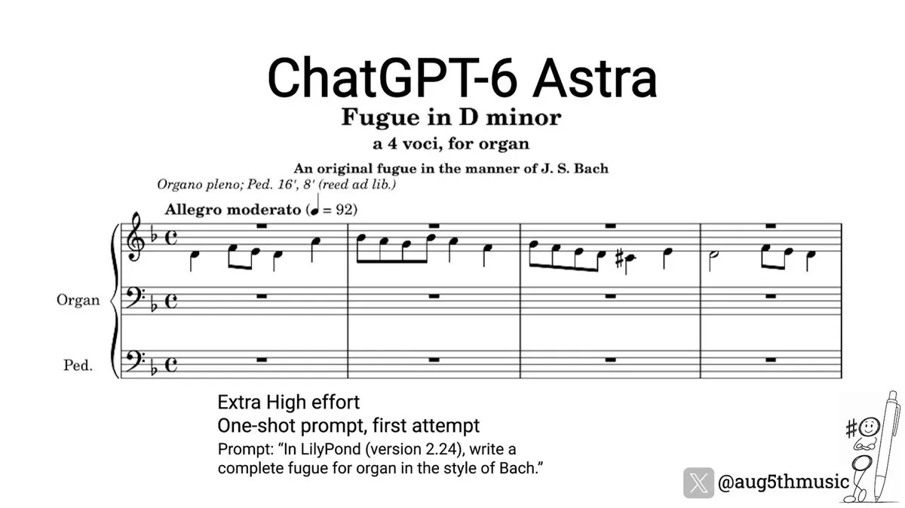</a><br>
<sub><a href="https://cdn.jsdelivr.net/gh/X-RayLuan/awesome-gpt-6-astra-prompts@main/assets/videos/aug5thmusic-bach-style-fugue-readme.mp4">▶ 播放视频</a> · <a href="https://x.com/aug5thmusic/status/2097373938393456984">X 原帖</a></sub>

_作者称，Astra 首次尝试就创作出一首完整的巴赫风格赋格曲。Astra 生成了 MIDI，作者将其导入 MuseScore，并选用 MuseSounds 的铜管乐器音色播放。_

**提示词** · 原文摘自[作者回复](https://x.com/aug5thmusic/status/2097374596660101432)（保留原文，不翻译）

```text
In LilyPond (version 2.24), write a complete fugue for organ in the style of Bach.
```

[原帖](https://x.com/aug5thmusic/status/2097373938393456984) · [用 EasyVeo 复刻](https://easyveo.com?utm_source=github&utm_medium=referral&utm_campaign=awesome_gpt6_astra_prompts&utm_content=aug5thmusic_bach_style_fugue) · [返回列表](#all-prompts)

---

### 用九张照片制作可交互的工作室 3D 模型
<a id="rpnickson-interactive-3d-studio"></a>

[@rpnickson](https://x.com/rpnickson) · Roberto Nickson · 社区演示 · GPT-6 Astra

<a href="https://cdn.jsdelivr.net/gh/X-RayLuan/awesome-gpt-6-astra-prompts@main/assets/videos/rpnickson-interactive-3d-studio-readme.mp4">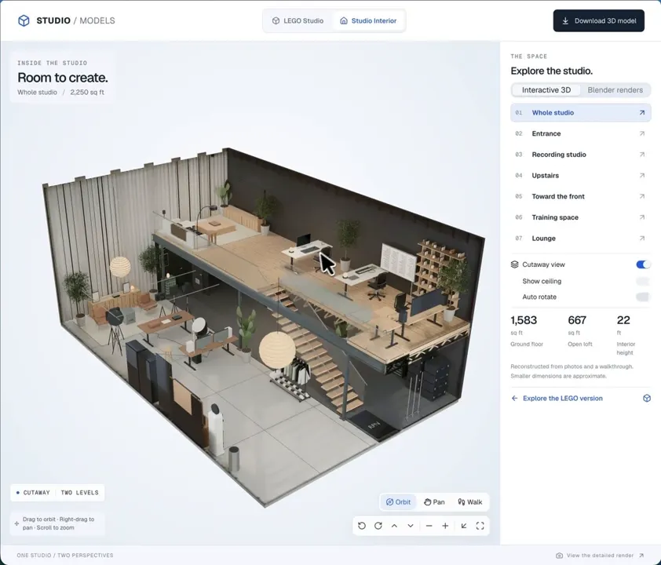</a><br>
<sub><a href="https://cdn.jsdelivr.net/gh/X-RayLuan/awesome-gpt-6-astra-prompts@main/assets/videos/rpnickson-interactive-3d-studio-readme.mp4">▶ 播放视频</a> · <a href="https://x.com/rpnickson/status/2097488440489116111">X 原帖</a></sub>

_作者向 GPT-6 Astra 提供了九张工作室照片，生成了可交互的空间 3D 模型。他说 Astra 先在 Blender 中制作模型，再将其做成可在浏览器中探索的网站。_

**提示词** · _作者未公开。_

[原帖](https://x.com/rpnickson/status/2097488440489116111) · [用 EasyVeo 复刻](https://easyveo.com?utm_source=github&utm_medium=referral&utm_campaign=awesome_gpt6_astra_prompts&utm_content=rpnickson_interactive_3d_studio) · [返回列表](#all-prompts)

---

### Codex 脚本生成 After Effects 视频
<a id="nyto-vd-codex-after-effects-video"></a>

[@Nyto_vd](https://x.com/Nyto_vd) · トニー太田 · 社区演示 · GPT-6 Astra

_作者使用 Codex（GPT-6 Astra）编写脚本，再在 After Effects 中运行，仅用 After Effects 的标准功能制作视频，没有借助外部 AI 视频生成工具。作者称视频在几分钟内完成。_

**提示词** · _作者未公开。_

[原帖](https://x.com/Nyto_vd/status/2097499735942893726) · [用 EasyVeo 复刻](https://easyveo.com?utm_source=github&utm_medium=referral&utm_campaign=awesome_gpt6_astra_prompts&utm_content=nyto_vd_codex_after_effects_video) · [返回列表](#all-prompts)

---

### 360°全景视频工坊
<a id="kanaworks-ai-360-panorama-video-workshop"></a>

[@KanaWorks_AI](https://x.com/KanaWorks_AI) · KANA｜東京AI映像 · 社区演示 · GPT-6 Astra

_作者表示，GPT-6 Astra 制作了一个工坊，可将去除背景的角色视频放入 360° 全景图中，预览并调整画面，再导出带有 YouTube 360° 元数据的 MP4。全景图由 ChatGPT Images 2.5 制作，视频由 Dreamina 上的 Seedance 2.5 制作。_

**提示词** · 原文摘自[作者帖子](https://x.com/KanaWorks_AI/status/2097518459596972066)（保留原文，不翻译）

```text
360°パノラマ画像とキャラクター動画をアップロードし、動画の背景を除去。キャラクターの位置やサイズをドラッグで調整しながらリアルタイムでプレビューでき、アニメーションのループ設定にも対応。最後に、YouTube 360°用のメタデータを付与したMP4をワンクリックで書き出せる“パノラマ動画工房”を作って。
```

[原帖](https://x.com/KanaWorks_AI/status/2097518459596972066) · [用 EasyVeo 复刻](https://easyveo.com?utm_source=github&utm_medium=referral&utm_campaign=awesome_gpt6_astra_prompts&utm_content=kanaworks_ai_360_panorama_video_workshop) · [返回列表](#all-prompts)

---

### 《英雄无敌 3》墓园阵营画面重制
<a id="ye-combinator-homm3-necropolis-remake"></a>

[@ye_combinator](https://x.com/ye_combinator) · Zihao Ye · 社区演示 · GPT-6 Astra

_Zihao Ye 重制了《英雄无敌 3》墓园阵营的画面。据作者介绍，Meshy 为人形生物生成带纹理的 3D 模型和初始骨骼，GPT-6 Astra 则驱动 Blender 重建动画并渲染画面；生成的美术素材被打包为 VCMI 模组。_

**提示词** · _作者未公开。_

[原帖](https://x.com/ye_combinator/status/2097562847215845500) · [用 EasyVeo 复刻](https://easyveo.com?utm_source=github&utm_medium=referral&utm_campaign=awesome_gpt6_astra_prompts&utm_content=ye_combinator_homm3_necropolis_remake) · [返回列表](#all-prompts)

---

### 金属方块加工厂游戏原型
<a id="chod3s-metal-cube-factory"></a>

[@chod3s](https://x.com/chod3s) · gin0 · 社区演示 · GPT-6 Astra

_这是一款工厂游戏原型，玩家通过布置机器，将金属方块加工成订单要求的零件。作者称，他们使用 Astra、Blender 和 Godot 制作了游戏，并用 Eleven Labs 制作音乐和音效；游戏还包含逐步介绍机器操作的可玩教程。_

**提示词** · _作者未公开。_

[原帖](https://x.com/chod3s/status/2097563137784385541) · [用 EasyVeo 复刻](https://easyveo.com?utm_source=github&utm_medium=referral&utm_campaign=awesome_gpt6_astra_prompts&utm_content=chod3s_metal_cube_factory) · [返回列表](#all-prompts)

---

### GPT-6 Astra 与 DeepSeek V4.1 Flash 的 Three.js 游戏对比
<a id="opendesignhq-threejs-game-comparison"></a>

[@OpenDesignHQ](https://x.com/OpenDesignHQ) · OpenDesign · 社区演示 · GPT-6 Astra

_OpenDesign 分别使用 GPT-6 Astra 和 DeepSeek V4.1 Flash 制作了两款 Three.js 游戏，并分享出来供大家比较。_

**提示词** · _作者未公开。_

[原帖](https://x.com/OpenDesignHQ/status/2097635757917983223) · [用 EasyVeo 复刻](https://easyveo.com?utm_source=github&utm_medium=referral&utm_campaign=awesome_gpt6_astra_prompts&utm_content=opendesignhq_threejs_game_comparison) · [返回列表](#all-prompts)

---

### 浏览器单人即时战略游戏
<a id="mustafaakin-browser-rts-game"></a>

[@mustafaakin](https://x.com/mustafaakin) · Mustafa Akın · 社区演示 · GPT-6 Astra

_Mustafa Akın 使用 ChatGPT Astra 和 Blender MCP 制作了一款浏览器单人即时战略游戏。据作者称，包括从零生成游戏素材在内，整个制作过程用了 40 条提示。_

**提示词** · _作者未公开。_

[原帖](https://x.com/mustafaakin/status/2097658461228069121) · [用 EasyVeo 复刻](https://easyveo.com?utm_source=github&utm_medium=referral&utm_campaign=awesome_gpt6_astra_prompts&utm_content=mustafaakin_browser_rts_game) · [返回列表](#all-prompts)

---

### 班加罗尔外环路赛车游戏
<a id="ravithejads-bengaluru-orr-racing-game"></a>

[@ravithejads](https://x.com/ravithejads) · Ravi Theja · 社区演示 · GPT-6 Astra

<a href="https://cdn.jsdelivr.net/gh/X-RayLuan/awesome-gpt-6-astra-prompts@main/assets/videos/ravithejads-bengaluru-orr-racing-game-readme.mp4">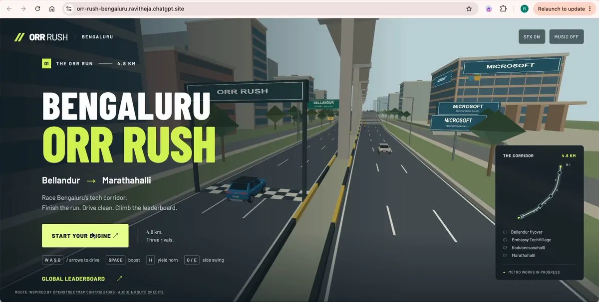</a><br>
<sub><a href="https://cdn.jsdelivr.net/gh/X-RayLuan/awesome-gpt-6-astra-prompts@main/assets/videos/ravithejads-bengaluru-orr-racing-game-readme.mp4">▶ 播放视频</a> · <a href="https://x.com/ravithejads/status/2097181044625887392">X 原帖</a></sub>

_Ravi Theja 使用 GPT-6 Astra 制作了一款赛车游戏，场景是班加罗尔外环路从 Bellandur 到 Marathahalli 的路段。游戏包含拥堵的车流、坑洼路面、外卖骑手、地铁施工，以及受《Road Rash》启发、可向附近车辆挥杆的玩法。_

**提示词** · _作者未公开。_

[原帖](https://x.com/ravithejads/status/2097181044625887392) · [用 EasyVeo 复刻](https://easyveo.com?utm_source=github&utm_medium=referral&utm_campaign=awesome_gpt6_astra_prompts&utm_content=ravithejads_bengaluru_orr_racing_game) · [返回示例](#all-prompts)

---

### Hollowflux
<a id="openai-showcase-hollowflux"></a>

[OpenAI Showcase](https://developers.openai.com/showcase/hollowflux) · Thomas Ricouard · 官方演示 · GPT-6 Astra

<a href="https://developers.openai.com/showcase/hollowflux">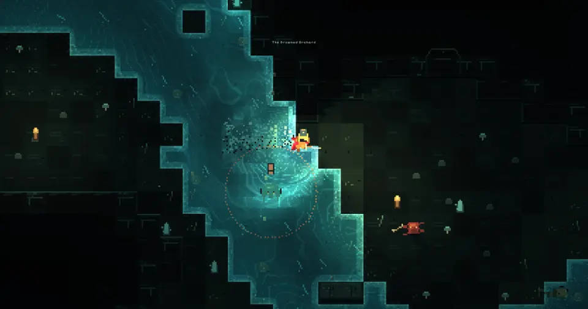</a><br>
<sub><a href="https://developers.openai.com/showcase/hollowflux">打开 Showcase</a></sub>

_A procedural dungeon crawler with combat shaped by reactive water._

**提示词（英文原文）**

```text
Generate five concept images for a top-down pixel dungeon crawler with real-time combat and a procedural fluid engine. Keep characters, equipment, and monsters simple and readable. Explore distinct environments with reactive water, blood particles, metal sparks, and responsive lighting. Aim for atmosphere and systemic variety without copying commercial game IP.
```

[Showcase 页面](https://developers.openai.com/showcase/hollowflux) · [用 EasyVeo 复刻](https://easyveo.com?utm_source=github&utm_medium=referral&utm_campaign=awesome_gpt6_astra_prompts&utm_content=openai_showcase_hollowflux) · [返回列表](#all-prompts)

---

### Sunwake
<a id="openai-showcase-sunwake"></a>

[OpenAI Showcase](https://developers.openai.com/showcase/sunwake) · Thomas Ricouard · 官方演示 · GPT-6 Astra

<a href="https://developers.openai.com/showcase/sunwake">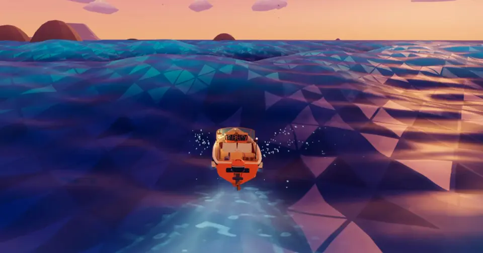</a><br>
<sub><a href="https://developers.openai.com/showcase/sunwake">打开 Showcase</a></sub>

_A sailing game about crossing wild seas and reaching lighthouses._

**提示词（英文原文）**

```text
Generate concept images for a 3D boating game with high seas and large waves at sunrise — sunlight on water, spray, and droplets on camera. Prefer procedural geometry without imported sprites. Aim for extremely smooth movement and physics even if water looks retro/faceted.
```

[Showcase 页面](https://developers.openai.com/showcase/sunwake) · [用 EasyVeo 复刻](https://easyveo.com?utm_source=github&utm_medium=referral&utm_campaign=awesome_gpt6_astra_prompts&utm_content=openai_showcase_sunwake) · [返回列表](#all-prompts)

---

### Void Explorer
<a id="openai-showcase-void-explorer"></a>

[OpenAI Showcase](https://developers.openai.com/showcase/void-explorer) · Thomas Ricouard · 官方演示 · GPT-6 Astra

<a href="https://developers.openai.com/showcase/void-explorer">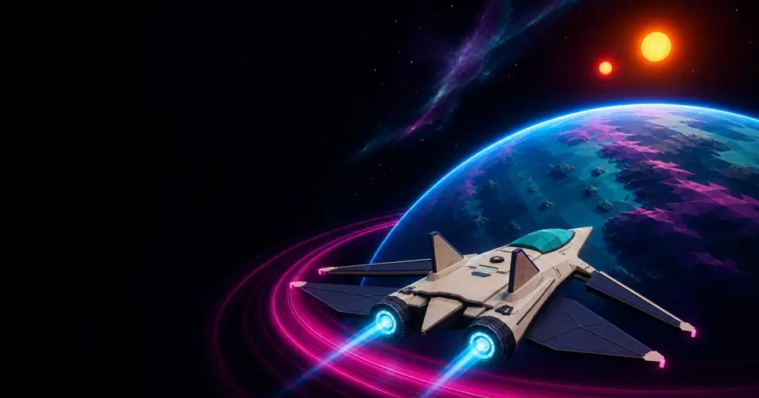</a><br>
<sub><a href="https://developers.openai.com/showcase/void-explorer">打开 Showcase</a></sub>

_A procedural space exploration game with planets to land on._

**提示词（英文原文）**

```text
Generate concept art for a fully explorable procedural universe where every visible star and planet is reachable. Support acceleration, atmospheric descent, and ground views. Use retro-futurist neon 3D with strong contrast — not photoreal, not overly simplistic.
```

[Showcase 页面](https://developers.openai.com/showcase/void-explorer) · [用 EasyVeo 复刻](https://easyveo.com?utm_source=github&utm_medium=referral&utm_campaign=awesome_gpt6_astra_prompts&utm_content=openai_showcase_void-explorer) · [返回列表](#all-prompts)

---

### Frame Studio
<a id="openai-showcase-frame-studio"></a>

[OpenAI Showcase](https://developers.openai.com/showcase/frame-studio) · Katia Gil Guzman · 官方演示 · GPT-6 Astra

<a href="https://developers.openai.com/showcase/frame-studio"></a><br>
<sub><a href="https://developers.openai.com/showcase/frame-studio">打开 Showcase</a></sub>

_A portfolio site for a fictional motion design studio._

**提示词（英文原文）**

```text
Build a polished interactive landing page for a fictional motion-design studio. Bold black/white with acid lime and ultramarine accents. Hero showreel with three original silent scenes and a scrubbable timeline that stays in sync with play/pause and scene selection. No real client logos or fabricated awards.
```

[Showcase 页面](https://developers.openai.com/showcase/frame-studio) · [用 EasyVeo 复刻](https://easyveo.com?utm_source=github&utm_medium=referral&utm_campaign=awesome_gpt6_astra_prompts&utm_content=openai_showcase_frame-studio) · [返回列表](#all-prompts)

---

### Tidegarden
<a id="openai-showcase-tidegarden"></a>

[OpenAI Showcase](https://developers.openai.com/showcase/tidegarden) · Eric Provencher · 官方演示 · GPT-6 Astra

<a href="https://developers.openai.com/showcase/tidegarden"></a><br>
<sub><a href="https://developers.openai.com/showcase/tidegarden">打开 Showcase</a></sub>

_A 3D tropical island with a living reef and rolling waves._

**提示词（英文原文）**

```text
Create a tiny tropical island with a beach, grass, one palm, open ocean, and clouds. Use a believable realtime 3D reference (leaning palm, turquoise shallows, warm afternoon light) as the visual north star, then improve foliage, reef banks, refraction, and shoreline wash tied to traveling waves.
```

[Showcase 页面](https://developers.openai.com/showcase/tidegarden) · [用 EasyVeo 复刻](https://easyveo.com?utm_source=github&utm_medium=referral&utm_campaign=awesome_gpt6_astra_prompts&utm_content=openai_showcase_tidegarden) · [返回列表](#all-prompts)

### Nightjar Listening Room
<a id="openai-showcase-nightjar-listening-room"></a>

[OpenAI Showcase](https://developers.openai.com/showcase/nightjar-listening-room) · Katia Gil Guzman · 官方演示 · GPT-6 Astra

<a href="https://developers.openai.com/showcase/nightjar-listening-room"></a><br>
<sub><a href="https://developers.openai.com/showcase/nightjar-listening-room">打开 Showcase</a></sub>

_A landing page for a fictional listening room with original audio._

**提示词（英文原文）**

```text
Build a polished interactive landing page for Nightjar, an imagined listening room. Warm tobacco wood, near-black, oxblood and amber light. Hero with turntable/sleeve/speaker and a “Play a sample” control. Offer three original short instrumental loops; selecting a record changes sleeve, label, and sound with synchronized tonearm/platter motion. Scrolling reveals bench, speakers, and bar. Include a compact listening programme and a local shortlist. No copyrighted commercial recordings or fake ticketing.
```

[Showcase 页面](https://developers.openai.com/showcase/nightjar-listening-room) · [用 EasyVeo 复刻](https://easyveo.com?utm_source=github&utm_medium=referral&utm_campaign=awesome_gpt6_astra_prompts&utm_content=openai_showcase_nightjar_listening_room) · [返回列表](#all-prompts)

---

### Pattern Studio
<a id="openai-showcase-pattern-studio"></a>

[OpenAI Showcase](https://developers.openai.com/showcase/pattern-studio) · Katia Gil Guzman · 官方演示 · GPT-6 Astra

<a href="https://developers.openai.com/showcase/pattern-studio">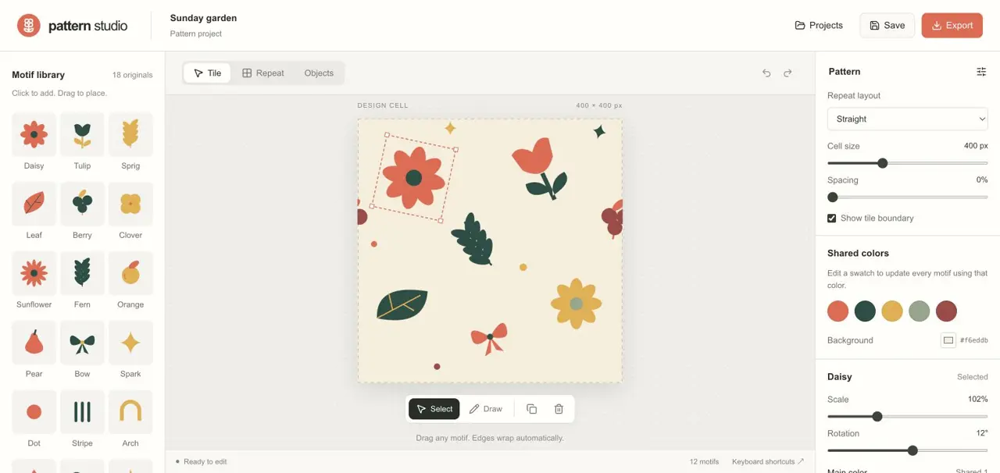</a><br>
<sub><a href="https://developers.openai.com/showcase/pattern-studio">打开 Showcase</a></sub>

_A design tool for creating seamless patterns and previewing them on objects._

**提示词（英文原文）**

```text
Build a seamless pattern editor with an original vector motif library and freehand custom motifs. Move, rotate, resize, layer, and recolor shapes in an editable tile. Support straight, half-drop, and mirrored repeats, plus previews on a cushion and wrapping paper. Include undo/redo, export of repeating tiles, and optional ChatGPT-account saving.
```

[Showcase 页面](https://developers.openai.com/showcase/pattern-studio) · [用 EasyVeo 复刻](https://easyveo.com?utm_source=github&utm_medium=referral&utm_campaign=awesome_gpt6_astra_prompts&utm_content=openai_showcase_pattern_studio) · [返回列表](#all-prompts)

---

### Ridge Pack
<a id="openai-showcase-ridge-pack"></a>

[OpenAI Showcase](https://developers.openai.com/showcase/ridge-pack) · Katia Gil Guzman · 官方演示 · GPT-6 Astra

<a href="https://developers.openai.com/showcase/ridge-pack">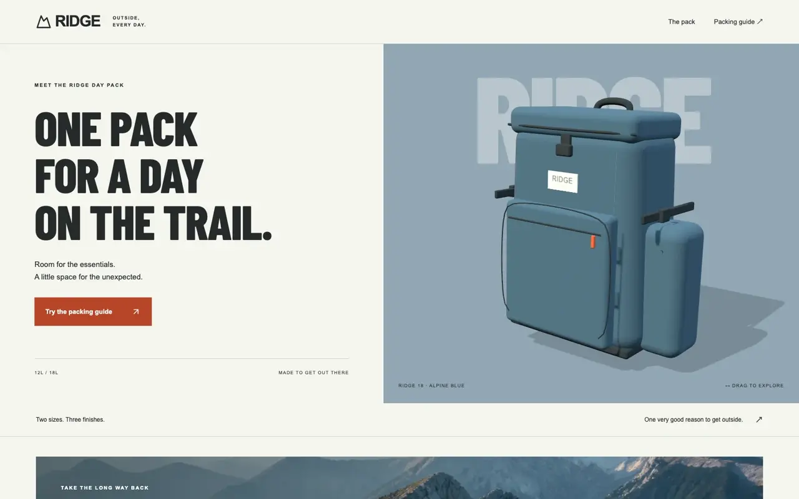</a><br>
<sub><a href="https://developers.openai.com/showcase/ridge-pack">打开 Showcase</a></sub>

_A fictional backpack storefront with an interactive packing guide._

**提示词（英文原文）**

```text
Build a polished interactive landing page for Ridge, an imagined outdoor day-pack brand. Chalk white, mountain blue, burnt orange, and graphite. Hero: “One pack for a day on the trail” with a coherent 3D pack and “Try the packing guide.” Exploded/cutaway compartments; visitors add 6–8 predefined objects with real fit feedback by compartment size. Changing pack size preserves what still fits. No checkout or hiking-safety claims.
```

[Showcase 页面](https://developers.openai.com/showcase/ridge-pack) · [用 EasyVeo 复刻](https://easyveo.com?utm_source=github&utm_medium=referral&utm_campaign=awesome_gpt6_astra_prompts&utm_content=openai_showcase_ridge_pack) · [返回列表](#all-prompts)

---

### Tidal House
<a id="openai-showcase-tidal-house"></a>

[OpenAI Showcase](https://developers.openai.com/showcase/tidal-house) · Katia Gil Guzman · 官方演示 · GPT-6 Astra

<a href="https://developers.openai.com/showcase/tidal-house">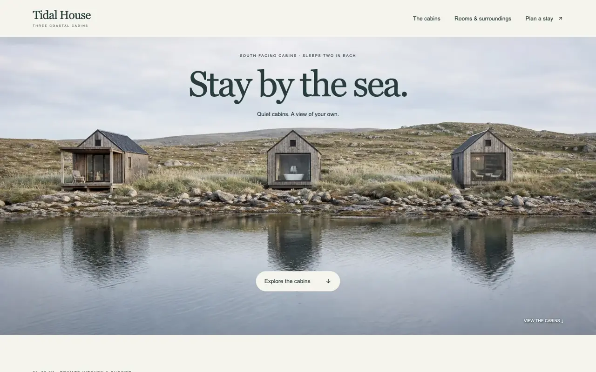</a><br>
<sub><a href="https://developers.openai.com/showcase/tidal-house">打开 Showcase</a></sub>

_A landing page for a fictional coastal cabin retreat._

**提示词（英文原文）**

```text
Build a polished interactive landing page for Tidal House, an imagined coastal retreat with three cabins around a sheltered inlet. Slate, pale sea-green, weathered timber, ivory. Pinned landscape lets visitors choose a cabin; camera moves closer and reveals a consistent floor plan/interior. Morning/evening light and low/high-tide previews. Finish with a downloadable stay-plan summary — no fake reservations or payments.
```

[Showcase 页面](https://developers.openai.com/showcase/tidal-house) · [用 EasyVeo 复刻](https://easyveo.com?utm_source=github&utm_medium=referral&utm_campaign=awesome_gpt6_astra_prompts&utm_content=openai_showcase_tidal_house) · [返回列表](#all-prompts)

---

### Type Field
<a id="openai-showcase-type-field"></a>

[OpenAI Showcase](https://developers.openai.com/showcase/type-field) · Katia Gil Guzman · 官方演示 · GPT-6 Astra

<a href="https://developers.openai.com/showcase/type-field">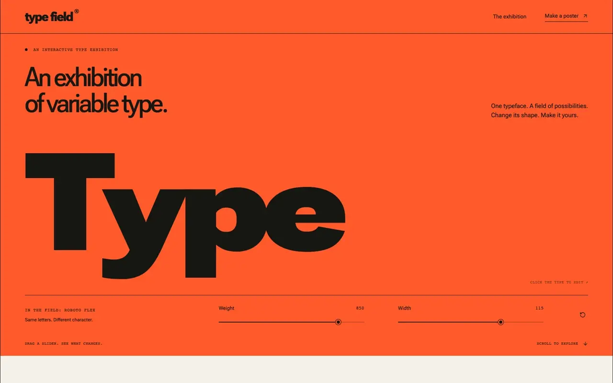</a><br>
<sub><a href="https://developers.openai.com/showcase/type-field">打开 Showcase</a></sub>

_An interactive site for experimenting with typography._

**提示词（英文原文）**

```text
Build a polished interactive typography exhibition using a licensed open-source variable font (credit accurately). Vivid orange, warm white, black. Hero specimen with real weight/width axis controls. Scroll through compact headline, editorial paragraph, and poster compositions. “Make a poster” with short title, three authored grids, palettes, and real SVG/PNG download. Optional baseline/grid overlay. No fabricated font authorship.
```

[Showcase 页面](https://developers.openai.com/showcase/type-field) · [用 EasyVeo 复刻](https://easyveo.com?utm_source=github&utm_medium=referral&utm_campaign=awesome_gpt6_astra_prompts&utm_content=openai_showcase_type_field) · [返回列表](#all-prompts)

---

### EasyVeo：拆解 → 分镜静帧 → 复刻
<a id="easyveo-remake-loop"></a>

[EasyVeo](https://easyveo.com) · 复刻爆款结构，保留你的产品

**提示词（英文原文）**

```text
Authorized short ad clip (≤30s). Decode hook / pacing / proof / CTA (~18 elements). Produce product-true stills, then a Seedance 2.5 / multi-model remake that keeps my SKU. No invented ROAS.
```

**中文简述**

授权广告短片（≤30s）拆解钩子/节奏/证据/CTA（约 18 元素）→ 产品真静帧 → Seedance 2.5 复刻，保留 SKU；不编造 ROAS。

[原帖](https://easyveo.com?utm_source=github&utm_medium=referral&utm_campaign=awesome_gpt6_astra_prompts&utm_content=entry_studio) · [返回列表](#all-prompts)

---


### 小小仪式
<a id="openai-showcase-little-ritual"></a>

[OpenAI Showcase](https://developers.openai.com/showcase/little-ritual) · Jeff Wang · 官方演示 · GPT-6 Astra

<a href="https://cdn.jsdelivr.net/gh/X-RayLuan/awesome-gpt-6-astra-prompts@main/assets/videos/openai-showcase-little-ritual-readme.mp4"></a><br>
<sub><a href="https://cdn.jsdelivr.net/gh/X-RayLuan/awesome-gpt-6-astra-prompts@main/assets/videos/openai-showcase-little-ritual-readme.mp4">▶ 播放视频</a> · <a href="https://github.com/X-RayLuan/awesome-gpt-6-astra-prompts/releases/download/media-v1/openai-showcase-little-ritual-readme.mp4">下载 MP4</a> · <a href="https://developers.openai.com/showcase/little-ritual">Showcase</a></sub>

_球形小世界上的 3D 咖啡配送游戏。_

**提示词（英文原文）**

```text
Build an original single-player 3D browser game about delivering coffee, set on a small, walkable spherical planet with a curved horizon. Give it a warm, stylized, cutesy look, mixing a compact town with quieter natural areas connected by paths around the globe. Include vertical exploration through stairs, upper floors, and bridges. Start the player in a café beside a coffee machine. Let them carry four visibly modeled coffees and explore to find neighbors, delivering to each once per round. Use a custom 3D interpretation of the Codex pet as the courier and other pets as neighbors. Keep discovery central, with interesting places to explore and small, playful interactions. Build the game modularly so we can change the world, characters, and mechanics easily.
```

**中文简述**

球形小世界上的 3D 咖啡配送游戏。

[Showcase 页面](https://developers.openai.com/showcase/little-ritual) · [用 EasyVeo 复刻](https://easyveo.com?utm_source=github&utm_medium=referral&utm_campaign=awesome_gpt6_astra_prompts&utm_content=openai_showcase_little-ritual) · [返回列表](#all-prompts)

---

### 速度回路
<a id="openai-showcase-velocity-loop"></a>

[OpenAI Showcase](https://developers.openai.com/showcase/velocity-loop) · VB Srivastav · 官方演示 · GPT-6 Astra

<a href="https://cdn.jsdelivr.net/gh/X-RayLuan/awesome-gpt-6-astra-prompts@main/assets/videos/openai-showcase-velocity-loop-readme.mp4"></a><br>
<sub><a href="https://cdn.jsdelivr.net/gh/X-RayLuan/awesome-gpt-6-astra-prompts@main/assets/videos/openai-showcase-velocity-loop-readme.mp4">▶ 播放视频</a> · <a href="https://github.com/X-RayLuan/awesome-gpt-6-astra-prompts/releases/download/media-v1/openai-showcase-velocity-loop-readme.mp4">下载 MP4</a> · <a href="https://developers.openai.com/showcase/velocity-loop">Showcase</a></sub>

_微型工坊里的 3D 玩具车计时赛。_

**提示词（英文原文）**

```text
Generate a menu concept for a realistic, die-cast-style 3D racing game with loop-the-loop tracks and nitrous. Show five course choices, varying difficulty, three assist levels, and best-time records in a clear, readable layout.
```

**中文简述**

微型工坊里的 3D 玩具车计时赛。

[Showcase 页面](https://developers.openai.com/showcase/velocity-loop) · [用 EasyVeo 复刻](https://easyveo.com?utm_source=github&utm_medium=referral&utm_campaign=awesome_gpt6_astra_prompts&utm_content=openai_showcase_velocity-loop) · [返回列表](#all-prompts)

---

### 深渊 Abyssal
<a id="openai-showcase-abyssal-bioluminescent-ecosystem"></a>

[OpenAI Showcase](https://developers.openai.com/showcase/abyssal-bioluminescent-ecosystem) · VB Srivastav · 官方演示 · GPT-6 Astra

<a href="https://developers.openai.com/showcase/abyssal-bioluminescent-ecosystem">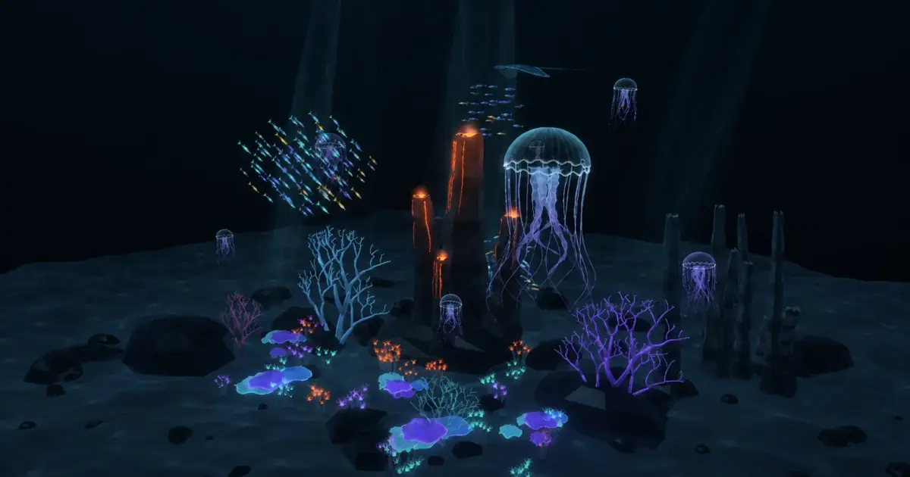</a><br>
<sub><a href="https://developers.openai.com/showcase/abyssal-bioluminescent-ecosystem">打开 Showcase</a></sub>

_程序化水下场景，含生物发光海洋生物。_

**提示词（英文原文）**

```text
Build this interactive 3D experience as a single self-contained index.html that works offline. Keep the HTML, CSS, JavaScript, procedural geometry, textures, and shaders inline, with no external dependencies or downloaded assets. Use browser-native WebGL with a graceful fallback if unavailable. Support desktop and mobile, keyboard-accessible controls, pause/resume, and reduced motion. Keep animation smooth and rendering performance bounded.

Render an original deep-ocean ecosystem surrounding a hydrothermal vent and towering procedurally grown coral or mineral formations. Establish strong depth with underwater fog, volumetric-looking light shafts, animated caustic approximations, marine-snow particles, and a dark abyss beyond the habitat.
```

**中文简述**

程序化水下场景，含生物发光海洋生物。

[Showcase 页面](https://developers.openai.com/showcase/abyssal-bioluminescent-ecosystem) · [用 EasyVeo 复刻](https://easyveo.com?utm_source=github&utm_medium=referral&utm_campaign=awesome_gpt6_astra_prompts&utm_content=openai_showcase_abyssal-bioluminescent-ecosystem) · [返回列表](#all-prompts)

---

### 发条天文台
<a id="openai-showcase-impossible-kinetic-architecture"></a>

[OpenAI Showcase](https://developers.openai.com/showcase/impossible-kinetic-architecture) · VB Srivastav · 官方演示 · GPT-6 Astra

<a href="https://developers.openai.com/showcase/impossible-kinetic-architecture">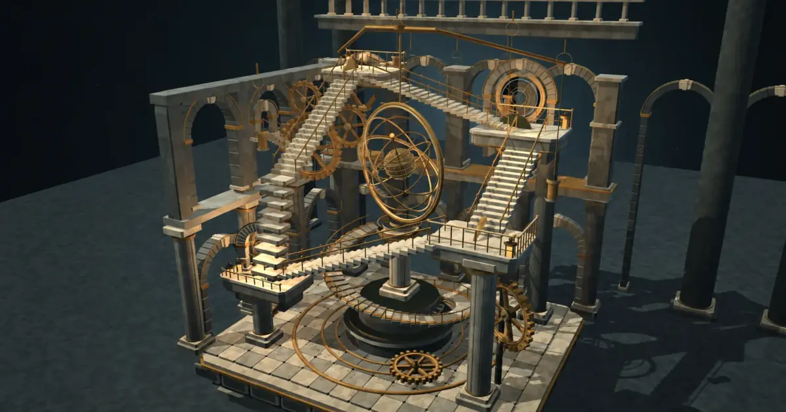</a><br>
<sub><a href="https://developers.openai.com/showcase/impossible-kinetic-architecture">打开 Showcase</a></sub>

_可变换机械天文台的互动 3D 场景。_

**提示词（英文原文）**

```text
Build this interactive 3D experience as a single self-contained index.html that works offline. Keep the HTML, CSS, JavaScript, procedural geometry, textures, and shaders inline, with no external dependencies or downloaded assets. Use browser-native WebGL with a graceful fallback if unavailable. Support desktop and mobile, keyboard-accessible controls, pause/resume, and reduced motion. Keep animation smooth and rendering performance bounded.

Construct an original cinematic impossible observatory inspired by historical fantastical prison etchings and precise astronomical instruments, without copying any source image.
```

**中文简述**

可变换机械天文台的互动 3D 场景。

[Showcase 页面](https://developers.openai.com/showcase/impossible-kinetic-architecture) · [用 EasyVeo 复刻](https://easyveo.com?utm_source=github&utm_medium=referral&utm_campaign=awesome_gpt6_astra_prompts&utm_content=openai_showcase_impossible-kinetic-architecture) · [返回列表](#all-prompts)

---

### 活细胞剖面
<a id="openai-showcase-living-cell-cross-section"></a>

[OpenAI Showcase](https://developers.openai.com/showcase/living-cell-cross-section) · VB Srivastav · 官方演示 · GPT-6 Astra

<a href="https://developers.openai.com/showcase/living-cell-cross-section">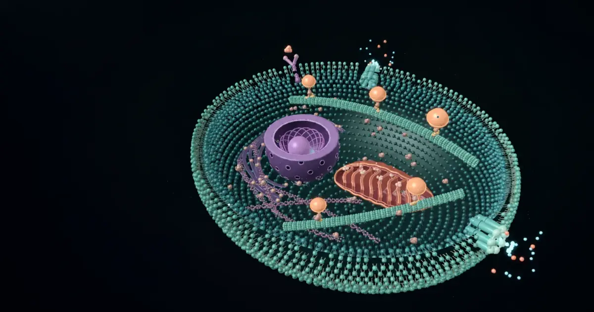</a><br>
<sub><a href="https://developers.openai.com/showcase/living-cell-cross-section">打开 Showcase</a></sub>

_可检视结构的互动 3D 细胞剖面。_

**提示词（英文原文）**

```text
Build this interactive 3D experience as a single self-contained index.html that works offline. Keep the HTML, CSS, JavaScript, procedural geometry, textures, and shaders inline, with no external dependencies or downloaded assets. Use browser-native WebGL with a graceful fallback if unavailable. Support desktop and mobile, keyboard-accessible controls, pause/resume, and reduced motion. Keep animation smooth and rendering performance bounded.

Build a luminous interactive cross-section of a living eukaryotic cell at molecular scale. Show an unmistakable phospholipid bilayer as two dense instanced layers with hydrophilic heads and paired hydrophobic tails. Animate membrane channels opening, receptor binding, and a selective concentration gradient of moving ions.
```

**中文简述**

可检视结构的互动 3D 细胞剖面。

[Showcase 页面](https://developers.openai.com/showcase/living-cell-cross-section) · [用 EasyVeo 复刻](https://easyveo.com?utm_source=github&utm_medium=referral&utm_campaign=awesome_gpt6_astra_prompts&utm_content=openai_showcase_living-cell-cross-section) · [返回列表](#all-prompts)

---

### 海面之下
<a id="openai-showcase-below-the-surface"></a>

[OpenAI Showcase](https://developers.openai.com/showcase/below-the-surface) · Katia Gil Guzman · 官方演示 · GPT-6 Astra

<a href="https://developers.openai.com/showcase/below-the-surface"></a><br>
<sub><a href="https://developers.openai.com/showcase/below-the-surface">打开 Showcase</a></sub>

_探索五大洋区的互动站点。_

**提示词（英文原文）**

```text
Build a complete, polished, interactive landing page. Use clear, natural copy and a restrained layout with purposeful controls. Keep native scrolling, support phone and desktop layouts, keyboard controls, and reduced motion. The main interaction should work without a runtime AI call or account.

Scenario: Below the Surface is a digital ocean exhibition. A visitor scrolls from the sunlit surface into the deep sea, discovering how light, pressure and animals change with depth.
```

**中文简述**

探索五大洋区的互动站点。

[Showcase 页面](https://developers.openai.com/showcase/below-the-surface) · [用 EasyVeo 复刻](https://easyveo.com?utm_source=github&utm_medium=referral&utm_campaign=awesome_gpt6_astra_prompts&utm_content=openai_showcase_below-the-surface) · [返回列表](#all-prompts)

---

### 庭院住宅
<a id="openai-showcase-courtyard-house"></a>

[OpenAI Showcase](https://developers.openai.com/showcase/courtyard-house) · Katia Gil Guzman · 官方演示 · GPT-6 Astra

<a href="https://developers.openai.com/showcase/courtyard-house">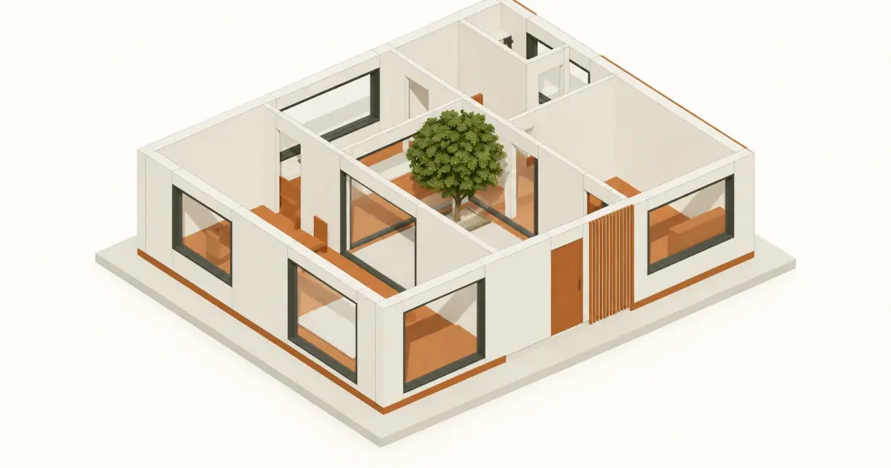</a><br>
<sub><a href="https://developers.openai.com/showcase/courtyard-house">打开 Showcase</a></sub>

_紧凑庭院住宅的互动 3D 导览。_

**提示词（英文原文）**

```text
Build a complete, polished, interactive landing page. Use clear, natural copy and a restrained layout with purposeful controls. Keep native scrolling, support phone and desktop layouts, keyboard controls, and reduced motion. The main interaction should work without a runtime AI call or account.

Scenario: an architectural practice presents Courtyard House, an imagined compact home organized around a planted courtyard. The visitor wants to understand the plan, how spaces connect and how daylight moves through the building. This is a focused architecture-project landing page, not an interior moodboard generator.

Art direction: gallery white, charcoal drawing lines, natural oak and one restrained terracotta accent.
```

**中文简述**

紧凑庭院住宅的互动 3D 导览。

[Showcase 页面](https://developers.openai.com/showcase/courtyard-house) · [用 EasyVeo 复刻](https://easyveo.com?utm_source=github&utm_medium=referral&utm_campaign=awesome_gpt6_astra_prompts&utm_content=openai_showcase_courtyard-house) · [返回列表](#all-prompts)

---

### 物理博物馆
<a id="openai-showcase-physics-museum"></a>

[OpenAI Showcase](https://developers.openai.com/showcase/physics-museum) · Katia Gil Guzman · 官方演示 · GPT-6 Astra

<a href="https://developers.openai.com/showcase/physics-museum">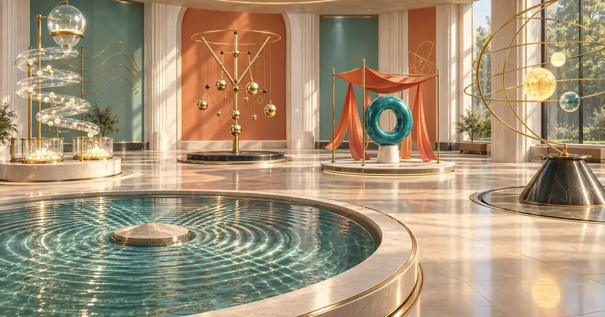</a><br>
<sub><a href="https://developers.openai.com/showcase/physics-museum">打开 Showcase</a></sub>

_含五个互动展项的 3D 科学博物馆。_

**提示词（英文原文）**

```text
Build a polished interactive science museum with five exhibits.

The concept
Create a beautiful museum that visitors move through in 3D. The museum and its sculptural exhibits must be authored in Blender, with editable .blend sources and a reproducible asset-generation script, then exported for the interactive web experience. Do not put a live model in the visitor experience: all five exhibits are authored in advance, and visitors play with their fixed interactions. No prompt field, chat interface, or runtime content generation.

This should feel like entering a small, extraordinary science museum: architectural daylight, pale mineral walls, a dark reflective floor used sparingly, brass details, translucent glass, carefully composed shadows, and restrained accents of color.
```

**中文简述**

含五个互动展项的 3D 科学博物馆。

[Showcase 页面](https://developers.openai.com/showcase/physics-museum) · [用 EasyVeo 复刻](https://easyveo.com?utm_source=github&utm_medium=referral&utm_campaign=awesome_gpt6_astra_prompts&utm_content=openai_showcase_physics-museum) · [返回列表](#all-prompts)

---

### 建筑工作室
<a id="openai-showcase-architecture-studio"></a>

[OpenAI Showcase](https://developers.openai.com/showcase/architecture-studio) · Katia Gil Guzman · 官方演示 · GPT-6 Astra

<a href="https://developers.openai.com/showcase/architecture-studio">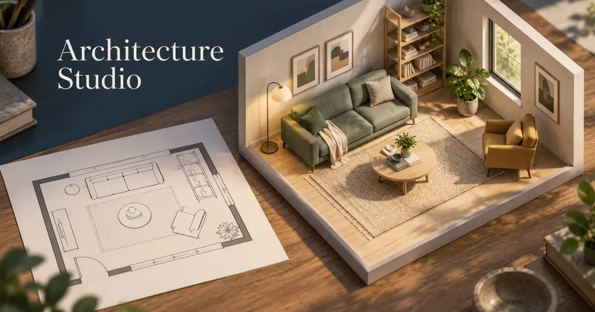</a><br>
<sub><a href="https://developers.openai.com/showcase/architecture-studio">打开 Showcase</a></sub>

_二维平面图与同步 3D 视图的房间规划器。_

**提示词（英文原文）**

```text
Build a room planner with one shared document powering a dimensioned 2D floor plan and a synchronized 3D view. Let people resize a rectangular room, place furniture from an original collection, move and rotate pieces, change finishes, and undo edits. Keep furniture editing in the plan and make the 3D view easy to orbit and inspect.
```

**中文简述**

二维平面图与同步 3D 视图的房间规划器。

[Showcase 页面](https://developers.openai.com/showcase/architecture-studio) · [用 EasyVeo 复刻](https://easyveo.com?utm_source=github&utm_medium=referral&utm_campaign=awesome_gpt6_astra_prompts&utm_content=openai_showcase_architecture-studio) · [返回列表](#all-prompts)

---

### 定格动画工作台
<a id="openai-showcase-stop-motion-desk"></a>

[OpenAI Showcase](https://developers.openai.com/showcase/stop-motion-desk) · Katia Gil Guzman · 官方演示 · GPT-6 Astra

<a href="https://cdn.jsdelivr.net/gh/X-RayLuan/awesome-gpt-6-astra-prompts@main/assets/videos/openai-showcase-stop-motion-desk-readme.mp4">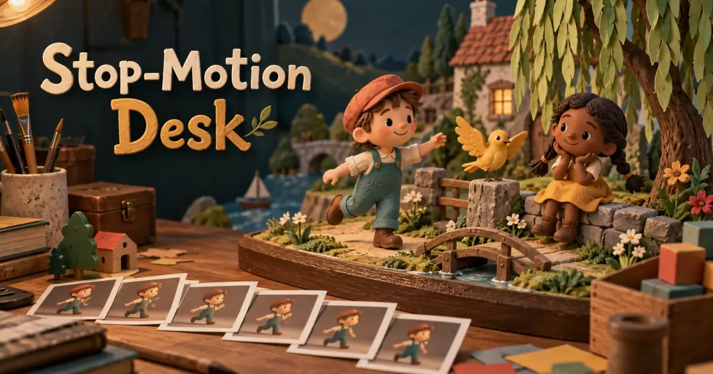</a><br>
<sub><a href="https://cdn.jsdelivr.net/gh/X-RayLuan/awesome-gpt-6-astra-prompts@main/assets/videos/openai-showcase-stop-motion-desk-readme.mp4">▶ 播放视频</a> · <a href="https://github.com/X-RayLuan/awesome-gpt-6-astra-prompts/releases/download/media-v1/openai-showcase-stop-motion-desk-readme.mp4">下载 MP4</a> · <a href="https://developers.openai.com/showcase/stop-motion-desk">Showcase</a></sub>

_浏览器内摆姿势与定格动画的 3D 工作室。_

**提示词（英文原文）**

```text
Build a browser-based stop-motion studio with original 3D characters and props. Let people arrange a scene, adjust a character’s pose, capture frames, preview the animation at different speeds, and export a GIF. Include frame reordering, duplication, deletion, and a clear preview of the previous pose. Keep the creative work on a single stage with a simple timeline below it.
```

**中文简述**

浏览器内摆姿势与定格动画的 3D 工作室。

[Showcase 页面](https://developers.openai.com/showcase/stop-motion-desk) · [用 EasyVeo 复刻](https://easyveo.com?utm_source=github&utm_medium=referral&utm_campaign=awesome_gpt6_astra_prompts&utm_content=openai_showcase_stop-motion-desk) · [返回列表](#all-prompts)

---


## 相关索引

- [OpenAI Developers Showcase](https://developers.openai.com/showcase) — 官方 GPT / Codex / Astra 演示
- [astra.directory](https://astra.directory) — Astra 独立作品星系索引（联系收录：`hello@astra.directory`；参考帖 [@AnupPandey_X](https://x.com/AnupPandey_X/status/2098828020652093444)）
- [pmer.cn Astra projects](https://pmer.cn/en/ai-tools/astra-projects/) — 评分目录（[@ai_pmer](https://x.com/ai_pmer/status/2098932007741063179)）
- [thecrystalbears.com](https://www.thecrystalbears.com/) — 游戏/图书/站点（[@JulianJenkins](https://x.com/JulianJenkins/status/2098858237667737960)）
- 本仓库：欢迎经 [CONTRIBUTING.md](CONTRIBUTING.md) 提交案例；对外索引互链优先上述目录

## 分享好案例

欢迎提 PR — 见 [CONTRIBUTING.md](CONTRIBUTING.md)。预览帧放 `assets/`；完整视频留在 X。

## 致谢

另收录 [OpenAI Developers Showcase](https://developers.openai.com/showcase) 官方演示。Scraped from [@OpenAIDevs](https://x.com/OpenAIDevs) [GPT-6 Astra by our community](https://x.com/OpenAIDevs/status/2098827327832822014) article embeds + 回复线程. Layout inspired by public awesome-list formats (not Tripo media). Product CTA: [EasyVeo](https://easyveo.com).

详见 [RIGHTS.md](RIGHTS.md)。
